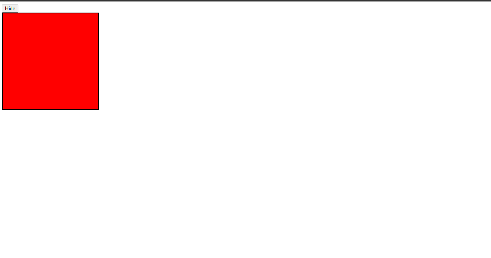
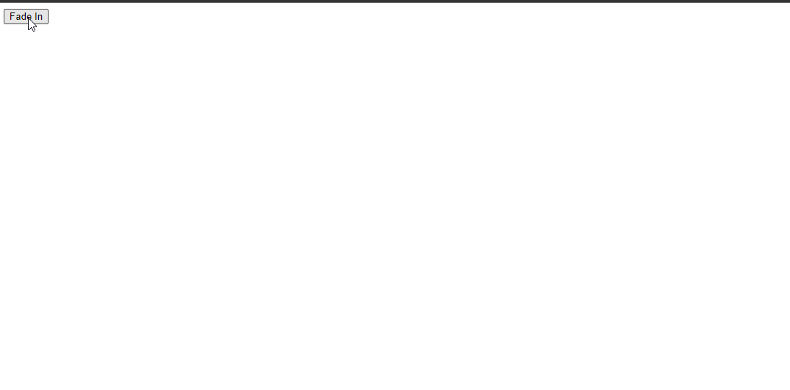
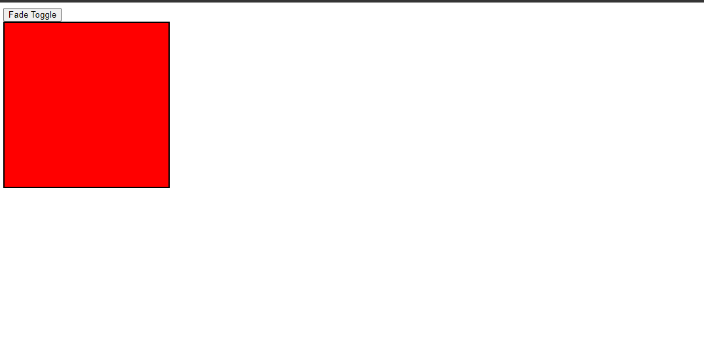
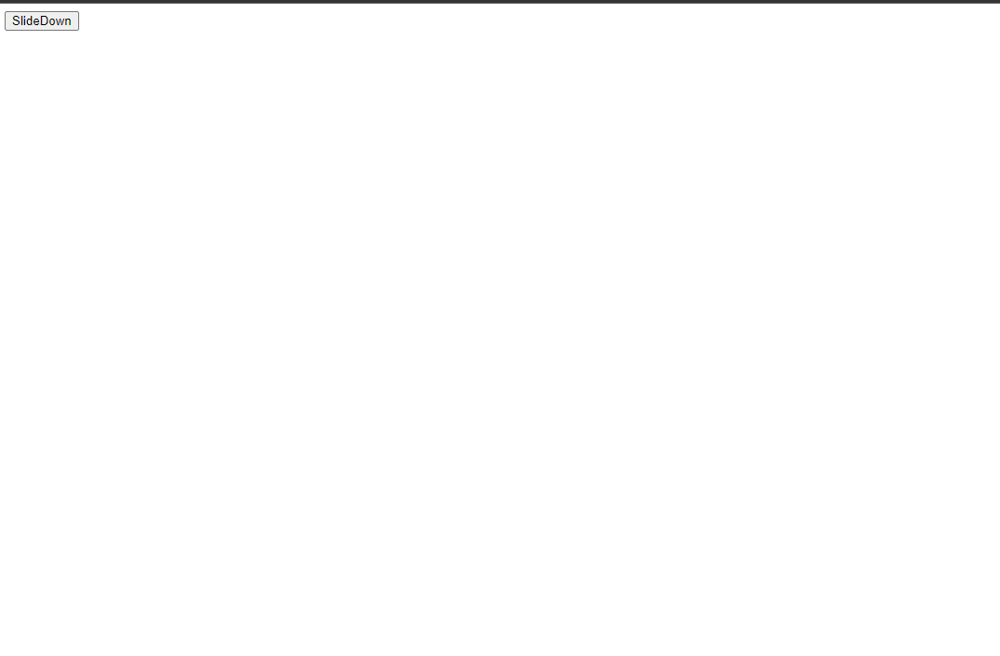
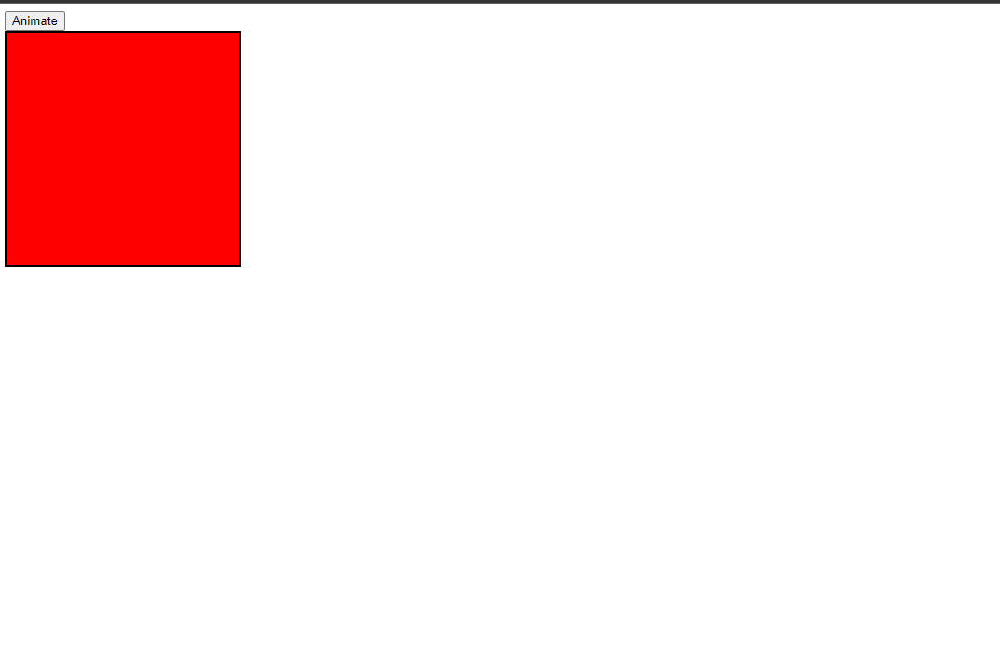
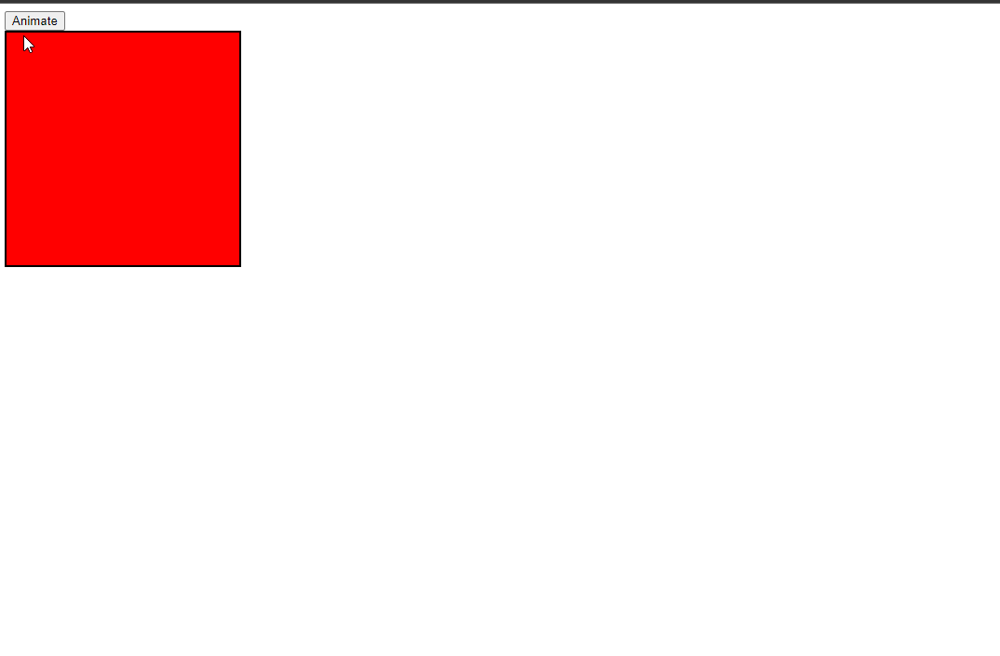
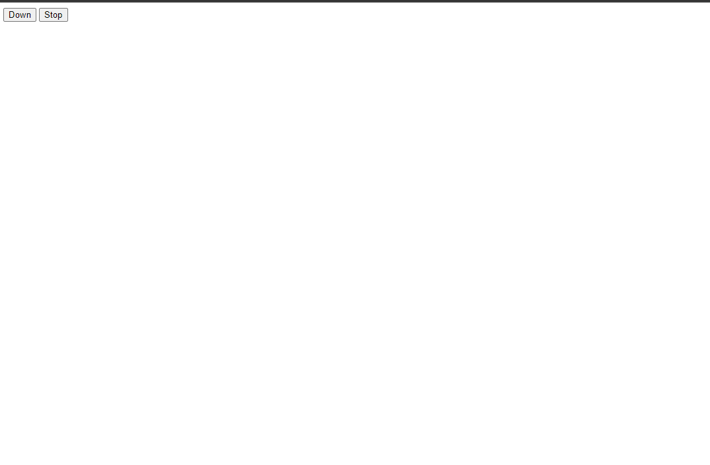

# 1. W3CSchool Basic Snippets

## Hide Show Snippets

### Example 0

#### HTML

```HTML
<!DOCTYPE html>

<html>

    <head>

        <title>This is the title</title>

        <link  rel="stylesheet" type="text/css" href="style.css">

    </head>

    <body>

        <input type="button" value="Hide" id="btn" />

        <div id="box">

        </div>

        <script src="jquery-3.2.1.min.js" type="text/javascript"></script>
        <script src="js.js" type="text/javascript"></script>

    </body>

</html>
```

#### CSS

```CSS
#box {

    width:250px;
    height:250px;
    background-color:red;
    border:2px solid black;

}
```

#### JavaScript

```JavaScript
$(document).ready(function () {

    $("#btn").click(function () {

        $("#box").hide("slow")//We can defind the speed (slow,fast,milliseconds).

    });

});
```

### Output



### Example 1

#### HTML

```HTML
<!DOCTYPE html>

<html>

    <head>

        <title>This is the title</title>

        <link  rel="stylesheet" type="text/css" href="style.css">

    </head>

    <body>

        <input type="button" value="Show" id="btn" />

        <div id="box">

        </div>

        <script src="jquery-3.2.1.min.js" type="text/javascript"></script>
        <script src="js.js" type="text/javascript"></script>

    </body>

</html>
```

#### CSS

```CSS
#box {

    width:250px;
    height:250px;
    background-color:red;
    border:2px solid black;
    display:none;

}
```

#### JavaScript

```JavaScript
$(document).ready(function () {

    $("#btn").click(function () {

        $("#box").show("fast")//We can defind the speed (slow,fast,milliseconds).

    });

});
```

### Output


### Example 2

#### HTML

```HTML
<!DOCTYPE html>

<html>

    <head>

        <title>This is the title</title>

        <link  rel="stylesheet" type="text/css" href="style.css">

    </head>

    <body>

        <input type="button" value="Toggle" id="btn" />

        <div id="box">

        </div>

        <script src="jquery-3.2.1.min.js" type="text/javascript"></script>
        <script src="js.js" type="text/javascript"></script>

    </body>

</html>
```

#### CSS

```CSS
#box {

    width:250px;
    height:250px;
    background-color:red;
    border:2px solid black;
    display:none;

}
```

#### JavaScript

```JavaScript
$(document).ready(function () {

    $("#btn").click(function () {

        $("#box").toggle("0.2")//We can defind the speed (slow,fast,milliseconds).

    });

});
```

### Output


## 2. Fade Snippets

### Example 0

#### HTML

```HTML
<!DOCTYPE html>

<html>

    <head>

        <title>This is the title</title>

        <link  rel="stylesheet" type="text/css" href="style.css">

    </head>

    <body>

        <input type="button" value="Fade In" id="btn" />

        <div id="box">

        </div>

        <script src="jquery-3.2.1.min.js" type="text/javascript"></script>
        <script src="js.js" type="text/javascript"></script>

    </body>

</html>
```

#### CSS

```CSS
#box {

    width:250px;
    height:250px;
    background-color:red;
    border:2px solid black;
    display:none;

}
```

#### JavaScript

```JavaScript
$(document).ready(function () {

    $("#btn").click(function () {

        $("#box").fadeIn("slow")//We can defind the speed (slow,fast,milliseconds).

    });

});
```

### Output



### Example 1

#### HTML

```HTML
<!DOCTYPE html>

<html>

    <head>

        <title>This is the title</title>

        <link  rel="stylesheet" type="text/css" href="style.css">

    </head>

    <body>

        <input type="button" value="Fade Out" id="btn" />

        <div id="box">

        </div>

        <script src="jquery-3.2.1.min.js" type="text/javascript"></script>
        <script src="js.js" type="text/javascript"></script>

    </body>

</html>
```

#### CSS

```CSS
#box {

    width:250px;
    height:250px;
    background-color:red;
    border:2px solid black;

}
```

#### JavaScript

```JavaScript
$(document).ready(function () {

    $("#btn").click(function () {

        $("#box").fadeOut("fast")//We can defind the speed (slow,fast,milliseconds).

    });

});
```

### Output


### Example 2

#### HTML

```HTML
<!DOCTYPE html>

<html>

    <head>

        <title>This is the title</title>

        <link  rel="stylesheet" type="text/css" href="style.css">

    </head>

    <body>

        <input type="button" value="Fade Toggle" id="btn" />

        <div id="box">

        </div>

        <script src="jquery-3.2.1.min.js" type="text/javascript"></script>
        <script src="js.js" type="text/javascript"></script>

    </body>

</html>
```

#### CSS

```CSS
#box {

    width:250px;
    height:250px;
    background-color:red;
    border:2px solid black;

}
```

#### JavaScript

```JavaScript
$(document).ready(function () {

    $("#btn").click(function () {

        $("#box").fadeToggle("0.1")//We can defind the speed (slow,fast,milliseconds).

    });

});
```

### Output



### Example 3

#### HTML

```HTML
<!DOCTYPE html>

<html>

    <head>

        <title>This is the title</title>

        <link  rel="stylesheet" type="text/css" href="style.css">

    </head>

    <body>

        <input type="button" value="Fade To" id="btn" />

        <div id="box">

        </div>

        <script src="jquery-3.2.1.min.js" type="text/javascript"></script>
        <script src="js.js" type="text/javascript"></script>

    </body>

</html>
```

#### CSS

```CSS
#box {

    width:250px;
    height:250px;
    background-color:red;
    border:2px solid black;

}
```

#### JavaScript

```JavaScript
$(document).ready(function () {

    $("#btn").click(function () {

        $("#box").fadeTo("slow",0.5)//We can defind the speed (slow,fast,milliseconds) and the Opacity value.

    });

});
```

### Output


### Example 4

#### HTML

```HTML
<!DOCTYPE html>

<html>

    <head>

        <title>This is the title</title>

        <link  rel="stylesheet" type="text/css" href="style.css">

    </head>

    <body>

        <input type="button" value="Fade To" id="btn" />

        <div id="box">

        </div>

        <script src="jquery-3.2.1.min.js" type="text/javascript"></script>
        <script src="js.js" type="text/javascript"></script>

    </body>

</html>
```

#### CSS

```CSS
#box {

    width:250px;
    height:250px;
    background-color:red;
    border:2px solid black;
    opacity:0.5

}
```

#### JavaScript

```JavaScript
$(document).ready(function () {

    $("#btn").click(function () {

        $("#box").fadeTo("slow",0.9)//We can defind the speed (slow,fast,milliseconds) and the Opacity value.

    });

});
```

### Output


## 3. Slide Snippets

### Example 0

#### HTML

```HTML
<!DOCTYPE html>

<html>

    <head>

        <title>This is the title</title>

        <link  rel="stylesheet" type="text/css" href="style.css">

    </head>

    <body>

        <input type="button" value="SlideDown" id="btn" />

        <div id="box">

        </div>

        <script src="jquery-3.2.1.min.js" type="text/javascript"></script>
        <script src="js.js" type="text/javascript"></script>

    </body>

</html>
```

#### CSS

```CSS
#box {

    width:250px;
    height:250px;
    background-color:red;
    border:2px solid black;
    display:none;

}
```

#### JavaScript

```JavaScript
$(document).ready(function () {

    $("#btn").click(function () {

        $("#box").slideDown("slow")//We can defind the speed (slow,fast,milliseconds).

    });

});
```

### Output



### Example 1

#### HTML

```HTML
<!DOCTYPE html>

<html>

    <head>

        <title>This is the title</title>

        <link  rel="stylesheet" type="text/css" href="style.css">

    </head>

    <body>

        <input type="button" value="SlideUp" id="btn" />

        <div id="box">

        </div>

        <script src="jquery-3.2.1.min.js" type="text/javascript"></script>
        <script src="js.js" type="text/javascript"></script>

    </body>

</html>
```

#### CSS

```CSS
#box {

    width:250px;
    height:250px;
    background-color:red;
    border:2px solid black;

}
```

#### JavaScript

```JavaScript
$(document).ready(function () {

    $("#btn").click(function () {

        $("#box").slideUp("fast")//We can defind the speed (slow,fast,milliseconds).

    });

});
```

### Output


### Example 2

#### HTML

```HTML
<!DOCTYPE html>

<html>

    <head>

        <title>This is the title</title>

        <link  rel="stylesheet" type="text/css" href="style.css">

    </head>

    <body>

        <input type="button" value="SlideToggle" id="btn" />

        <div id="box">

        </div>

        <script src="jquery-3.2.1.min.js" type="text/javascript"></script>
        <script src="js.js" type="text/javascript"></script>

    </body>

</html>
```

#### CSS

```CSS
#box {

    width:250px;
    height:250px;
    background-color:red;
    border:2px solid black;

}
```

#### JavaScript

```JavaScript
$(document).ready(function () {

    $("#btn").click(function () {

        $("#box").slideToggle("0.1")//We can defind the speed (slow,fast,milliseconds).

    });

});
```

### Output


## 4. Animate Snippets

### Example 0

#### HTML

```HTML
<!DOCTYPE html>

<html>

    <head>

        <title>This is the title</title>

        <link  rel="stylesheet" type="text/css" href="style.css">

    </head>

    <body>

        <input type="button" value="Animate" id="btn" />

        <div id="box">

        </div>

        <script src="jquery-3.2.1.min.js" type="text/javascript"></script>
        <script src="js.js" type="text/javascript"></script>

    </body>

</html>
```

#### CSS

```CSS
#box {

    width:250px;
    height:250px;
    background-color:red;
    border:2px solid black;
    position:relative;
    background-color:red;

}
```

#### JavaScript

```JavaScript
$(document).ready(function () {

    $("#btn").click(function () {

        $("#box").animate({

            left: "250px",
            top: "250px",
            width: "500px",

                    });

    });

});
```

### Output



### Example 1

#### HTML

```HTML
<!DOCTYPE html>

<html>

    <head>

        <title>This is the title</title>

        <link  rel="stylesheet" type="text/css" href="style.css">

    </head>

    <body>

        <input type="button" value="Animate" id="btn" />

        <div id="box">

        </div>

        <script src="jquery-3.2.1.min.js" type="text/javascript"></script>
        <script src="js.js" type="text/javascript"></script>

    </body>

</html>
```

#### CSS

```CSS
#box {

    width:250px;
    height:250px;
    background-color:red;
    border:2px solid black;
    position:relative;
    background-color:red;

}
```

#### JavaScript

```JavaScript
$(document).ready(function () {

    $("#btn").click(function () {

        var box = $("#box");
        box.animate({
        height:"toggle"

        });

    });
});
```

### Output



### Example 2

#### HTML

```HTML
<!DOCTYPE html>

<html>

    <head>

        <title>This is the title</title>

        <link  rel="stylesheet" type="text/css" href="style.css">

    </head>

    <body>

        <input type="button" value="Animate" id="btn" />

        <div id="box">

        </div>

        <script src="jquery-3.2.1.min.js" type="text/javascript"></script>
        <script src="js.js" type="text/javascript"></script>

    </body>

</html>
```

#### CSS

```CSS
#box {

    width:250px;
    height:250px;
    background-color:red;
    border:2px solid black;
    position:relative;
    background-color:red;

}
```

#### JavaScript

```JavaScript
$(document).ready(function () {

    $("#btn").click(function () {

        var box = $("#box");
        box.animate({

            width: "500px",
            opacity: 0.5,
        });
        box.animate({

            width: "250px",
            opacity: 1,
            height:"500px"

        });

        box.animate({

            width: "500px",
            opacity: 1,

        });

    });
});
```

### Output


## 5. Stop Snippets

### Example 0

#### HTML

```HTML
<!DOCTYPE html>

<html>

    <head>

        <title>This is the title</title>

        <link  rel="stylesheet" type="text/css" href="style.css">

    </head>

    <body>

        <input type="button" value="Down" id="btn" />
        <input type="button" value="Stop" id="btnS" />

        <div id="box">

            <h4>kuna</h4>

        </div>

        <script src="jquery-3.2.1.min.js" type="text/javascript"></script>
        <script src="js.js" type="text/javascript"></script>

    </body>

</html>
```

#### CSS

```CSS
#box {

    width:250px;
    height:250px;
    background-color:red;
    border:2px solid black;
  display:none;

}
```

#### JavaScript

```JavaScript
$(document).ready(function () {

    $("#btn").click(function () {

        $("#box").slideDown(3000);

    });

    $("#btnS").click(function () {

        $("#box").stop();
    });

});
```

### Output



## 6. Chain Snippets

### Example 0

#### HTML

```HTML
<!DOCTYPE html>

<html>

    <head>

        <title>This is the title</title>

        <link  rel="stylesheet" type="text/css" href="style.css">

    </head>

    <body>

        <input type="button" value="Down" id="btn" />

        <div id="box">

        </div>

        <script src="jquery-3.2.1.min.js" type="text/javascript"></script>
        <script src="js.js" type="text/javascript"></script>

    </body>

</html>
```

#### CSS

```CSS
#box {

    width:250px;
    height:250px;
    background-color:red;
    border:2px solid black;
    position:relative;

}
```

#### JavaScript

```JavaScript
$(document).ready(function () {

    $("#btn").click(function () {

        $("#box").css("background-color", "blue").slideUp("fast").slideDown("solw").animate({ left: "250px" });

    });

});
```

### Output


