## Channel 9 Snippets

## 1. Basic Snippets

### Example 0

#### HTML

```HTML
<!DOCTYPE html>

<html>

    <head>

        <title>This is the title</title>

        <link  rel="stylesheet" type="text/css" href="style.css">

    </head>

    <body>

        <script src="jquery-3.2.1.min.js" type="text/javascript"></script>
        <script src="js.js" type="text/javascript"></script>

    </body>

</html>
```

#### JavaScript

```JavaScript
$(document).ready(function () {

    alert("Code 1");
});

$(document).ready(function () {

    alert("Code 2");
});

$(function () {

    alert("Code 3");
});


$(function () {

    alert("Code 4");

});

/*
 *Each document works one by one.
 *
 */
```

### Output

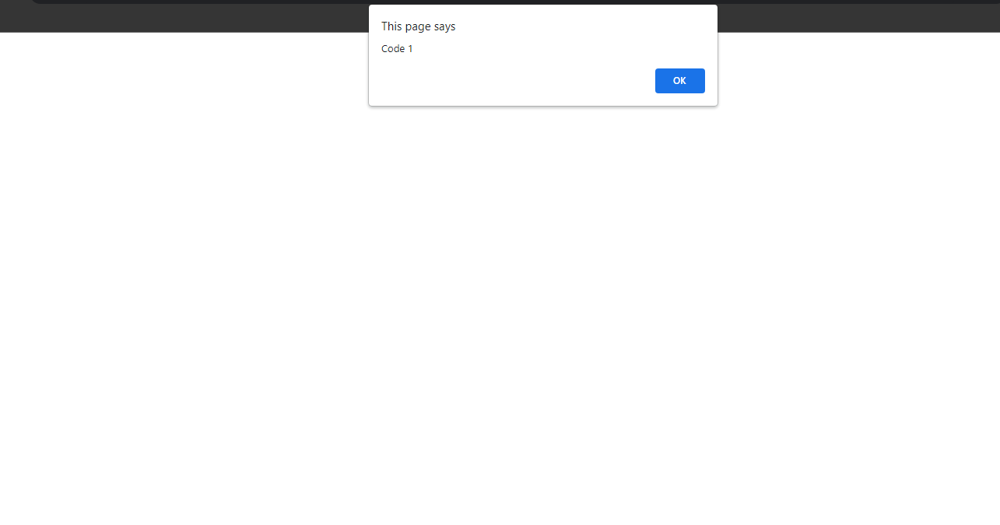

### Example 1

#### HTML

```HTML
<!DOCTYPE html>

<html>

    <head>

        <title>This is the title</title>

        <link  rel="stylesheet" type="text/css" href="style.css">

    </head>

    <body>

        <input type="button" id="btn" value="ChangeText" />

        <h1 id="p">This is JokerHakcer</h1>

        <script src="jquery-3.2.1.min.js" type="text/javascript"></script>
        <script src="js.js" type="text/javascript"></script>

    </body>

</html>
```

#### CSS

```CSS
#box {

    width:250px;
    height:250px;
    background-color:red;
    border:2px solid black;
    position:relative;

}
```

#### JavaScript

```JavaScript
$(document).ready(function () {

    $("#btn").click(function () {

        $("#p").text("This is now changed");//text is like innerHTML.
    });

});
```

### Output

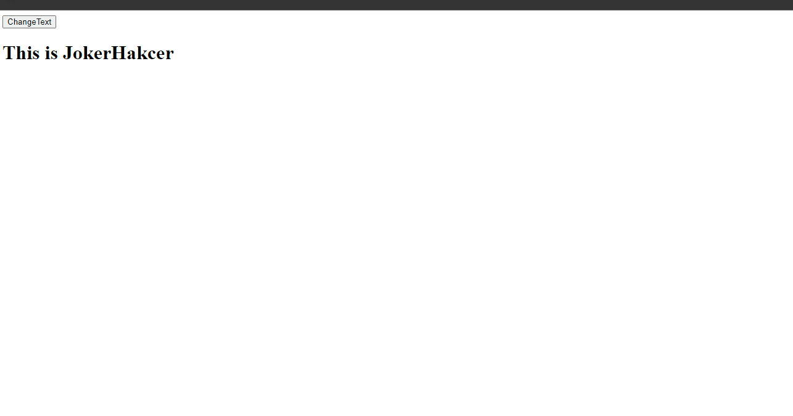

### Example 2

#### HTML

```HTML
<!DOCTYPE html>

<html>

    <head>

        <title>This is the title</title>

        <link  rel="stylesheet" type="text/css" href="style.css">

    </head>

    <body>

        <input type="button" id="btn" value="ChangeText" />

        <h1 id="p">This is JokerHakcer</h1>

        <script src="jquery-3.2.1.min.js" type="text/javascript"></script>
        <script src="js.js" type="text/javascript"></script>

    </body>

</html>
```

#### CSS

```CSS
#box {

    width:250px;
    height:250px;
    background-color:red;
    border:2px solid black;
    position:relative;

}
```

#### JavaScript

```JavaScript
$(document).ready(function () {

    $("#btn").click(function () {

        $("#p").html("<h6>This is h5</h6>");
    });

})
```

### Output


### Example 3

#### HTML

```HTML
<!DOCTYPE html>

<html>

    <head>

        <title>This is the title</title>

        <link  rel="stylesheet" type="text/css" href="style.css">

    </head>

    <body>

        <input type="button" id="btn" value="ChangeText" />

        <h1 id="p">This is JokerHakcer</h1>

        <script src="jquery-3.2.1.min.js" type="text/javascript"></script>
        <script src="js.js" type="text/javascript"></script>

    </body>

</html>
```

#### CSS

```CSS
#box {

    width:250px;
    height:250px;
    background-color:red;
    border:2px solid black;
    position:relative;
}
```

#### JavaScript

```JavaScript
$(document).ready(function () {

    $("#btn").click(function () {

        $("#p").prepend("<h6>This is h5</h6>");
    });

})
```

### Output

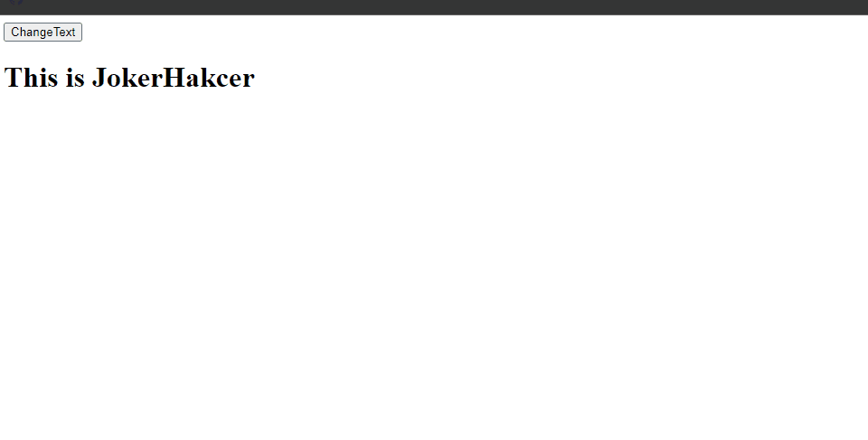

### Example 4

#### HTML

```HTML
<!DOCTYPE html>

<html>

    <head>

        <title>This is the title</title>

        <link  rel="stylesheet" type="text/css" href="style.css">

    </head>

    <body>

        <input type="button" id="btn" value="ChangeText" />

        <h1 id="p">This is JokerHakcer</h1>

        <script src="jquery-3.2.1.min.js" type="text/javascript"></script>
        <script src="js.js" type="text/javascript"></script>

    </body>

</html>
```

#### CSS

```CSS
#box {

    width:250px;
    height:250px;
    background-color:red;
    border:2px solid black;
    position:relative;

}
```

#### JavaScript

```JavaScript
$(document).ready(function () {

    $("#btn").click(function () {

        $("#p").append("<h6>This is h5</h6>");
    });

})

//There are alose after and before keywords like this.
```

### Output

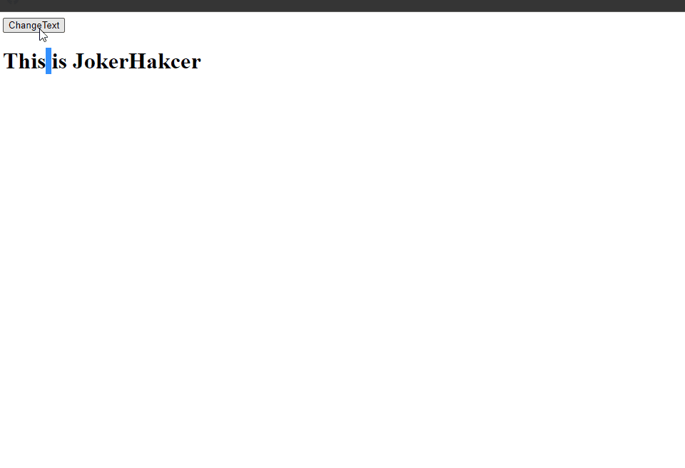

### Example 5

#### HTML

```HTML
<!DOCTYPE html>

<html>

    <head>

        <title>This is the title</title>

        <link  rel="stylesheet" type="text/css" href="style.css">

    </head>

    <body>

        <input type="button" id="btn" value="ChangeText" />

        <a id="p" href="ww.google.lk">Kuna</a>

        <script src="jquery-3.2.1.min.js" type="text/javascript"></script>
        <script src="js.js" type="text/javascript"></script>

    </body>

</html>
```

#### CSS

```CSS
#box {

    width:250px;
    height:250px;
    background-color:red;
    border:2px solid black;
    position:relative;

}
```

#### JavaScript

```JavaScript
$(function () {

    $("#btn").click(function () {

        $("#p").attr("href", "http://www.fade.com");

    });

});

//I have changed the url.
```

### Output

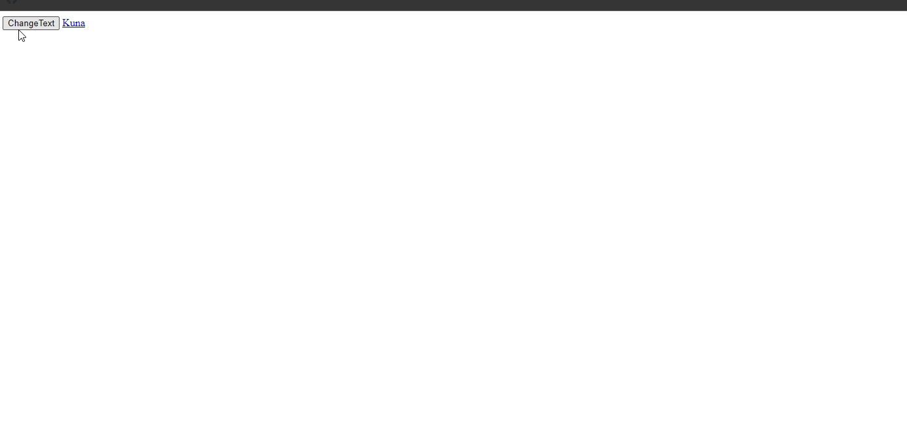

### Example 6

#### HTML

```HTML
<!DOCTYPE html>

<html>

    <head>

        <title>This is the title</title>

        <link  rel="stylesheet" type="text/css" href="style.css">

    </head>

    <body>

        <input type="button" id="btn" value="ChangeText" />
        <h1 id="p"> THis i s d</h1>

        <script src="jquery-3.2.1.min.js" type="text/javascript"></script>
        <script src="js.js" type="text/javascript"></script>

    </body>

</html>
```

#### CSS

```CSS
.class1 {

    color:red;
}
```

#### JavaScript

```JavaScript
$(function () {

    $("#btn").click(function () {

        $("#p").addClass("class1")

    });

});
```

### Output

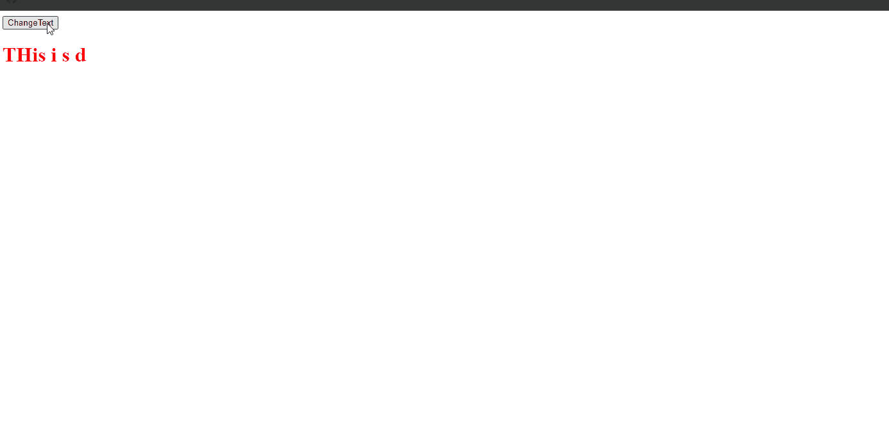

## 2. DOM Snippets

### Example 0

#### HTML

```HTML
<!DOCTYPE html>

<html>

    <head>

        <title>This is the title</title>

        <link  rel="stylesheet" type="text/css" href="style.css">

</head>

    <body>

        <h1 id="h1">This is ID</h1>
        <h1 class="h1">This is class</h1>

        <script src="jquery-3.2.1.min.js" type="text/javascript"></script>
        <script src="js.js" type="text/javascript"></script>

    </body>

</html>
```

#### CSS

```CSS
.style1 {

    background-color:red;

}
```

#### JavaScript

```JavaScript
$(document).ready(function () {

    $("#h1,.h1").addClass("style1");

});

//We can chose many type elements by using (,).
```

### Output

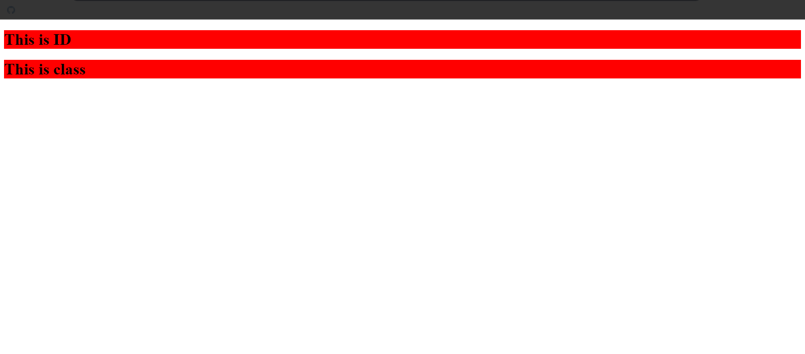

### Example 1

#### HTML

```HTML
<!DOCTYPE html>

<html>

    <head>

        <title>This is the title</title>

        <link  rel="stylesheet" type="text/css" href="style.css">

    </head>

    <body>

        <h1>This is ID</h1>
        <h1>This is class</h1>

        <script src="jquery-3.2.1.min.js" type="text/javascript"></script>
        <script src="js.js" type="text/javascript"></script>

    </body>

</html>
```

#### CSS

```CSS
.style1 {

    background-color:red;

}
```

#### JavaScript

```JavaScript
$(document).ready(function () {

    $("h1:contains('class')").addClass("style1");

});

//We can select anything that contains a specific words but this is case sensitive.
// $(".h1:contains('class')").addClass("style1"); this is class.
// $("#h1:contains('class')").addClass("style1"); this is id.
// $(".h1:contains('class')").addClass("style1"); this is class.
```

### Output

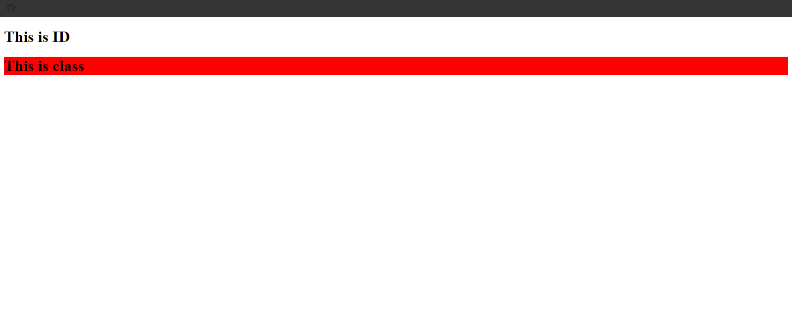

### Example 2

#### HTML

```HTML
<!DOCTYPE html>

<html>

    <head>

        <title>This is the title</title>

        <link  rel="stylesheet" type="text/css" href="style.css">

    </head>

    <body>

        <h1 id="dis">This is ID</h1>
        <h1 class="dis">This is class</h1>

        <script src="jquery-3.2.1.min.js" type="text/javascript"></script>
        <script src="js.js" type="text/javascript"></script>

    </body>

</html>
```

#### CSS

```CSS
.style1 {

    background-color:red;
}
```

#### JavaScript

```JavaScript
$(document).ready(function () {

    $("#dis").next().addClass("style1");

});

//Next is used to find an element that is next to the #dis.
```

### Output


### Example 3

#### HTML

```HTML
<!DOCTYPE html>

<html>

    <head>

        <title>This is the title</title>

        <link  rel="stylesheet" type="text/css" href="style.css">

    </head>

    <body>

        <h1 id="dis">This is ID</h1>
        <h1 class="dis">This is class</h1>

        <script src="jquery-3.2.1.min.js" type="text/javascript"></script>
        <script src="js.js" type="text/javascript"></script>

    </body>

</html>
```

#### CSS

```CSS
.style1 {

    background-color:red;

}
```

#### JavaScript

```JavaScript
$(document).ready(function () {

    $(".dis").prev().addClass("style1");

});

//Next is used to find an element that is next to the #dis.
```

### Output

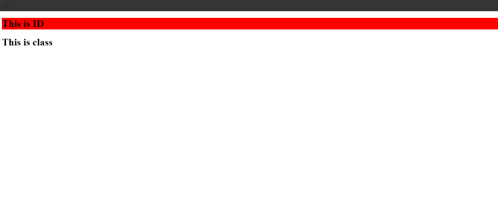

### Example 4

#### HTML

```HTML
<!DOCTYPE html>

<html>

    <head>

        <title>This is the title</title>

        <link  rel="stylesheet" type="text/css" href="style.css">

    </head>

    <body>

        <div>

            <h1 id="k">kuna</h1>
            <h1>gta</h1>
            <h1>Joker</h1>

        </div>

        <div>

            <h1 id="k">kuna 2</h1>
            <h1>gta 2</h1>
            <h1>Joker 2</h1>

        </div>

        <script src="jquery-3.2.1.min.js" type="text/javascript"></script>
        <script src="js.js" type="text/javascript"></script>

    </body>

</html>
```

#### CSS

```CSS
.style1 {

    background-color:red;
}
```

#### JavaScript

```JavaScript
$(document).ready(function () {

    $("#k").siblings().addClass("style1");

});

//The siblings() is used to find all of the siblings of an element.
```

### Output

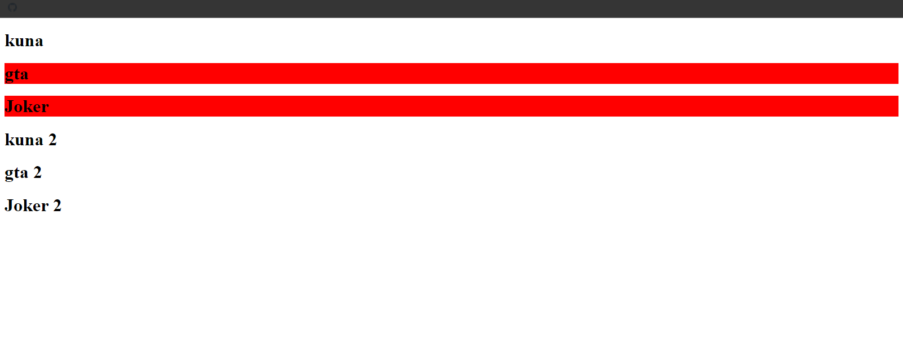

### Example 5

#### HTML

```HTML
<!DOCTYPE html>

<html>

    <head>

        <title>This is the title</title>
        <link  rel="stylesheet" type="text/css" href="style.css">

    </head>

    <body>

        <div>

            <h1 id="k">kuna</h1>
            <h1>gta</h1>
            <h1>Joker</h1>

        </div>

        <div>

            <h1 id="k">kuna 2</h1>
            <h1>gta 2</h1>
            <h1>Joker 2</h1>

        </div>

        <script src="jquery-3.2.1.min.js" type="text/javascript"></script>
        <script src="js.js" type="text/javascript"></script>

    </body>

</html>
```

#### CSS

```CSS
.style1 {

   color:red;
    border:2px solid red;

}
```

#### JavaScript

```JavaScript
$(document).ready(function () {

    $("#k").parent().addClass("style1");

});

//The parent() is used to find the parent of the element.
```

### Output

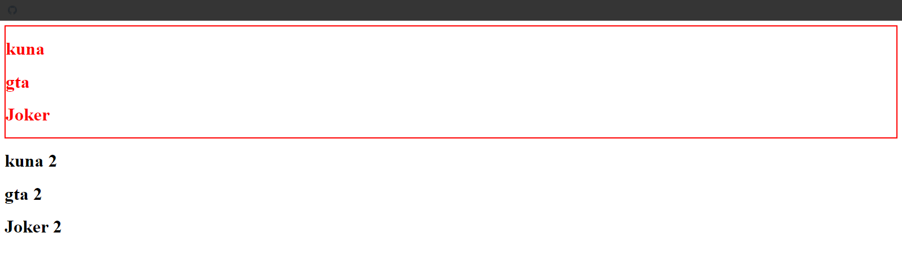

### Example 6

#### HTML

```HTML
<!DOCTYPE html>

<html>

    <head>

        <title>This is the title</title>

        <link  rel="stylesheet" type="text/css" href="style.css">

    </head>

    <body>

            <h1>kuna</h1>
            <h1>gta</h1>
            <h1>Joker</h1>

        <script src="jquery-3.2.1.min.js" type="text/javascript"></script>
        <script src="js.js" type="text/javascript"></script>

    </body>

</html>
```

#### CSS

```CSS
.style1 {

   color:red;
    border:2px solid red;
}
```

#### JavaScript

```JavaScript
$(document).ready(function () {

    $("h1:nth-child(1)").addClass("style1");

});

//By using the nth-child() you can select items bashed on the numbers.
```

### Output

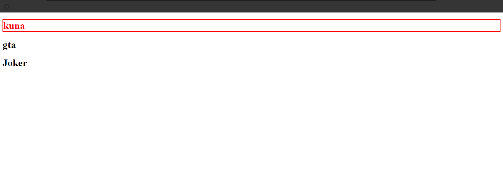

### Example 7

#### HTML

```HTML
<!DOCTYPE html>

<html>

    <head>

        <title>This is the title</title>

        <link  rel="stylesheet" type="text/css" href="style.css">

    </head>

    <body>

     <h1 title="k">This is kuna</h1>

        <h1>This is gta</h1>

        <script src="jquery-3.2.1.min.js" type="text/javascript"></script>
        <script src="js.js" type="text/javascript"></script>

    </body>

</html>
```

#### CSS

```CSS
.style1 {

   color:red;
    border:2px solid red;
}
```

#### JavaScript

```JavaScript
$(document).ready(function () {

    $("h1[title='k']").addClass("style1");

});

//We can select bashed on attributes.
```

### Output

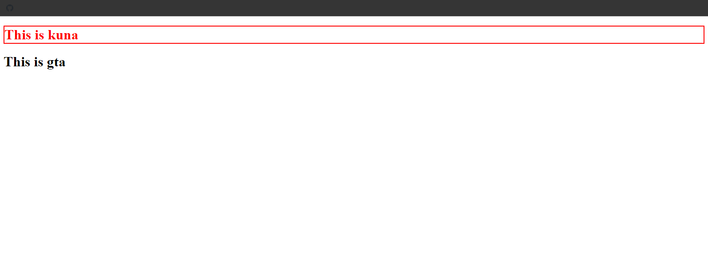

### Example 8

#### HTML

```HTML
<!DOCTYPE html>

<html>

    <head>

        <title>This is the title</title>

        <link  rel="stylesheet" type="text/css" href="style.css">

    </head>

    <body>

     <h1 title="k">This is kuna</h1>

        <h1>This is gta</h1>

        <script src="jquery-3.2.1.min.js" type="text/javascript"></script>
        <script src="js.js" type="text/javascript"></script>

    </body>

</html>
```

#### CSS

```CSS
.style1 {

   color:red;
    border:2px solid red;
}
```

#### JavaScript

```JavaScript
$(document).ready(function () {

    $("h1[title!='k']").addClass("style1");

});

//This will select all elements that are not have title "k".
```

### Output

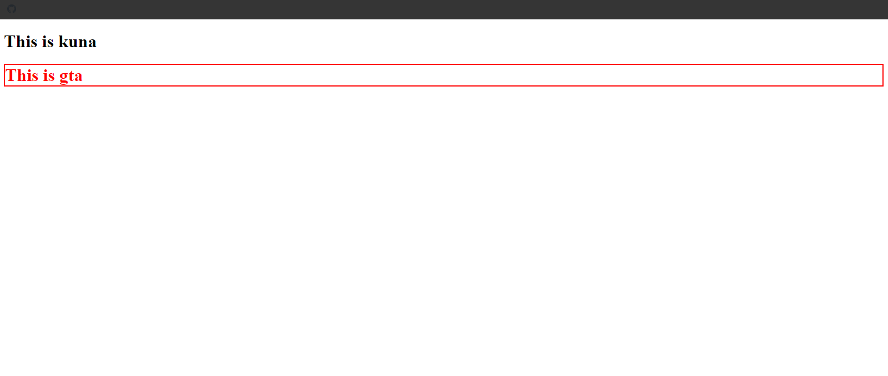

### Example 9

#### HTML

```HTML
<!DOCTYPE html>

<html>

    <head>

        <title>This is the title</title>

        <link  rel="stylesheet" type="text/css" href="style.css">

    </head>

    <body>

     <h1 id="k">This is kuna</h1>

        <h1>This is gta</h1>
        <h1>This is hacker</h1>
        <h1>This is joker</h1>

        <script src="jquery-3.2.1.min.js" type="text/javascript"></script>
        <script src="js.js" type="text/javascript"></script>

    </body>

</html>
```

#### CSS

```CSS
.style1 {

   color:red;
    border:2px solid red;
}
```

#### JavaScript

```JavaScript
$(document).ready(function () {

    $("h1").not("[id]").addClass("style1");

});
```

### Output

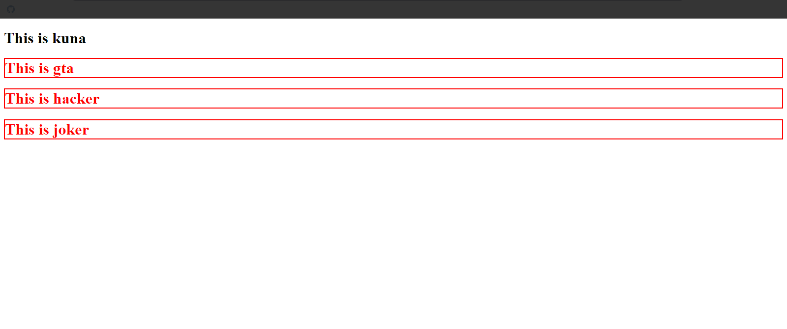

### Example 10

#### HTML

```HTML
<!DOCTYPE html>

<html>

    <head>

        <title>This is the title</title>

        <link  rel="stylesheet" type="text/css" href="style.css">

    </head>

    <body>

        <p>This is paragraph</p>

        <h1>This is h1</h1>
        <h2>This is h2</h2>
        <h3>This is h3</h3>
        <h4>This is h4</h4>
        <h5>This is h5</h5>
        <h6>This is h6</h6>

        <script src="jquery-3.2.1.min.js" type="text/javascript"></script>
        <script src="js.js" type="text/javascript"></script>

    </body>

</html>
```

#### CSS

```CSS
.style1 {

   color:red;
    border:2px solid red;
}
```

#### JavaScript

```JavaScript
$(document).ready(function () {

    $(":header").addClass("style1");

});

//This will all of header elements form h1 to h6.
```

### Output

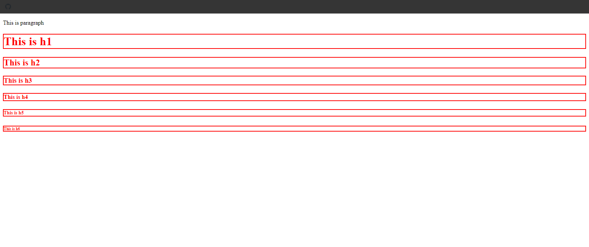

### Example 11

#### HTML

```HTML
<!DOCTYPE html>

<html>

    <head>

        <title>This is the title</title>

        <link  rel="stylesheet" type="text/css" href="style.css">

    </head>

    <body>

        <h1 id="k"></h1>
        <h2 class="h"></h2>
        <p></p>

        <script src="jquery-3.2.1.min.js" type="text/javascript"></script>
        <script src="js.js" type="text/javascript"></script>

    </body>

</html>
```

#### CSS

```CSS
.style1 {

   color:red;
    border:2px solid red;
}
```

#### JavaScript

```JavaScript
$(document).ready(function () {

    $("p:empty").text("p element has got new text");
    $("#k:empty").text("#k elemt has got new text");
    $(".h:empty").text(".k element has got new text");

});

//We can use the empty keywords to fill the empty elements.
```

### Output

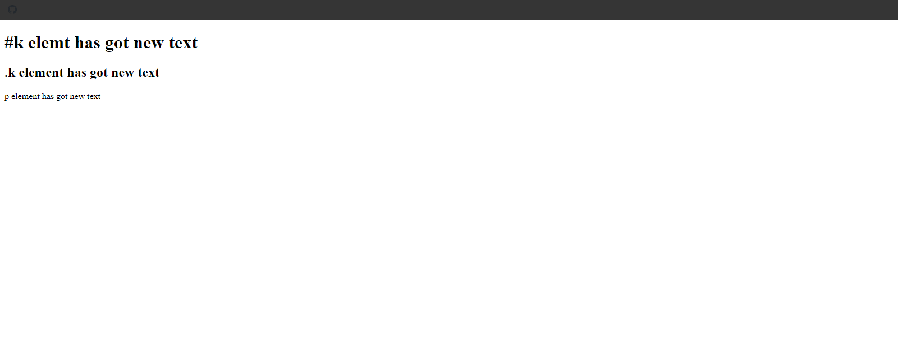

### Example 12

#### HTML

```HTML
<!DOCTYPE html>

<html>

    <head>

        <title>This is the title</title>

        <link  rel="stylesheet" type="text/css" href="style.css">

    </head>

<body>

    <h1>This is kuna</h1>
    <h1>This is kuna</h1>
    <h1>This is kuna</h1>
    <h1>This is kuna</h1>
    <h1>This is kuna</h1>
    <h1>This is kuna</h1>

    <script src="jquery-3.2.1.min.js" type="text/javascript"></script>
    <script src="js.js" type="text/javascript"></script>

</body>

</html>
```

#### CSS

```CSS
.style1 {

   color:red;
    border:2px solid red;
}
```

#### JavaScript

```JavaScript
$(document).ready(function () {

    $("h1:even").addClass("style1");

});
```

### Output

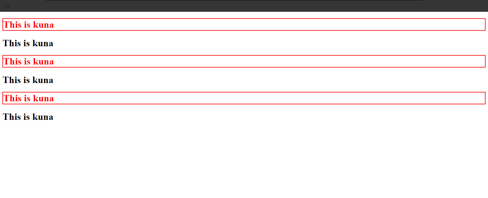

### Example 13

#### HTML

```HTML
<!DOCTYPE html>

<html>

    <head>

        <title>This is the title</title>

        <link  rel="stylesheet" type="text/css" href="style.css">

    </head>

<body>

    <h1>This is kuna</h1>
    <h1>This is kuna</h1>
    <h1>This is kuna</h1>
    <h1>This is kuna</h1>
    <h1>This is kuna</h1>
    <h1>This is kuna</h1>

    <script src="jquery-3.2.1.min.js" type="text/javascript"></script>
    <script src="js.js" type="text/javascript"></script>

</body>

</html>
```

#### CSS

```CSS
.style1 {

   color:red;
    border:2px solid red;
}
```

#### JavaScript

```JavaScript
$(document).ready(function () {

    $("h1:odd").addClass("style1");

});
```

### Output

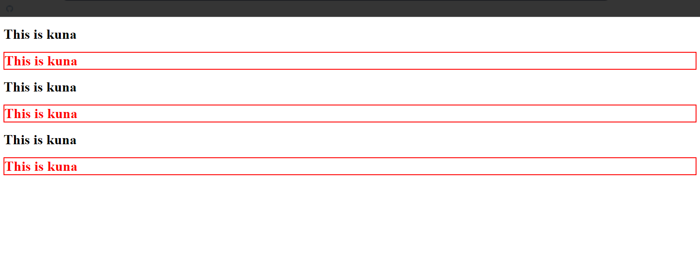

## 3. Events content

### Example 0

#### HTML

```HTML
<!DOCTYPE html>

<html>

    <head>

        <title>This is the title</title>

        <link  rel="stylesheet" type="text/css" href="style.css">

    </head>

<body>

    <div id="start">

    </div>

    <div id="box">

        

    </div>

    <h1 id="dis"></h1>

    <p id="st">You are scoring</p>

    <script src="jquery-3.2.1.min.js" type="text/javascript"></script>
    <script src="js.js" type="text/javascript"></script>

</body>

</html>
```

#### CSS

```CSS
#start{

    width:250px;
    height:250px;
    border:2px solid red;
    position:relative;
    left:750px;

}
```

#### JavaScript

```JavaScript
$(document).ready(function () {

    var score = 0;

    var st = $("#st").hide();

    $("img").click(function () {

        score += 1;
        $("#dis").text(score);
        st.show("slow");

    });

    $("#start").mouseover(function () {

        score = 0;
        $("#dis").text(score);
    });

});
```

### Output

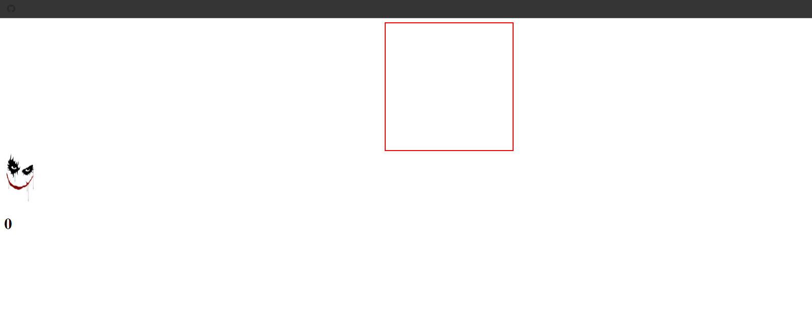
