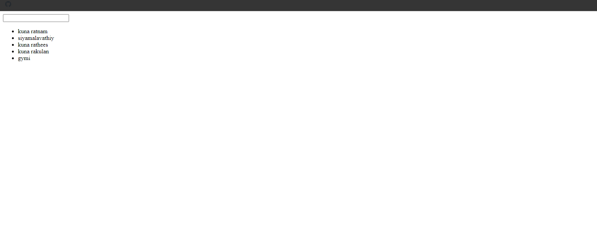

## The New Bonston Snippets

## 1. Introduction Snippets

### Example 0

#### HTML

```HTML
<!DOCTYPE html>

<html>

    <head>

        <title>This is the title</title>

        <link  rel="stylesheet" type="text/css" href="style.css">

    </head>

<body>

    <input type="button" id="hideAndShow" value="Hide" />

    <h1 id="txt">This is kuna</h1>

    <script src="jquery-3.2.1.min.js" type="text/javascript"></script>
    <script src="js.js" type="text/javascript"></script>

</body>

</html>
```

#### JavaScript

```JavaScript
$(document).ready(function () {

    var btn = $("#hideAndShow");
    var txt = $("#txt");

    btn.click(function () {

        if (btn.attr("value") == "Hide") {

            txt.hide("slow");
            btn.attr("value", "Show");

        } else {

            txt.show("slow");
            btn.attr("value", "Hide");

        }

    });
});

//by using jquery we can write web application easliy without the raw javascript.
//jquery is write less and do more framework.
//jquery is used almost everywhere.
//This is a small example of what can jquery do.
```

### Output


## 2. Selectors Snippets

### 1. All Slector Snippets

### Example 0

#### HTML

```HTML
<!DOCTYPE html>

<html>

    <head>

        <title>This is the title</title>

        <link  rel="stylesheet" type="text/css" href="style.css">

    </head>

<body>

    <h1>You have <span id="sec"></span> Seconds more</h1>

    <script src="jquery-3.2.1.min.js" type="text/javascript"></script>
    <script src="js.js" type="text/javascript"></script>

</body>

</html>
```

#### CSS

```CSS
#sec {

    color:red;

}
```

#### JavaScript

```JavaScript
var count = $("*").length;
alert(count);

// * symbol means all elements
//Jqery uses css selectors
//# for id . for class and element names for element selectors.
```

### Output


### Example 1

#### HTML

```HTML
<!DOCTYPE html>

<html>

    <head>

        <title>This is the title</title>

        <link  rel="stylesheet" type="text/css" href="style.css">

    </head>

<body>

    <div id="box1">

        <h1>This is kuna 1</h1>
        <h1>This is kuna 2</h1>
        <b>This is kuna  3</b>
        <p>This is kuna  4</p>

    </div>

    <div id="box2">

        <h1>This is kuna 1</h1>
        <h1>This is kuna 2</h1>
        <b>This is kuna  3</b>
        <p>This is kuna  4</p>

    </div>

    <script src="jquery-3.2.1.min.js" type="text/javascript"></script>
    <script src="js.js" type="text/javascript"></script>

</body>

</html>
```

#### CSS

```CSS
.sec {

    color:red;

}
```

#### JavaScript

```JavaScript
$(document).ready(function () {

    $("* > #box1").addClass("sec")

});

//jQuery uses the Css selectors.
//Everything inside the box1.
//* means everything
```

### Output


### 2. Find ( ) Snippets

### Example 0

#### HTML

```HTML
<!DOCTYPE html>

<html>

    <head>

        <title>This is the title</title>

        <link  rel="stylesheet" type="text/css" href="style.css">
    </head>

<body>

    <div id="box1">

        <h1>This is kuna 1</h1>
        <h1>This is kuna 2</h1>
        <b>This is kuna  3</b>
        <p>This is kuna  4</p>

    </div>

    <div id="box2">

        <h1>This is kuna 1</h1>
        <h1>This is kuna 2</h1>
        <b>This is kuna  3</b>
        <p>This is kuna  4</p>

    </div>

    <script src="jquery-3.2.1.min.js" type="text/javascript"></script>
    <script src="js.js" type="text/javascript"></script>

</body>

</html>
```

#### CSS

```CSS
.sec {

    color:red;

}
```

#### JavaScript

```JavaScript
$(document).ready(function () {

    $("#box1").find("p").addClass("sec");

});

//The find keyword is used to find elements inside another element.
//in this example i have selected all p elements that is in the box1 id element box1 is an div element.
// we can also use * ,h1-h6,div and all elements.
```

### Output


### 3. Input Selectors Snippets

### Example 0

#### HTML

```HTML
<!DOCTYPE html>

<html>

    <head>

        <title>This is the title</title>

        <link  rel="stylesheet" type="text/css" href="style.css">

    </head>

<body>

    <input type="button" value="Start Button" />

    <input type="submit" value="Start Submit" />

    <script src="jquery-3.2.1.min.js" type="text/javascript"></script>
    <script src="js.js" type="text/javascript"></script>

</body>

</html>
```

#### CSS

```CSS
.sec {

    color:red;

}
```

#### JavaScript

```JavaScript
$(":button").click(function () {

    alert("The button is started");

});

$(":submit").click(function () {

    alert("The submit is started");
});

//When we select anything that is in the input family we need use this : sign before the item.
//Examples
//:submit :button :text :radio :checkbox :password :email and more.
```

### Output


### Example 1

#### HTML

```HTML
<!DOCTYPE html>

<html>

    <head>

        <title>This is the title</title>

        <link  rel="stylesheet" type="text/css" href="style.css">

    </head>

<body>

    <input type="email"/>

    <script src="jquery-3.2.1.min.js" type="text/javascript"></script>
    <script src="js.js" type="text/javascript"></script>

</body>

</html>
```

#### CSS

```CSS
table, tr, th, td {

    border:1px solid black;

}

.newClass {
    background-color:green;
}
```

#### JavaScript

```JavaScript
$(document).ready(function () {

    var dText = "Enter the Email";

    $("input[type='email']").attr("value", dText).focus(function () {

        if ($(this).val() == dText) {

            $(this).attr("value", "");

        }

    }).blur(function () {

        if ($(this).val() == "") {

            $(this).attr("value", dText);
        }

    });

});

//We can select all input elements input[type='text'],input[type='password'] and all.
//We can also use like this a[href='www.google.lk'].

//algorithm

//when we focus on the email  if it is default text we need to make blank.
//when we blur form the email if it is empty we need to give the default text back.
```

### Output


### 4. NTH Child ( ) Snippets

### Example 0

#### HTML

```HTML
<!DOCTYPE html>

<html>

    <head>

        <title>This is the title</title>

        <link  rel="stylesheet" type="text/css" href="style.css">

    </head>

<body>

    <p>This is P 1</p>
    <p>This is P 2</p>
    <p>This is P 3</p>

    <script src="jquery-3.2.1.min.js" type="text/javascript"></script>
    <script src="js.js" type="text/javascript"></script>

</body>

</html>
```

#### CSS

```CSS
.sec {

    color:red;

}
```

#### JavaScript

```JavaScript
$(document).ready(function () {

    $("p:nth-child(2)").text("Kuna");

});

//The nth-child() is used to select elements bashed on numbers.
// We can also use p:first for first element or p:last last element or nth-child(position) for selecting indexed element.
//nth-child() starts on 1 not on 0.
//you can specify number position in the parentheses ().
```

### Output


### 5. This Snippets

### Example 0

#### HTML

```HTML
<!DOCTYPE html>

<html>

    <head>

        <title>This is the title</title>

        <link  rel="stylesheet" type="text/css" href="style.css">

    </head>

<body>

    <input type="submit" value="Start Button" />

    <input type="submit" value="Start Submit" />

    <script src="jquery-3.2.1.min.js" type="text/javascript"></script>
    <script src="js.js" type="text/javascript"></script>

</body>

</html>
```

#### CSS

```CSS
.sec {

    color:red;

}
```

#### JavaScript

```JavaScript
$(":submit").click(function () {

    $(this).attr("value","Please Wait..")

});

//The this keyword selects the current element.
//this means the current element.
//in this case the submit button will change it's value to Please wait..
```

### Output


### Example 1

#### HTML

```HTML
<!DOCTYPE html>

<html>

    <head>

        <title>This is the title</title>

        <link  rel="stylesheet" type="text/css" href="style.css">

    </head>

<body>

   <input type="button" value="click" />

    <script src="jquery-3.2.1.min.js" type="text/javascript"></script>
    <script src="js.js" type="text/javascript"></script>

</body>

</html>
```

#### CSS

```CSS
.sec {

    color:red;

}
```

#### JavaScript

```JavaScript
$(document).ready(function () {

    $(":button").click(function () {

        $(this).attr("value", "Guna");

    });

});

//The this keyword means the current element that we are using or working on.
//the attr keyword means attributes.
```

### Output


### 6. Multi Selector Snippets

### Example 0

#### HTML

```HTML
<!DOCTYPE html>

<html>

    <head>

        <title>This is the title</title>

        <link  rel="stylesheet" type="text/css" href="style.css">

    </head>

<body>

    <input type="button" value="Click" />

    <h1>This is H1</h1>

    <script src="jquery-3.2.1.min.js" type="text/javascript"></script>
    <script src="js.js" type="text/javascript"></script>

</body>

</html>
```

#### CSS

```CSS
.sec {

    color:red;

}
```

#### JavaScript

```JavaScript
$(document).ready(function () {

    $(":button,h1").click(function () {

        alert("The button or the H1 has been clicked");

    });

});

//This is the multi selector method.
//We can use unlimted number of elements followed by ",";
//This is called groupping selectors
```

### Output


### 7. ODD Selecting Snippets

### Example 0

#### HTML

```HTML
<!DOCTYPE html>

<html>

    <head>

        <title>This is the title</title>

        <link  rel="stylesheet" type="text/css" href="style.css">

    </head>

<body>

    <table>

        <tr><td>First Row</td></tr>
        <tr><td>Second Row</td></tr>
        <tr><td>Third Row</td></tr>
        <tr><td>Forth Row</td></tr>
        <tr><td>Fith Row</td></tr>
        <tr><td>Sixth Row</td></tr>
        <tr><td>Seventh Row</td></tr>
        <tr><td>Eight Row</td></tr>

    </table>

    <script src="jquery-3.2.1.min.js" type="text/javascript"></script>
    <script src="js.js" type="text/javascript"></script>

</body>

</html>
```

#### CSS

```CSS
table, tr, th, td {

    border:1px solid black;

}

.newClass {
    background-color:green;
}
```

#### JavaScript

```JavaScript
$(function () {

    $("table tr:odd").addClass("newClass");

});

//We can use even or odd.
```

### Output


### 8. Even Selecting Snippets

### Example 0

#### HTML

```HTML
<!DOCTYPE html>

<html>

    <head>

        <title>This is the title</title>

        <link  rel="stylesheet" type="text/css" href="style.css">

    </head>

<body>

    <div id="box1">

        <p>First Row</p>
        <p>Second Row</p>
        <p>Third Row</p>
        <p>Forth Row</p>
        <p>Fith Row</p>
        <p>Sixth Row</p>
        <p>Seventh Row</p>
        <p>Eight Row</p>

    </div>

    <script src="jquery-3.2.1.min.js" type="text/javascript"></script>
    <script src="js.js" type="text/javascript"></script>

</body>

</html>
```

#### CSS

```CSS
table, tr, th, td {

    border:1px solid black;

}

.newClass {
    background-color:green;
}
```

#### JavaScript

```JavaScript
$(function () {

    $("#box1 p:even").addClass("newClass");

});

//We can use even or odd.
//even is one by one.
//odd is one by one form the end.
```

### Output


### 9. Contains Snippets

### Example 0

#### HTML

```HTML
<!DOCTYPE html>

<html>

    <head>

        <title>This is the title</title>

        <link  rel="stylesheet" type="text/css" href="style.css">

    </head>

<body>

    <input type="text" id="search_names" />

    <ul id="names">

        <li>kuna ratnam</li>
        <li>siyamalavathiy</li>
        <li>kuna rathees</li>
        <li>kuna rakulan</li>
        <li>gymi</li>

    </ul>

    <script src="jquery-3.2.1.min.js" type="text/javascript"></script>
    <script src="js.js" type="text/javascript"></script>

</body>

</html>
```

#### CSS

```CSS
h1 {

    color:red;

}

.heighlited{

    background-color:yellow;
}
```

#### JavaScript

```JavaScript
$(document).ready(function () {

    $("#search_names").keyup(function () {

        var search_value = $(this).val();//this menans the current value."#search_names" value.

        $("#names li").removeClass("heighlited");//This will remove the class when key is up every time. if you do not put this line of code
                                                 //the heightligher will not update.
        if ($.trim(search_value) != "") {//$.trim removes white spces form left and right.

            $("#names li:contains('" + search_value + "')").addClass("heighlited");

        }

    });

});

//in Jquery we use contains selector is to find some data that is in the element.
//if you want to select an element that contains some certian words you need to use this :contains selector.
```

### Output



### 10. First () Last () Preview () Next () Snippets

### Example 0

#### HTML

```HTML
<!DOCTYPE html>

<html>

    <head>

        <title>This is the title</title>

        <link  rel="stylesheet" type="text/css" href="style.css">

    </head>

<body>

    <form action="#" enctype="multipart/form-data">

        <input type="file" id="file" />

        <input type="submit" id="submit"  value="Upload" disabled="disabled"/>

    </form>

    <script src="jquery-3.2.1.min.js" type="text/javascript"></script>
    <script src="js.js" type="text/javascript"></script>

</body>

</html>
```

#### CSS

```CSS
h1 {

    color:red;

}

.heighlited{

    background-color:yellow;
}
```

#### JavaScript

```JavaScript
$(document).ready(function () {

    $("#file").change(function () {

        $(this).next().removeAttr("disabled");

    });

});

//The next() is used to select an element that is next to one element.
//in this case i have selected the submit button element that is next to the file element.
//prev() is used to select the previous element.
//next() is used to select the next element.
```

### Output


### Example 1

#### HTML

```HTML
<!DOCTYPE html>

<html>

    <head>

        <title>This is the title</title>

        <link  rel="stylesheet" type="text/css" href="style.css">

    </head>

<body>

    <ul id="items">

        <li>Kuna</li>
        <li>Rakulan</li>
        <li>Joker</li>
        <li>Hacker</li>
        <li>GTA</li>
        <li>Maker</li>

    </ul>

    <div id="dis"></div>

    <script src="jquery-3.2.1.min.js" type="text/javascript"></script>
    <script src="js.js" type="text/javascript"></script>

</body>

</html>
```

#### JavaScript

```JavaScript
$(document).ready(function () {

    $("#items li:first").append(" (First Element)");//This selects the first element and append some value
    $("#items li:last").prepend("(Last Element) ");//This selects the last elemen prepand sone value
    $("ul li:first").next().append(" (After the first element)")//This selects a element that is next to the first element.
    $("ul li:last").prev().prepend("Before the last element ")//This selects a element that is behind the last element.

});

//:first selects the first element in the collation.
//:last selects the last element in the collation.
//append() means add some elements after the element.
//prepend() means add some elements before the element.
//next() selects a element that is next to the selected element.
//prev() selects a element that is behind the selected element.
```

### Output


### Example 2

#### HTML

```HTML
<!DOCTYPE html>

<html>

    <head>

        <title>This is the title</title>

        <link  rel="stylesheet" type="text/css" href="style.css">

    </head>

<body>

    <ul id="items">

        <li>Kuna</li>
        <li>Rakulan</li>
        <li>Joker</li>
        <li>Hacker</li>
        <li>GTA</li>
        <li>Maker</li>

    </ul>

    <div id="dis"></div>

    <script src="jquery-3.2.1.min.js" type="text/javascript"></script>
    <script src="js.js" type="text/javascript"></script>

</body>

</html>
```

#### JavaScript

```JavaScript
$(document).ready(function () {

    $("ul").find("li").first().append(" (First element)");//This selects the first element and append some text.
    $("ul").find("li").last().prepend("(Last Element )");//This selects the last element and prepend some text.
    $("ul").find("li").first().next().append(" (Second Element)");//This selects a element that is next to the first element.
    $("ul").find("li").last().prev().prepend("(Before the last element) ");//This selects a element that is behind the last element.

});

//find() is used to find elements thats are in an element.
//first() is used as a function in this example.This selects the first element.
//last() is also a function format.This selects the last element.
//next() selects a element that is next to the selected element.
//prev() selects a element that is behind the selected element.
//appned() adds some elements after the element.
//prepend() adds some elements before the element.
```

### Output


### 11. Next All () and Preview All () Snippets

### Example 0

#### HTML

```HTML
<!DOCTYPE html>

<html>

    <head>

        <title>This is the title</title>

        <link  rel="stylesheet" type="text/css" href="style.css">

    </head>

<body>

    <ul id="items">

        <li>Kuna</li>
        <li>Rakulan</li>
        <li>Joker</li>
        <li>Hacker</li>
        <li>GTA</li>
        <li>Maker</li>

    </ul>

    <div id="dis"></div>

    <script src="jquery-3.2.1.min.js" type="text/javascript"></script>
    <script src="js.js" type="text/javascript"></script>

</body>

</html>
```

#### CSS

```CSS
ul li {

    list-style-type:none;

}

ul {

    padding:0;
    margin:0;

}

.bold {

    font-weight:bold;

}
```

#### JavaScript

```JavaScript
$(document).ready(function () {

    $("ul").find("li").first().addClass("bold").hover(function () {

        $(this).nextAll().toggle("fast");//in this example $(this) means  $("ul").find("li").first().addClass("bold").hover().

    }).nextAll().hide("fast");

});

//addClass() is used to give classes to an element.
//nextAll()  means select all elements thats are after the selected element.
//There is another keyword that is prevAll().
//prevAll()  means select all elements thats are before the selected element.
//toggle() means toggle
//hide is an effect.
//hide and toggle take paramters like fast and slow millisconds 1000 milliseconds is 1 second.
```

### Output


### Example 1

#### HTML

```HTML
<!DOCTYPE html>

<html>

    <head>

        <title>This is the title</title>

        <link  rel="stylesheet" type="text/css" href="style.css">

    </head>

<body>

    <h1>Click the window</h1>

    <ul id="items">

        <li>Kuna</li>
        <li>Rakulan</li>
        <li>Joker</li>
        <li>Hacker</li>
        <li>GTA</li>
        <li>Maker</li>

    </ul>

    <div id="dis"></div>

    <script src="jquery-3.2.1.min.js" type="text/javascript"></script>
    <script src="js.js" type="text/javascript"></script>

</body>

</html>
```

#### CSS

```CSS
ul li {

    list-style-type:none;

}

ul {

    padding:0;
    margin:0;

}

.bold {

    font-weight:bold;
    color:red
}
```

#### JavaScript

```JavaScript
$(document).ready(function () {

    window.addEventListener("click", function () {

        $("ul").find("li").last().prevAll().addClass("bold");

    });

});

//find() is used to find elements in an element.
//prevAll() selects all elements thats are before the selected elements.
//I have add some raw javacipt code.
```

### Output


## Events Snippets

### 1. Click Snippets

### Example 0

#### HTML

```HTML
<!DOCTYPE html>

<html>

    <head>

        <title>This is the title</title>

        <link  rel="stylesheet" type="text/css" href="style.css">

    </head>

<body>

    <input type="button" id="hider"  value="Hide"/>

    <h1 id="mass">This is kuna</h1>

    <script src="jquery-3.2.1.min.js" type="text/javascript"></script>
    <script src="js.js" type="text/javascript"></script>

</body>

</html>
```

#### CSS

```CSS
h1 {

    color:red;
}

.heighlited{

    background-color:yellow;
}
```

#### JavaScript

```JavaScript
$(document).ready(function () {

    $("#hider").click(function () {

        $("#mass").hide("slow");

    });

});

//jquery uses javascript events.
//So we can easliy use them without the on prefix.for Ex onclick is click onchange is change and onblur is blur
//The click is used to a click event to an element.
//It can be any element like h1-h6,p,a,button or anyting.
//We have used hide() funtion in this example.
//The hide() funtion is used to hide h1-h6 or any elements.
//The hide() element will take some parameters like slow,fast and milliseconds 1000 is 1 second.
```

### Output


### 2. DBL Click Snippets

### Example 0

#### HTML

```HTML
<!DOCTYPE html>

<html>

    <head>

        <title>This is the title</title>

        <link  rel="stylesheet" type="text/css" href="style.css">

    </head>

<body>

    <a href="#"  id="menu_links">Menu</a>

    <div id="menu">

        <h4>Programs</h4>
        <h4>System Disk</h4>
        <h4>Data Disk 1</h4>
        <h4>Data Disk 2</h4>
        <h4>Data Disk 3</h4>

    </div>

    <script src="jquery-3.2.1.min.js" type="text/javascript"></script>
    <script src="js.js" type="text/javascript"></script>

</body>

</html>
```

#### CSS

```CSS
#menu {

    display:none;

}
```

#### JavaScript

```JavaScript
$(function () {

    $("#menu_links").dblclick(function () {

        $("#menu").show("slow");

    });

});

//The dblclick() means dobble click
//The show() represents show some element.
//We can specify the speed slow,fast and milliseconds 1000 millisecounds is 1 second.
```

### Output


### 3. Keydown Snippets

### Example 0

#### HTML

```HTML
<!DOCTYPE html>

<html>

    <head>

        <title>This is the title</title>

        <link  rel="stylesheet" type="text/css" href="style.css">

    </head>

<body>

    <input type="text" id="txt" />

    <h1 id="display"></h1>

    <script src="jquery-3.2.1.min.js" type="text/javascript"></script>
    <script src="js.js" type="text/javascript"></script>

</body>

</html>
```

#### CSS

```CSS
#menu {

    display:none;

}
```

#### JavaScript

```JavaScript
$("#txt").keydown(function (event) {

    var keyCodeValue = event.keyCode;
    var realValue = String.fromCharCode(keyCodeValue);
    $("#display").html(realValue);

});

//The keydown event occurs when the user presses the key inside.
//The html() function is used to change html datas.
```

### Output


### 4. Keyup Snippets

### Example 0

#### HTML

```HTML
<!DOCTYPE html>

<html>

    <head>

        <title>This is the title</title>

        <link  rel="stylesheet" type="text/css" href="style.css">

    </head>

<body>

    <input type="text" id="txt" />

    <h1 id="display"></h1>

    <script src="jquery-3.2.1.min.js" type="text/javascript"></script>
    <script src="js.js" type="text/javascript"></script>

</body>

</html>
```

#### CSS

```CSS
#menu {

    display:none;

}
```

#### JavaScript

```JavaScript
$("#txt").keyup(function () {

    var value = $(this).val();
    $("#display").html(value);

});

//The keyup() event fires when the user relese the key.
```

### Output


### 5. Change Snippets

### Example 0

#### HTML

```HTML
<!DOCTYPE html>

<html>

    <head>

        <title>This is the title</title>

        <link  rel="stylesheet" type="text/css" href="style.css">

    </head>

<body>

    <select id="listOfStrems">

        <option value="Software Engineering">Software Engineering</option>
        <option value="Network Engineering">Network Engineering</option>
        <option value="Multimedia Engineering">Multimedia Engineering</option>

    </select>

    <h1 id="list_feedback"></h1>

    <script src="jquery-3.2.1.min.js" type="text/javascript"></script>
    <script src="js.js" type="text/javascript"></script>

</body>

</html>
```

#### CSS

```CSS
#menu {

    display:none;

}
```

#### JavaScript

```JavaScript
$("#listOfStrems").change(function () {

    var textValue = $(this).val();

    $("#list_feedback").text(textValue);

});

//The change event occur when text or anything changes.
//The text() is same as innerHTML.
```

### Output


### 6. Submit Snippets

### Example 0

#### HTML

```HTML
<!DOCTYPE html>

<html>

    <head>

        <title>This is the title</title>

        <link  rel="stylesheet" type="text/css" href="style.css">

    </head>

<body>

    <form id="form1">

        <input type="email" id="user_mail" />
        <input type="submit" id="submitBtn" />

    </form>

    <div id="feedBack">

    </div>

    <script src="jquery-3.2.1.min.js" type="text/javascript"></script>
    <script src="js.js" type="text/javascript"></script>

</body>

</html>
```

#### CSS

```CSS
#menu {

    display:none;

}
```

#### JavaScript

```JavaScript
$("#form1").submit(function () {

    var user_email = $("#user_mail").val();
    $("#feedBack").html("Thanks " + user_email + " has been successfully submited");

});

//The submit funtion for the form element.
//While we are submiting a form we can use this funtion.
```

### Output


### 7. Hover Snippets

### Example 0

#### HTML

```HTML
<!DOCTYPE html>

<html>

    <head>

        <title>This is the title</title>

        <link  rel="stylesheet" type="text/css" href="style.css">

    </head>

<body>

    <a href="#" id="video">Videos</a>
    <a href="#" id="code">Codings</a>
    <a href="#" id="games">Games</a>

    <div id="feedback"></div>

    <script src="jquery-3.2.1.min.js" type="text/javascript"></script>
    <script src="js.js" type="text/javascript"></script>

</body>

</html>
```

#### CSS

```CSS
#box1 {

    width:250px;
    height:250px;
    background-color:red;
    border:2px solid black;

}
```

#### JavaScript

```JavaScript
$(document).ready(function () {

    $("#video").hover(function () {

     $("#feedback").html("Free Video tutorials");

    });

    $("#code").hover(function () {

        $("#feedback").html("Free Codings");

    });

    $("#games").hover(function () {

        $("#feedback").html("Free Games");
    });

});
```

### Output


### 8. Scroll Snippets

### Example 0

#### HTML

```HTML
<!DOCTYPE html>

<html>

    <head>

        <title>This is the title</title>

        <link  rel="stylesheet" type="text/css" href="style.css">

    </head>

<body>

    <textarea id="txt_area" cols="27" rows="7"></textarea>

    <div id="feedback"></div>

    <script src="jquery-3.2.1.min.js" type="text/javascript"></script>
    <script src="js.js" type="text/javascript"></script>

</body>

</html>
```

#### CSS

```CSS
#box1 {

    width:250px;
    height:250px;
    background-color:red;
    border:2px solid black;

}
```

#### JavaScript

```JavaScript
$(document).ready(function () {

    var ipsum = "This is Jokerhacker";

    for (a = 0; a < 200; a++) {

        document.getElementById("txt_area").innerHTML += ipsum;
    }

    $("#txt_area").scroll(function () {

        var topS = $("#txt_area").scrollTop();//The scrollTop returns the top position and scrollLeft returns the left position.

        $("#feedback").html("You have scrolled " + topS);

    });

});

//The above javascript raw code create random text and placed inside the text-area.
//+= means adding together if we put only the = it will assign last output.Only one time This is Jokerhacker will be printed.
//scroll funtion for scrolling apps.
```

### Output


### 9. Select Snippets

### Example 0

#### HTML

```HTML
<!DOCTYPE html>

<html>

    <head>

        <title>This is the title</title>

        <link  rel="stylesheet" type="text/css" href="style.css">

    </head>

<body>

    <input type="text" id="text_sele" />

    <div id="feed"></div>

    <script src="jquery-3.2.1.min.js" type="text/javascript"></script>
    <script src="js.js" type="text/javascript"></script>

</body>

</html>
```

#### CSS

```CSS
#box1 {

    width:250px;
    height:250px;
    background-color:red;
    border:2px solid black;

}
```

#### JavaScript

```JavaScript
$(function () {

    $("#text_sele").select(function () {

        $(this).css("color", "red").css("background-color","green");
        $("#feed").text("Something has been selected");

    });

});
```

### Output


### 10. Focus In and Focus Out Snippets

### Example 0

#### HTML

```HTML
<!DOCTYPE html>

<html>

    <head>

        <title>This is the title</title>

        <link  rel="stylesheet" type="text/css" href="style.css">

    </head>

<body>

    <p>Your name <input type="text" id="enter_name" /> <span id="name_span"></span> </p>
    <p>Your age <input type="text" id="enter_age" /> <span id="age_span"></span></p>

    <script src="jquery-3.2.1.min.js" type="text/javascript"></script>
    <script src="js.js" type="text/javascript"></script>

</body>

</html>
```

#### CSS

```CSS
#box1 {

    width:250px;
    height:250px;
    background-color:red;
    border:2px solid black;

}
```

#### JavaScript

```JavaScript
$(document).ready(function () {

    $("#enter_name").focusin(function () {

        $("#name_span").text("Enter your name");
    });

    $("#enter_name").focusout(function () {

        $("#name_span").text("");

    });

    $("#enter_age").focusin(function () {

        $("#age_span").text("Enter your age");

    });

    $("#enter_age").focusout(function () {

        $("#age_span").text("");

    });

});

//The focusin is totally diffrent form click.
//for example if the user press the tap key then it will move to the next fild that is not click that is focusin.
```

### Output


### 11. Bind Snippets

### Example 0

#### HTML

```HTML
<!DOCTYPE html>

<html>

    <head>

        <title>This is the title</title>

        <link  rel="stylesheet" type="text/css" href="style.css">

    </head>

<body>

    <h1 id="jh">Jokerhacker</h1>

    <script src="jquery-3.2.1.min.js" type="text/javascript"></script>
    <script src="js.js" type="text/javascript"></script>

</body>

</html>
```

#### CSS

```CSS
.h {

    color:red;

}
```

#### JavaScript

```JavaScript
$(function () {

    $("#jh").bind("mouseenter mouseleave", function () {

        $(this).toggleClass("h");

    });

});

//The bind() function is used to give many events for one block of codes.
```

### Output


### Example 1

#### HTML

```HTML
<!DOCTYPE html>

<html>

    <head>

        <title>This is the title</title>

        <link  rel="stylesheet" type="text/css" href="style.css">

    </head>

<body>

    <h1 id="jh">Jokerhacker</h1>

    <script src="jquery-3.2.1.min.js" type="text/javascript"></script>
    <script src="js.js" type="text/javascript"></script>

</body>

</html>
```

#### CSS

```CSS
.h {

    color:red;

}
```

#### JavaScript

```JavaScript
$(function () {

    $("#jh").mouseenter(function () {

        $(this).addClass("h");

    }).mouseleave(function () {

        $(this).removeClass("h");
    });

});

//This is not bind method.
//in jquery we can chian events together.
```

### Output


