## 4. jQuery Effects Snippets

### 1. Hide () Snippets

### Example 0

#### HTML

```HTML
<!DOCTYPE html>

<html>

    <head>

        <title>This is the title</title>

        <link  rel="stylesheet" type="text/css" href="style.css">

    </head>

<body>

    <input type="button" id="hide" value="Hide" />

    <div id="box1"></div>

    <script src="jquery-3.2.1.min.js" type="text/javascript"></script>
    <script src="js.js" type="text/javascript"></script>

</body>

</html>
```

#### CSS

```CSS
#box1 {
    width: 250px;
    height: 250px;
    border: 2px solid black;
    background-color:red;
}
```

#### JavaScript

```JavaScript
$(document).ready(function () {

    $("#hide").click(function () {

        $('#box1').hide("slow", "linear", function () {

            alert("The animation has been finished");
        })

    });

});

//The hide() is used to hide any element.
//It takes 3 parameters speed,animation effect type,callback.
//Speeds slow fast millisecond 1000 is 1 second.
//effects linear
//callback function
```

### Output


### 2. Show () Snippets

### Example 0

#### HTML

```HTML
<!DOCTYPE html>

<html>

    <head>

        <title>This is the title</title>

        <link  rel="stylesheet" type="text/css" href="style.css">

    </head>

<body>

    <input type="button" id="show" value="Show" />

    <div id="box1"></div>

    <script src="jquery-3.2.1.min.js" type="text/javascript"></script>
    <script src="js.js" type="text/javascript"></script>

</body>

</html>
```

#### CSS

```CSS
#box1 {
    width: 250px;
    height: 250px;
    border: 2px solid black;
    background-color:red;

}
```

#### JavaScript

```JavaScript
$(document).ready(function () {

    $("#box1").hide();//It automatically  hides when the document is ready.

    $("#show").click(function () {

        $("#box1").show("slow", "linear", function () {

            alert("It has been showed");
        });

    });

});

//show() is oppasite to hide().
//show() takes  parameters like hide() speed effects callback
//speed slow fast millisecond 1000 = 1 second
//then linear
//callback function.
```

### Output

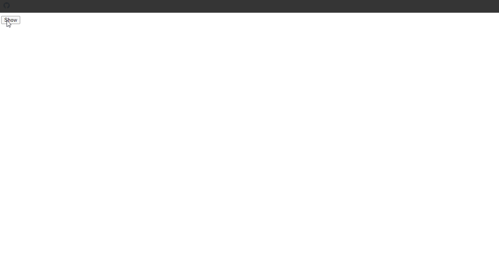

### 3. Toggle () Snippets

### Example 0

#### HTML

```HTML
<!DOCTYPE html>

<html>

    <head>

        <title>This is the title</title>

        <link  rel="stylesheet" type="text/css" href="style.css">

    </head>

<body>

    <input type="button" id="toggle" value="Toggle" />

    <div id="box1"></div>

    <script src="jquery-3.2.1.min.js" type="text/javascript"></script>
    <script src="js.js" type="text/javascript"></script>

</body>

</html>
```

#### CSS

```CSS
#box1 {
    width: 250px;
    height: 250px;
    border: 2px solid black;
    background-color:red;

}
```

#### JavaScript

```JavaScript
$(document).ready(function () {

    $("#toggle").click(function () {

        $("#box1").toggle("slow", "linear", function () {

            alert("Toggle has been finished");
        });
    });
});

//It is almost like hide() and show().
//It does toggle the element form hide to show.
//It takes parameters like hide() and show() speed , effects , callback.
//speed slow, fast milliseconds 1000 = 1 second
//linear
//callback function.
```

### Output

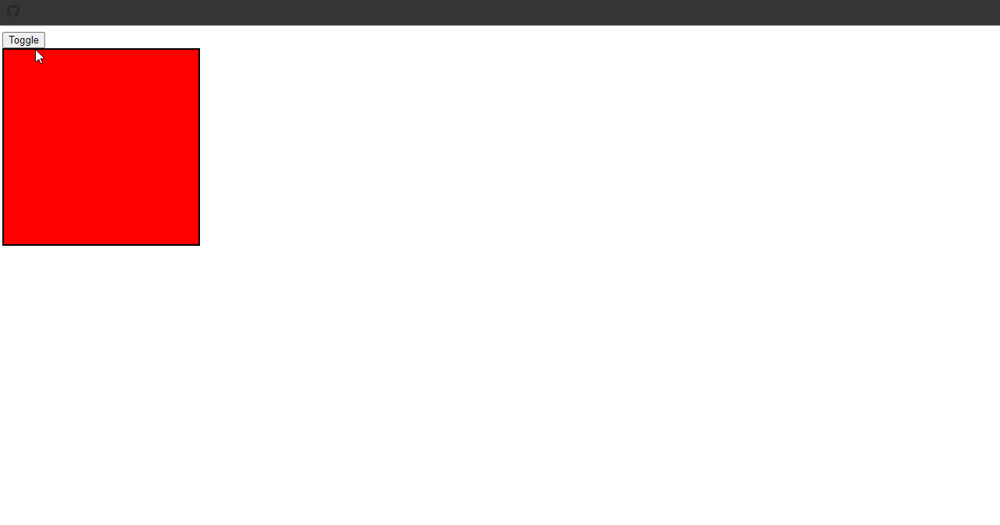

### 4. Fade In () Snippets

### Example 0

#### HTML

```HTML
<!DOCTYPE html>

<html>

    <head>

        <title>This is the title</title>

        <link  rel="stylesheet" type="text/css" href="style.css">

    </head>

<body>

    <input id="fadein" value="FadeIn" type="button"  /><br />

    

    <script src="jquery-3.2.1.min.js" type="text/javascript"></script>
    <script src="js.js" type="text/javascript"></script>

</body>

</html>
```

#### CSS

```CSS
#img1 {
    width:500px;
    height:400px;
    display:none;
}
```

#### JavaScript

```JavaScript
$(function () {

    $("#fadein").click(function () {

        $("#img1").fadeIn(2000, "linear", function () {

            alert("fadeIn() has been completed");
        });

    });

});

//fadeIn() is all most like other effects.
//It takes 3 parameters speed effects callback.
//speed slow , fast milliseconds 1000 =1 second
//effects linear and all/
//callback function.
```

### Output


### 5. Fade Out () Snippets

### Example 0

#### HTML

```HTML
<!DOCTYPE html>

<html>

    <head>

        <title>This is the title</title>

        <link  rel="stylesheet" type="text/css" href="style.css">

    </head>

<body>

    <p><input id="fadeout" type="button"  value="FadeOut"/> <input type="button" id="fadein" value="FadeIn" /> </p>

    <br />

    <h4 id="feedback"></h4>

    <script src="jquery-3.2.1.min.js" type="text/javascript"></script>
    <script src="js.js" type="text/javascript"></script>

</body>

</html>
```

#### CSS

```CSS
#img1 {
    width:500px;
    height:400px;

}
```

#### JavaScript

```JavaScript
$(document).ready(function () {

    $("#fadeout").click(function () {

        $("#img1").fadeOut(2000, "linear", function () {

            $("#feedback").html("The image has been hidden");
        });

    });

    $("#fadein").click(function () {

        $("#img1").fadeIn("slow", "linear", function () {

            $("#feedback").text("The image has been showen");
        });

    });

});

//fadeOut() is same as fadeIn() but it fade outs the element.
//It takes parameters like fadeIn();
//Speed slow fast milliseconds 1000 = 1 second.
//effects linear and all.
//callback
//html() can change the html but text() can only change the text.
```

### Output

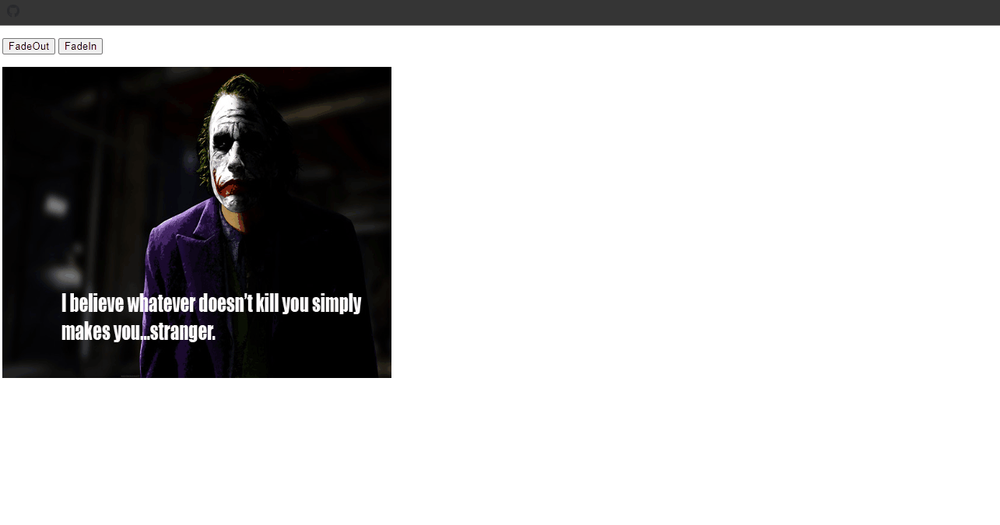

### 6. Fade Toggle () Snippets

### Example 0

#### HTML

```HTML
<!DOCTYPE html>

<html>

    <head>

        <title>This is the title</title>

        <link  rel="stylesheet" type="text/css" href="style.css">

    </head>

<body>

   <p><input type="button" id="inout" value="fadeIn and fadeOut" /></p>

    <br />

    <script src="jquery-3.2.1.min.js" type="text/javascript"></script>
    <script src="js.js" type="text/javascript"></script>

</body>

</html>
```

#### CSS

```CSS
#img1 {
    width:500px;
    height:400px;

}
```

#### JavaScript

```JavaScript
$(function () {

    $("#inout").click(function () {

        $("#img1").fadeToggle(1000, "linear", function () {

            alert("Animation has been completed");
        });

    });

});

//This fade Toggle
//It takes parameter values like fadeIn() and fadeOut().
//speed slow fast milliseconds 1000 = 1 second.
//Animation type (effects) linear and all.
//callback function.
```

### Output

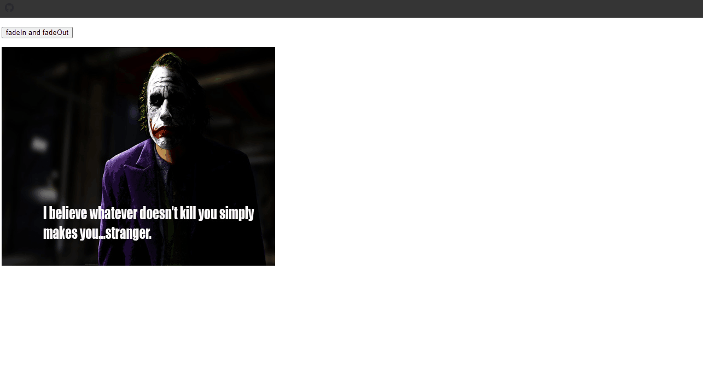

### 7. Fade to () Snippets

### Example 0

#### HTML

```HTML
<!DOCTYPE html>

<html>

    <head>

        <title>This is the title</title>

        <link  rel="stylesheet" type="text/css" href="style.css">

    </head>

<body>

    

    <script src="jquery-3.2.1.min.js" type="text/javascript"></script>
    <script src="js.js" type="text/javascript"></script>

</body>

</html>
```

#### CSS

```CSS
#box1 {

    width:250px;
    height:250px;
    background-color:red;
    border:2px solid black;

}
```

#### JavaScript

```JavaScript
$(document).ready(function () {

    $(".imgs").click(function () {

        $(this).fadeTo("slow", 0.5, function () {//$(this) means current element.

            $(this).css("border", "5px solid red");

        });

    });

});

//The fadeTo() is use to fade an image to a certain opacity.
//It takes 3 parameters speed opacity value callback.
```

### Output

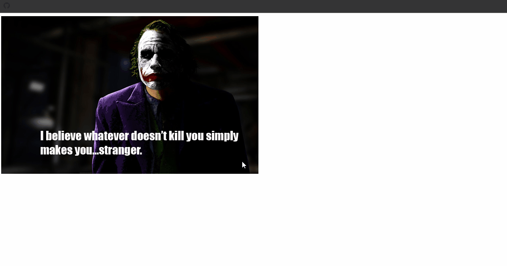

### Example 1

#### HTML

```HTML
<!DOCTYPE html>

<html>

    <head>

        <title>This is the title</title>

        <link  rel="stylesheet" type="text/css" href="style.css">

    </head>

<body>

    
    

    <script src="jquery-3.2.1.min.js" type="text/javascript"></script>
    <script src="js.js" type="text/javascript"></script>

</body>

</html>
```

#### CSS

```CSS
#box1 {

    width:250px;
    height:250px;
    background-color:red;
    border:2px solid black;

}
```

#### JavaScript

```JavaScript
$(function () {

    var speed = 500;

    $(".imgs").css("opacity", 0.5);

    $(".imgs").mouseover(function () {

        $(this).fadeTo(speed, 1) //$(this) means the current element that the user overs it.

        $(".imgs").not(this).fadeTo(speed, 0.4);//not(this) means not apply to the current element.

    });

});

//The fadeTo() is use to fade an image to a certain opacity.
//It takes 3 parameters speed opacity value callback.
```

### Output


### 8. Slide Down () Snippets

### Example 0

#### HTML

```HTML
<!DOCTYPE html>

<html>

    <head>

        <title>This is the title</title>

        <link  rel="stylesheet" type="text/css" href="style.css">

    </head>

<body>

    <div id="loginPage">

        <h3></h3>

    </div>

    <script src="jquery-3.2.1.min.js" type="text/javascript"></script>
    <script src="js.js" type="text/javascript"></script>

</body>

</html>
```

#### CSS

```CSS
#loginPage {

    width:750px;
    height:100px;
    border:2px solid red;
    background-color:black;
    margin-left:auto;
    margin-right:auto;
    color:white;
    font-size:20px;
    text-align:center;
    display:none;

}

body{
margin-top:0;

}
```

#### JavaScript

```JavaScript
$(function () {

    $("#loginPage").slideDown(500, "linear", function () {

        $("#loginPage h3").text("You need to login first if you want to access the website");
    });

});

//The slideDown() almost like fadeIn() but it has a diffrent animation effect.
//It takes 3 parameters values
//Speed slow fast milliseconds 1000 = 1 second
//Animation type linear and all.
//It has a callback function.
```

### Output

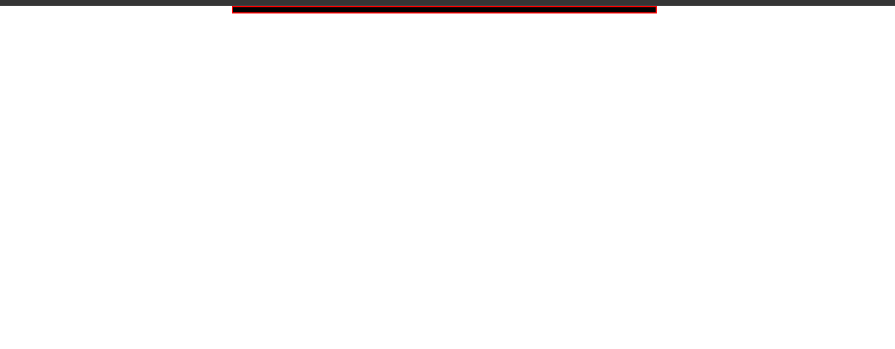

### 9. Slide Up () Snippets

### Example 0

#### HTML

```HTML
<!DOCTYPE html>

<html>

    <head>

        <title>This is the title</title>

        <link  rel="stylesheet" type="text/css" href="style.css">

    </head>

<body>

    <div id="loginPage">

        <h3></h3>
        <a href="#" id="hideMsg">No,Thanks</a>

    </div>

    <script src="jquery-3.2.1.min.js" type="text/javascript"></script>
    <script src="js.js" type="text/javascript"></script>

</body>

</html>
```

#### CSS

```CSS
#loginPage {

    width:750px;
    height:100px;
    border:2px solid red;
    background-color:black;
    margin-left:auto;
    margin-right:auto;
    color:white;
    font-size:20px;
    text-align:center;
    display:none;

}

body{
margin-top:0;

}
```

#### JavaScript

```JavaScript
$(function () {

    var speed = 500;

    $("#loginPage").slideDown(speed, "linear", function () {

        $("#loginPage h3").text("You need to login first if you want to access the website");

    });

    $("#hideMsg").click(function () {

        $("#loginPage").slideUp(speed, "linear", function () {

            alert("Sorry You can't access the website untill you login");

            window.open("www.google.lk", "_self");
        });

    });

});

//The slideUp() is oppasite to slideDown().
//It takes 3 parameters like speed animation type(effects) and callback.
//speed slow fast milliseconds 1000 = 1 second.
//Animation type linear and others
//It has callback function.
```

### Output


### 10. Slide Toggle () Snippets

### Example 0

#### HTML

```HTML
<!DOCTYPE html>

<html>

    <head>

        <title>This is the title</title>

        <link  rel="stylesheet" type="text/css" href="style.css">

    </head>

<body>

    <input id="slidetoggle" type="button" value="SlideToggle" />

    <div id="box1"></div>

    <script src="jquery-3.2.1.min.js" type="text/javascript"></script>
    <script src="js.js" type="text/javascript"></script>

</body>

</html>
```

#### CSS

```CSS
#box1 {

    width:250px;
    height:250px;
    background-color:red;
    border:2px solid black;

}
```

#### JavaScript

```JavaScript
$(document).ready(function () {

    $("#slidetoggle").click(function () {

        $("#box1").slideToggle(600, "linear", function () {

            alert("Finished");
        });

    });

});

//The slideToggle() is same as fadeToggle but diffrent animation.
//It takes 3 parameters like speed slow fast milliseconds 1000 = 1 second
//Animation types linear
//It has a callback function.
```

### Output

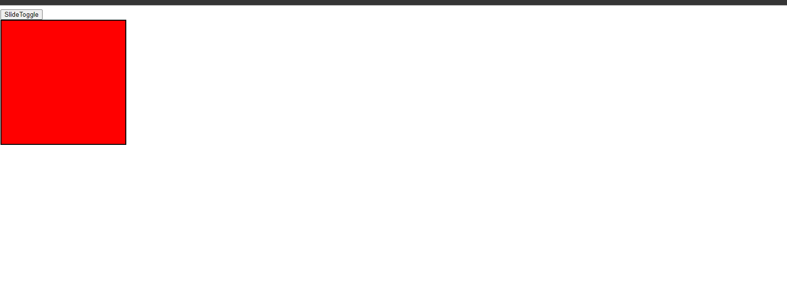

### 11. Stop () Snippets

### Example 0

#### HTML

```HTML
<!DOCTYPE html>

<html>

    <head>

        <title>This is the title</title>

        <link  rel="stylesheet" type="text/css" href="style.css">

    </head>

<body>

    <p><input id="start" type="button" value="Start" /><input id="stop" type="button" value="Stop" /></p>

    <p></p>

    <script src="jquery-3.2.1.min.js" type="text/javascript"></script>
    <script src="js.js" type="text/javascript"></script>

</body>

</html>
```

#### CSS

```CSS
#box1 {

    width:250px;
    height:250px;
    background-color:red;
    border:2px solid black;

}
```

#### JavaScript

```JavaScript
$(document).ready(function () {

    $("#start").click(function () {

        $("#img1").slideToggle(3000);
    });

    $("#stop").click(function () {

        $("#img1").stop();

    });

});

//The stop() keyword is used to stop animations.
```

### Output

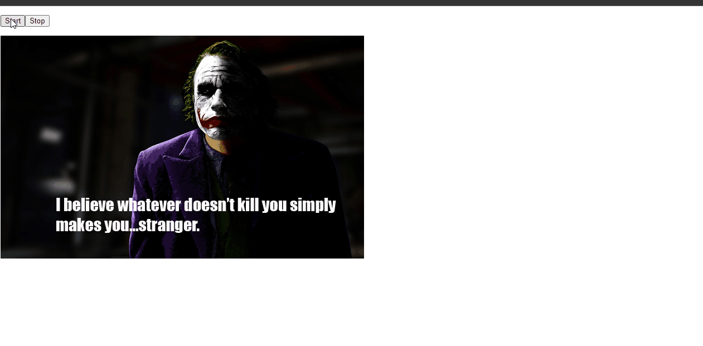

### 12. Delay () Snippets

### Example 0

#### HTML

```HTML
<!DOCTYPE html>

<html>

    <head>

        <title>This is the title</title>

        <link  rel="stylesheet" type="text/css" href="style.css">

    </head>

<body>

  <input id="start" type="button" value="Start" />

    <p id="someText">This is JokerHcker</p>

    <script src="jquery-3.2.1.min.js" type="text/javascript"></script>
    <script src="js.js" type="text/javascript"></script>

</body>

</html>
```

#### CSS

```CSS
#box1 {

    width:250px;
    height:250px;
    background-color:red;
    border:2px solid black;

}
```

#### JavaScript

```JavaScript
$(function () {

    $("#start").click(function () {

        $("#someText").delay(3000).fadeOut();

    });

});

//The delay() function is used to give some certain times to delay the animation.
//delay() takes milliseconds 1000= 1 second.
```

### Output


### Example 0

#### HTML

```HTML

```

#### CSS

```CSS

```

#### JavaScript

```JavaScript

```

### Output


### Example 1

#### HTML

```HTML
<!DOCTYPE html>

<html>

    <head>

        <title>This is the title</title>

        <link  rel="stylesheet" type="text/css" href="style.css">

    </head>

<body>

  <input id="start" type="button" value="Start" />

    <p id="someText">This is JokerHcker</p>

    <script src="jquery-3.2.1.min.js" type="text/javascript"></script>
    <script src="js.js" type="text/javascript"></script>

</body>

</html>
```

#### CSS

```CSS
#box1 {

    width:250px;
    height:250px;
    background-color:red;
    border:2px solid black;

}
```

#### JavaScript

```JavaScript
$(function () {

    $("#start").click(function () {

        $("#someText").fadeOut().delay(3000).fadeIn();

    });

});

//In this example first the element will be disappeared than after 3 seconds it will appaear
//The delay() function is used to give some certain times to delay the animation.
//delay() takes milliseconds 1000= 1 second.
```

### Output

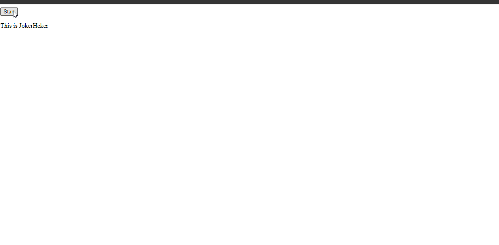

### 13. Resize () Snippets

### Example 0

#### HTML

```HTML
<!DOCTYPE html>

<html>

	<head>

		<title>This is the title</title>

		<link  rel="stylesheet" type="text/css" href="style.css">

	</head>

<body>

    <div id="veryCenter"></div>

	<script src="jquery-3.2.1.min.js" type="text/javascript"></script>
	<script src="js.js" type="text/javascript"></script>

</body>

</html>
```

#### CSS

```CSS
#veryCenter {

    width:250px;
    height:150px;
    background-color:black;
    position:absolute;

}
```

#### JavaScript

```JavaScript
$(document).ready(function () {

    function div_center() {

        var window_height = $(window).height();
        var window_width = $(window).width();

        var obj_height = $("#veryCenter").height();
        var obj_width = $("#veryCenter").width();

        $("#veryCenter").css('top', (window_height / 2) - (obj_height / 2)).css("left", (window_width / 2) - (obj_width / 2));//We got death center of the object by dividing by 2.

    }

     div_center();

     $(window).resize(function () {

         div_center();
     })
});

//We need to subtract the window height and width by object window height and width.
//before this want to divide window height and width and object height and width by 2.
//The resize() events runs everytime when the user resize the page.
//in a nutshall we need get the death center of the objects and window than we subtract them.
```

### Output


## 5. jQuery DOM Manipulation Snippets

### 1. HTML () Snippets

### Example 0

#### HTML

```HTML
<!DOCTYPE html>

<html>

    <head>

        <title>This is the title</title>

        <link  rel="stylesheet" type="text/css" href="style.css">

    </head>

<body>

    <input type="button" value="Copy" id="copy_btn" />

    <p id="copyText"><strong>This is Guna</strong></p>

    <p id="pastePlace"></p>

    <script src="jquery-3.2.1.min.js" type="text/javascript"></script>
    <script src="js.js" type="text/javascript"></script>

</body>

</html>
```

#### JavaScript

```JavaScript
$(document).ready(function () {

    $("#copy_btn").click(function () {

        var text = $("#copyText").html();
        $("#pastePlace").html(text);

    });

});

//The html() function is used to get the html data and change the html data.
//It is almost like innerHTML.
```

### Output


### 2. Text () Snippets

### Example 0

#### HTML

```HTML
<!DOCTYPE html>

<html>

    <head>

        <title>This is the title</title>

        <link  rel="stylesheet" type="text/css" href="style.css">

    </head>

<body>

    <input type="button" value="Copy" id="copy_btn" />

    <p id="copyText"><strong>This is Guna</strong></p>

    <p id="pastePlace"></p>

    <script src="jquery-3.2.1.min.js" type="text/javascript"></script>
    <script src="js.js" type="text/javascript"></script>

</body>

</html>
```

#### JavaScript

```JavaScript
$(document).ready(function () {

    $("#copy_btn").click(function () {

        var text = $("#copyText").text();
        $("#pastePlace").text(text);

    });

});

//in this example text() copied the text data.
//It is quite same as html() but html() copies html() data also but this copies only the text.

```

### Output


### Example 1

#### HTML

```HTML
<!DOCTYPE html>

<html>

    <head>

        <title>This is the title</title>

        <link  rel="stylesheet" type="text/css" href="style.css">

    </head>

<body>

    <p>This is kuna</p>

    <script src="jquery-3.2.1.min.js" type="text/javascript"></script>
    <script src="js.js" type="text/javascript"></script>

</body>

</html>
```

#### CSS

```CSS
.sec {

    color:red;

}
```

#### JavaScript

```JavaScript
$(function () {

    var a = $("p").text();

    alert(a);

});

//text() is equal to innerHTML.
//the p will select all p elements.
//jQuerry uses CSS Selectors.
//element names for element selecting and # for id . for class.
```

### Output


### 3. Val () Snippets

### Example 0

#### HTML

```HTML
<!DOCTYPE html>

<html>

    <head>

        <title>This is the title</title>

        <link  rel="stylesheet" type="text/css" href="style.css">

    </head>

<body>

    <h1 id="k">THis is </h1>

    <input type="text" id="textArea" />

    <div id="place">

    </div>

    <script src="jquery-3.2.1.min.js" type="text/javascript"></script>
    <script src="js.js" type="text/javascript"></script>

</body>

</html>
```

#### CSS

```CSS
#place {

    color:red;
    font-size:18px;

}
```

#### JavaScript

```JavaScript
#place {

    color:red;
    font-size:18px;

}
```

### Output

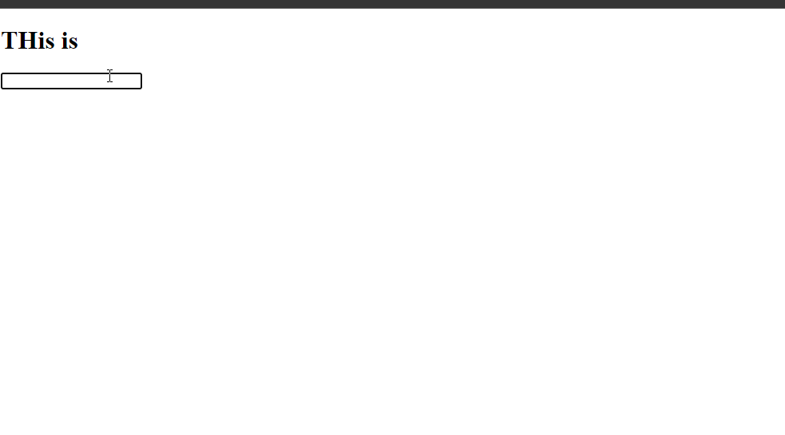

### 4. ATTR () Snippets

### Example 0

#### HTML

```HTML
<!DOCTYPE html>

<html>

    <head>

        <title>This is the title</title>

        <link  rel="stylesheet" type="text/css" href="style.css">

    </head>

<body>

    <input type="button" id="btn"  value="Get the link value"/>

    <a href="http://www.google.lk" target="_blank" id="alink" >Google</a>

    <h1 id="dis"></h1>

    <script src="jquery-3.2.1.min.js" type="text/javascript"></script>
    <script src="js.js" type="text/javascript"></script>

</body>

</html>
```

#### CSS

```CSS
#place {

    color:red;
    font-size:18px;

}
```

#### JavaScript

```JavaScript
$(function () {

    $("#btn").click(function () {

        var hrefVal = $("#alink").attr("href");
        $("#dis").text(hrefVal);

    });

});

//This is the way to get the attributes form an element.
//if you want to change the href you the give the value in this second parameter.
//attr("href", "www.facebook.com");
```

### Output


### Example 1

#### HTML

```HTML
<!DOCTYPE html>

<html>

    <head>

        <title>This is the title</title>

        <link  rel="stylesheet" type="text/css" href="style.css">

    </head>

<body>

    <input type="button" id="btn"  value="Get the link value"/>

    <a href="http://www.google.lk" target="_blank" id="alink" >Google</a>

    <h1 id="dis"></h1>

    <script src="jquery-3.2.1.min.js" type="text/javascript"></script>
    <script src="js.js" type="text/javascript"></script>

</body>

</html>
```

#### CSS

```CSS
#place {

    color:red;
    font-size:18px;

}
```

#### JavaScript

```JavaScript
$(function () {

    $("#btn").click(function () {

        var hrefVal = $("#alink").attr("target","_self");

    });

});

//in this exarple i have changed the target atteribute.
```

### Output

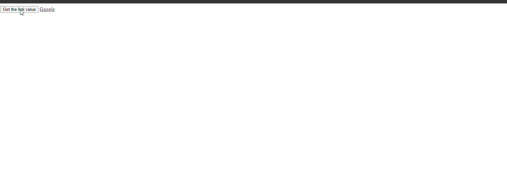

### 5. Add Class () Snippets

### Example 0

#### HTML

```HTML
<!DOCTYPE html>

<html>

    <head>

        <title>This is the title</title>

        <link  rel="stylesheet" type="text/css" href="style.css">

    </head>

<body>

    <input type="button" id="addClassBtn"  value="AddNewClass"/>

    <div id="gta"></div>

    <script src="jquery-3.2.1.min.js" type="text/javascript"></script>
    <script src="js.js" type="text/javascript"></script>

</body>

</html>
```

#### CSS

```CSS
#gta {

    width:250px;
    height:250px;
    border:2px solid black;

}

.newcls {

    background-color:red;
}

.k {
    -moz-border-radius: 50%;
    -webkit-border-radius: 50%;
    border-radius: 50%;
}
```

#### JavaScript

```JavaScript
$(document).ready(function () {

    $("#addClassBtn").click(function () {

        $("#gta").addClass("newcls k");

    });

});

//The addClass() is use to give a class to an element.
//If you want to apply many classes you can apply them by followed by spaces.
//Ex addClass("kuna gta car") 3 classes applied.
```

### Output

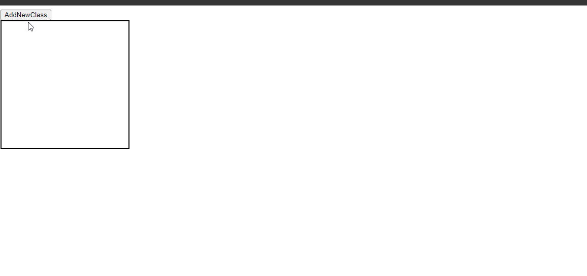

### 6. Remove ATTR () Snippets

### Example 0

#### HTML

```HTML
<!DOCTYPE html>

<html>

    <head>

        <title>This is the title</title>

        <link  rel="stylesheet" type="text/css" href="style.css">

    </head>

<body>

    <input type="button" id="removeCls"  value="Remove Classes"/>

    <p id="para" class="bold heighlited">This is joker</p>

    <script src="jquery-3.2.1.min.js" type="text/javascript"></script>
    <script src="js.js" type="text/javascript"></script>

</body>

</html>
```

#### CSS

```CSS
.heighlited {

    background-color:greenyellow;

}

.bold {

    font-weight:bold;

}
```

#### JavaScript

```JavaScript
$(document).ready(function () {

    $("#removeCls").click(function () {

        $("#para").removeClass("heighlited bold");

    });

});

//removeClass() is used to remove classes form an element.
```

### Output

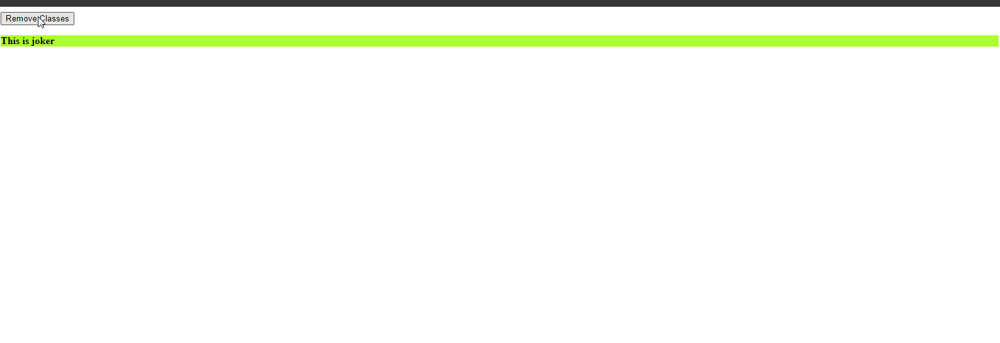

### 7. Toggle Class () Snippets

### Example 0

#### HTML

```HTML
<!DOCTYPE html>

<html>

    <head>

        <title>This is the title</title>

        <link  rel="stylesheet" type="text/css" href="style.css">

    </head>

<body>

    <input type="button" id="swtich" value="SwitchClasses" />

    <h1 id="kuna">This is kuna</h1>

    <script src="jquery-3.2.1.min.js" type="text/javascript"></script>
    <script src="js.js" type="text/javascript"></script>

</body>

</html>
```

#### CSS

```CSS
.high {

    background-color:yellow;

}

.bold{

    font-size:8em;

}
```

#### JavaScript

```JavaScript
$(function () {

    $("#swtich").click(function () {

        $("#kuna").toggleClass("high bold");

    });

});

//toggleClass() is used to toggle classes.
```

### Output

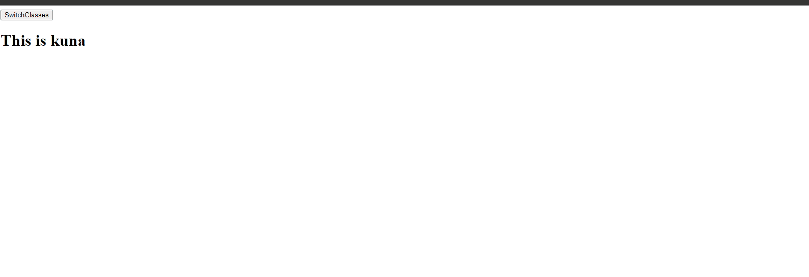

### 8. Remove Class ATTR () Snippets

### Example 0

#### HTML

```HTML
<!DOCTYPE html>

<html>

    <head>

        <title>This is the title</title>

        <link  rel="stylesheet" type="text/css" href="style.css">

    </head>

<body>

  <p><input type="checkbox" id="checked" /> I Agree</p><br />

    <input type="button" value="continue" id="conBtn" disabled="disabled" />

    <script src="jquery-3.2.1.min.js" type="text/javascript"></script>
    <script src="js.js" type="text/javascript"></script>

</body>

</html>
```

#### JavaScript

```JavaScript
$(document).ready(function () {

    $("#checked").click(function () {

        $(this).attr("disabled", "disabled");
        $("#conBtn").removeAttr("disabled");

    });

    $("#conBtn").click(function () {

        window.open("http://www.google.lk", "_self");
    });

});

//removeAttr() is used to remove attributes.
```

### Output


### Example 1

#### HTML

```HTML
<!DOCTYPE html>

<html>

    <head>

        <title>This is the title</title>

        <link  rel="stylesheet" type="text/css" href="style.css">

    </head>

<body>

    <form action="#" enctype="multipart/form-data">

        <input type="file"  />

        <input type="submit"   value="Upload" />

    </form>

    <script src="jquery-3.2.1.min.js" type="text/javascript"></script>
    <script src="js.js" type="text/javascript"></script>

</body>

</html>
```

#### CSS

```CSS
h1 {

    color:red;

}

.heighlited{

    background-color:yellow;
}
```

#### JavaScript

```JavaScript
$(document).ready(function () {

    $("input[type='file']").change(function () {

        $(this).next().removeAttr("disabled");

    }).next().attr("disabled", true);

});

//removeAttr() is used to remove attributes.
//We can also select input family like above input[type='The Type'];
//we have disabled the submit button in jquery.
//if the file change then the submit button will be visible.
//prev() is used to find previous elements.
```

### Output

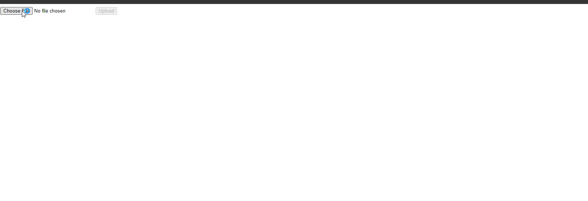

### 9. CSS () Snippets

### Example 0

#### HTML

```HTML
<!DOCTYPE html>

<html>

    <head>

        <title>This is the title</title>

        <link  rel="stylesheet" type="text/css" href="style.css">

    </head>

<body>

    <input type="text" />
    <input type="text" />
    <input type="text" />

    <script src="jquery-3.2.1.min.js" type="text/javascript"></script>
    <script src="js.js" type="text/javascript"></script>

</body>

</html>
```

#### CSS

```CSS
.sec {

    color:red;

}
```

#### JavaScript

```JavaScript
$(document).ready(function () {

    $(":text").focusin(function () {

        $(this).css("background-color", "red");

    });

    $(":text").focusout(function () {

        $(this).css("background-color", "#fff");

    });

});

//The css is used to give css effects to an element.
//The this means the current element.
//we can select all input elements by using this :input.
//If you use :input element all input elements will be selected.
//The : is used to find elements in input family such as :password,:submit,:text:checkbox and all.
```

### Output

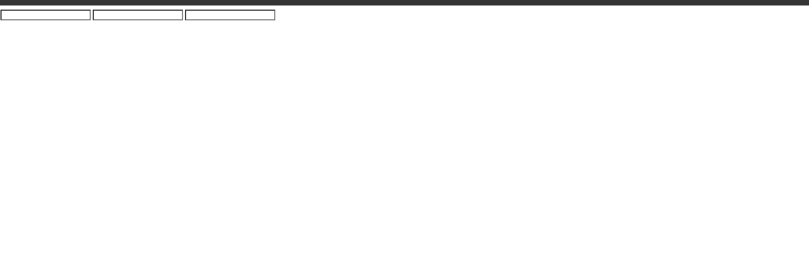

### 10. Has () Snippets

### Example 0

#### HTML

```HTML
<!DOCTYPE html>

<html>

    <head>

        <title>This is the title</title>

        <link  rel="stylesheet" type="text/css" href="style.css">

    </head>

<body>

    <h6>Menu 1</h6>

    <ul id="menu">

    </ul>

    <div id="dis"></div>

    <script src="jquery-3.2.1.min.js" type="text/javascript"></script>
    <script src="js.js" type="text/javascript"></script>

</body>

</html>
```

#### JavaScript

```JavaScript
$(document).ready(function () {

    $("#menu").each(function () {//We loop the #menu

        var this_val = $(this) //in Jquery We must put the $() sign before the this keyword.In here this means ul element.

        if (this_val.has("li").length == 0) {

            this_val.append("Empty element")
        }

    });

});

//this_val.has('li').length==0 means is ul element has no li element run the block of code.
//each() is like loop.It runs all elements in order.
```

### Output


### Example 1

#### HTML

```HTML
<!DOCTYPE html>

<html>

    <head>

        <title>This is the title</title>

        <link  rel="stylesheet" type="text/css" href="style.css">

    </head>

<body>

<h1 id="dos">This is kuna</h1>

    <div id="dis"></div>

    <script src="jquery-3.2.1.min.js" type="text/javascript"></script>
    <script src="js.js" type="text/javascript"></script>

</body>

</html>
```

#### JavaScript

```JavaScript
$(document).ready(function () {

    if ($("#dos").has("kuna")) {

        alert("Yes it has");
    }

});

//The has() element is like :contains();
//The has() checkes weather an element contains certain words or element.
```

### Output


