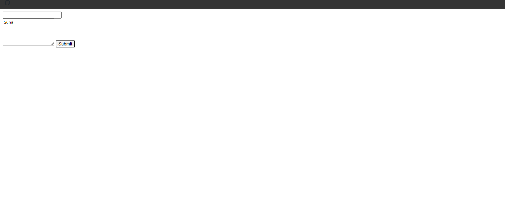
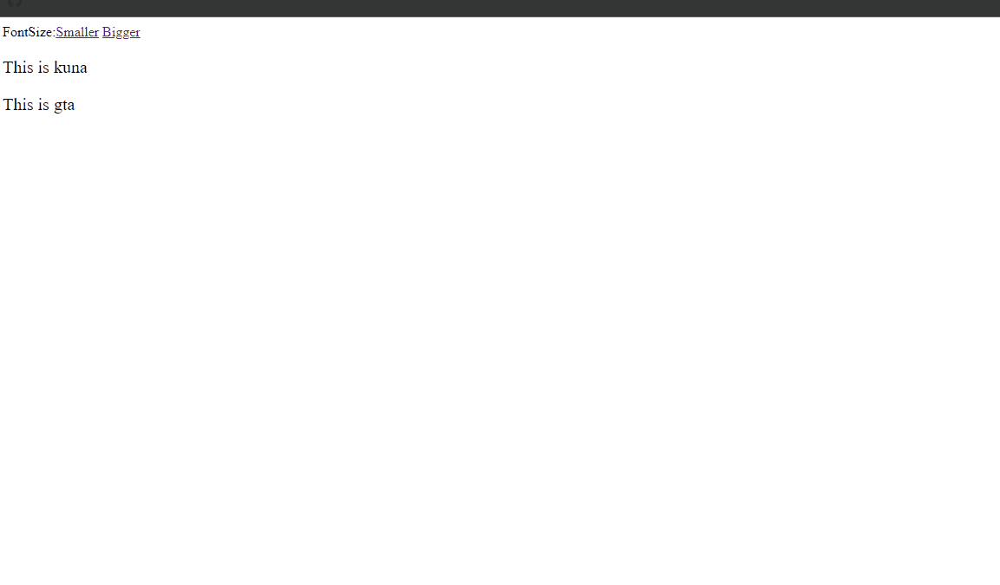

### 6. jQuery Utilities Snippets

### 1. Each () Snippets

### Example 0

#### HTML

```HTML
<!DOCTYPE html>

<html>

    <head>

        <title>This is the title</title>

        <link  rel="stylesheet" type="text/css" href="style.css">

    </head>

<body>

    <p><input type="text" /><input type="text" /><input type="text" /><input type="button" value="Combine" id="combine" /></p>

    <div id="dis"></div>

    <script src="jquery-3.2.1.min.js" type="text/javascript"></script>
    <script src="js.js" type="text/javascript"></script>

</body>

</html>
```

#### JavaScript

```JavaScript
$(document).ready(function () {

    $("#combine").click(function () {
        var values='';

        $("input[type='text']").each(function () {

            values+= $(this).val()+" ";//+= means add everything together.

            $("#dis").text(values);

        });

    });

});

//The each() method runs all elements in order.
//It is like forEach() method in javascript.
```

### Output


### Example 1

#### HTML

```HTML
<!DOCTYPE html>

<html>

    <head>

        <title>This is the title</title>

        <link  rel="stylesheet" type="text/css" href="style.css">

    </head>

<body>

    <div class="btns"></div>
    <div class="btns"></div>
    <div class="btns"></div>

    <div id="dis"></div>

    <script src="jquery-3.2.1.min.js" type="text/javascript"></script>
    <script src="js.js" type="text/javascript"></script>

</body>

</html>
```

#### CSS

```CSS
.btns {

    width:100px;
    height:100px;
    border-radius:50%;
    background-color:red;
    border:2px solid black;
    display:inline-block;
    margin-left:50px;

}

body {

    margin:0;
    padding:0;

}
```

#### JavaScript

```JavaScript
$(function () {

    $(".btns").each(function () {

        $(this).click(function () {

            alert("this is clicked");
        });

    });

});

//The each is like a loop.
```

### Output


### Example 2

#### HTML

```HTML
<!DOCTYPE html>

<html>

    <head>

        <title>This is the title</title>

        <link  rel="stylesheet" type="text/css" href="style.css">

    </head>

<body>

    <p><input type="text" /><input type="text" /><input type="text" /><input type="button" value="Combine" id="combine" /></p>

    <div id="dis"></div>

    <script src="jquery-3.2.1.min.js" type="text/javascript"></script>
    <script src="js.js" type="text/javascript"></script>

</body>

</html>
```

#### JavaScript

```JavaScript
$(document).ready(function () {

    $("#combine").click(function () {

        $("input[type='text']").each(function () {

            var returns = true;

            if ($(this).val() == "") {

                returns = false;
            }

            if (returns == false) {

                $("#dis").text("Fill out all elements");

            } else {

                $("#dis").text("Thanks for filling out")

            }
        });

    });

});

//The each() method takes function
//it runs all elements in order.
//It is like forEach() method in JS.
```

### Output


### Example 3

#### HTML

```HTML
<!DOCTYPE html>

<html>

	<head>

		<title>This is the title</title>

		<link  rel="stylesheet" type="text/css" href="style.css">

	</head>

<body>

    <input id="name" type="text" /> <input id="insert" type="button" value="Insert" />

    <div id="names_list">

    </div>

    <script src="jquery-3.2.1.min.js" type="text/javascript"></script>
    <script src="js.js" type="text/javascript"></script>

</body>

</html>
```

#### JavaScript

```JavaScript
$(document).ready(function () {

    function display_names() {

        $("#names_list").html("");//This line of code removes div contents.

        $.each(names, function (index, value) {

            $("#names_list").append(value +"<br />");
        });

    }

    var names = ["Kuna", "rakulan", "Joker", "Hacker"];
    display_names();

    $("#insert").click(function () {

        var val = $("#name").val();
        names.push(val);
        display_names();

    });

});
```

### Output


### 2. In Array () Snippets

### Example 0

#### HTML

```HTML
<!DOCTYPE html>

<html>

	<head>

		<title>This is the title</title>

		<link  rel="stylesheet" type="text/css" href="style.css">

	</head>

<body>

    <script src="jquery-3.2.1.min.js" type="text/javascript"></script>
    <script src="js.js" type="text/javascript"></script>

</body>

</html>
```

#### JavaScript

```JavaScript
$(document).ready(function () {

    var arrs = ["kuna", "hacker", "joker", "maker"];

    if ($.inArray("kuna", arrs) != "-1") {

        alert("Found");

    } else {

        alert("Not Found");

    }

});

//We can use jQuery instead of $
//inArray is used to check if any element or text exist in the array.
//It is like some() method in Javascipt.
//It returns -1 if it does npt find the value otherwise it returns it's value.
```

### Output


### Example 1

#### HTML

```HTML
<!DOCTYPE html>

<html>

	<head>

		<title>This is the title</title>

		<link  rel="stylesheet" type="text/css" href="style.css">

	</head>

<body>

    <input id="arrs" type="text" /><input id="btn1" type="button" value="Check" />

    <script src="jquery-3.2.1.min.js" type="text/javascript"></script>
    <script src="js.js" type="text/javascript"></script>

</body>

</html>
```

#### JavaScript

```JavaScript
$(document).ready(function () {

    var arrs = ["kuna", "joker", "hacker", "maker", "gta"];
    var arrVal = $("#arrs");

    $("#btn1").click(function () {

        if ($.inArray(arrVal.val(),arrs) != "-1") {

            alert("This is in the array");

        } else {

            alert("This is not in the array");
        }

    });

});

//We can use jQuery intead of $.
//inArray is used to check if any element or text exist in the array.
//It is like some() method in Javascipt.
//It returns -1 if it does npt find the value otherwise it returns it's value.
```

### Output


### Example 2

#### HTML

```HTML
<!DOCTYPE html>

<html>

	<head>

		<title>This is the title</title>

		<link  rel="stylesheet" type="text/css" href="style.css">

	</head>

<body>

    <p><input id="username" type="text" placeholder="Username" />   <input id="password" placeholder="Password" type="password" /></p>

    <p><input id="signIn" type="button" value="Sign In" /></p>

    <script src="jquery-3.2.1.min.js" type="text/javascript"></script>
    <script src="js.js" type="text/javascript"></script>

</body>

</html>
```

#### JavaScript

```JavaScript
$(function () {

    var usernames = ["kuna", "joker", "hacker"];
    var passwords = ["kuna123", "joker123", "hacker123"];

    var theUsername=$("#username");
    var thePassword=$("#password");

    $("#signIn").click(function () {

        if ($.inArray(theUsername.val(), usernames) != "-1" && jQuery.inArray(thePassword.val(),passwords)!="-1") {

            alert("You are loged in");

        } else {

            alert("Something is wrong");

        }

    });

});

//We can use jQuery instead of $
//inArray is used to check if any element or text exist in the array.
//It is like some() method in Javascipt.
//It returns -1 if it does npt find the value otherwise it returns it's value.
```

### Output


### 3. Now () Snippets

### Example 0

#### HTML

```HTML
<!DOCTYPE html>

<html>

	<head>

		<title>This is the title</title>

		<link  rel="stylesheet" type="text/css" href="style.css">

	</head>

<body>

    <div id="time">

    </div>

    <script src="jquery-3.2.1.min.js" type="text/javascript"></script>
    <script src="js.js" type="text/javascript"></script>

</body>

</html>
```

#### JavaScript

```JavaScript
$(document).ready(function () {

    setInterval(function () {

        var timeStamp = $.now();//We can also use jQuery.now().
        $("#time").text(timeStamp);

    }, 1)

});

//now() represents the current time in millisecounds.
```

### Output


### Example 1

#### HTML

```HTML
<!DOCTYPE html>

<html>

	<head>

		<title>This is the title</title>

		<link  rel="stylesheet" type="text/css" href="style.css">

	</head>

<body>

    <div id="time">

    </div>

    <script src="jquery-3.2.1.min.js" type="text/javascript"></script>
    <script src="js.js" type="text/javascript"></script>

</body>

</html>
```

#### JavaScript

```JavaScript
$(document).ready(function () {

    var eventTime = Date.parse('17 june 2017')/1000;//normally it is in milliseconds.we deivied by 1000 now it is changed into secounds.
    var currentTime = Math.floor(jQuery.now() / 1000)//Math.floor() is floor it like 5.4=5 5.6=6.We also divide by 1000.//We can use $ for jQuery.
    var seconds = eventTime - currentTime;//by subtracting eventTime by currentTime we got the remaining time.
    var days = Math.floor(seconds / (60 * 60 * 24));//This the concept of getting the days.
    $("#time").html(days);

});

//Date.parse() method is the javascript method.It parses the date into milliseconds.
//jQuery.now() is returns the current time.
```

### Output


### 7. jQuery AJAX Snippets

### 1. Load () Snippets

### Example 0

#### HTML

```HTML
<!DOCTYPE html>

<html>

	<head>

		<title>This is the title</title>

		<link  rel="stylesheet" type="text/css" href="style.css">

	</head>

<body>

    <input type="button" value="GetThePage" id="btn_click" />

    <div id="conT">

    </div>

    <script src="jquery-3.2.1.min.js" type="text/javascript"></script>
    <script src="js.js" type="text/javascript"></script>

</body>

</html><!DOCTYPE html>

<html>

	<head>

		<title>This is the title</title>

		<link  rel="stylesheet" type="text/css" href="style.css">

	</head>

<body>

    <input type="button" value="GetThePage" id="btn_click" />

    <div id="conT">

    </div>

    <script src="jquery-3.2.1.min.js" type="text/javascript"></script>
    <script src="js.js" type="text/javascript"></script>

</body>

</html>
```

```html
<!DOCTYPE html>
<html>
<head>
    <title></title>
	<meta charset="utf-8" />
</head>
<body>

    <h1>This is an HTML Page</h1>

</body>
</htl>

```

#### JavaScript

```JavaScript
$(document).ready(function () {

    $("#btn_click").click(function () {

        $("#conT").load("page1.html");

    });

});

//The load() is used to load a contant.
//It is an AJAX concept
```

### Output


### Example 1

#### HTML

```HTML
<!DOCTYPE html>

<html>

	<head>

		<title>This is the title</title>

		<link  rel="stylesheet" type="text/css" href="style.css">

	</head>

<body>

    <input type="button" value="GetThePage" id="btn_click" />

    <div id="conT">

    </div>

    <script src="jquery-3.2.1.min.js" type="text/javascript"></script>
    <script src="js.js" type="text/javascript"></script>

</body>

</html>
```

```html
<!DOCTYPE html>
<html>
<head>
    <title></title>
	<meta charset="utf-8" />
</head>
<body>

    <h1>This is an HTML Page</h1>

</body>
</html>
```

#### JavaScript

```JavaScript
$(document).ready(function () {

    $("#btn_click").click(function () {

        $("#conT").load("php1.php");

    });

});

//The load() is used to load a contant.
//It is an AJAX concept
```

#### PHP

```PHP
<?php

for($x=0;$x<=10;$x++){

   echo $x;

}

?>
```

### Output


### Example 2

#### HTML

```HTML
<!DOCTYPE html>

<html>

	<head>

		<title>This is the title</title>

        <link href="style.css" rel="stylesheet" type="text/css" />

	</head>

<body>

    <a class="pages" href="pages/home.html">HomePage</a>
    <a class="pages" href="pages/protflio.html">Protfilo</a>
    <a class="pages" href="pages/contact.html">Contact</a>

    <div id="pageLoader">
    </div>

    <script src="jquery-3.2.1.min.js" type="text/javascript"></script>
    <script src="jquery-ui.min.js" type="text/javascript"></script>
    <script src="slideDown.js" type="text/javascript"></script>
    <script src="js.js" type="text/javascript"></script>

</body>

</html>
```

#### JavaScript

```JavaScript
$(document).ready(function () {

    $("#pageLoader").load($(".pages:first").attr("href"));//This will load the first link as default when the page hsa been loaded.

    $(".pages").click(function () {

        var href = $(this).attr("href");//this is the currently clicked link.
        $("#pageLoader").hide().load(href).fadeIn();//First hide then load the contant and fadeIn().

        return false;//This will prevert the page open in another window.
    });

});

//XAAMP Server wants
```

### Output


### 2. $ Get Post () Snippets

### Example 0

#### HTML

```HTML
<!DOCTYPE html>

<html>

	<head>

		<title>This is the title</title>

		<link  rel="stylesheet" type="text/css" href="style.css">

	</head>

<body>

    <input id="string" type="text" /><input id="sendData" type="button" value="Send" />

    <div id="foo"></div>

    <script src="jquery-3.2.1.min.js" type="text/javascript"></script>
    <script src="js.js" type="text/javascript"></script>

</body>

</html>
```

#### JavaScript

```JavaScript
$(document).ready(function () {

    $("#sendData").click(function () {

        var str = $("#string").val();
        var k="joker"
        $.get('php/reverse.php', { inp: str,inp2:k }, function (data) {//data is the rerutn value form the php

            $("#foo").text(data);
        })

    });

});

//We can use jQuery instead of $.
//$.get() is use to send a data to Specified php file.
//$("php/reverse.php") This means for what php file do we want to send it.
//inp is a variable that we are sending that variable contains string value.,we can send more by ,

//php

//strrev is reverse the string.
//$_GET[] is used to get the value.
```

### Output


### 3. $ Post () Snippets

### Example 0

#### HTML

```HTML
<!DOCTYPE html>

<html>

	<head>

		<title>This is the title</title>

		<link  rel="stylesheet" type="text/css" href="style.css">

	</head>

<body>

    <input id="text1" type="text" /><br />

    <textarea id="text2" rows="5" cols="18"></textarea>

    <input id="subBtn" type="button" value="Submit" />

    <div id="foo"></div>

    <script src="jquery-3.2.1.min.js" type="text/javascript"></script>
    <script src="js.js" type="text/javascript"></script>

</body>

</html>
```

#### JavaScript

```JavaScript
$(function () {

    $("#subBtn").click(function () {

        var name = $("#text1").val();
        var text = $("#text2").val();

        $.post("php/reverse.php", { name: name, text: text }, function (data) {

            $("#foo").html(data);
        });

    });

});

//The differnce between $.get() and $.post() the $.post() is more secure than the $.get().
```

### Output



### 4. $ AJAX () Snippets

### Example 0

#### HTML

```HTML
<!DOCTYPE html>

<html>

	<head>

		<title>This is the title</title>

		<link  rel="stylesheet" type="text/css" href="style.css">

	</head>

<body>

    <input id="load" type="button" value="Load" />

    <div id="content"></div>

    <script src="jquery-3.2.1.min.js" type="text/javascript"></script>
    <script src="js.js" type="text/javascript"></script>

</body>

</html>
```

```HTML
<!DOCTYPE html>
<html>
<head>
    <title></title>
	<meta charset="utf-8" />
</head>
<body>

    <h1>Loaded Ok..</h1>
</body>
</html>
```

#### JavaScript

```JavaScript
$(document).ready(function () {

    $("#load").click(function () {

        $.ajax({

            url: "php1.php",
            success: function (data) {//data is the return value.

                $("#content").html(data);

            }

        });

    });

});

//$.ajax() is same as load() but it has success function.
```

### Output


### Example 1

#### HTML

```HTML
<!DOCTYPE html>

<html>

	<head>

		<title>This is the title</title>

		<link  rel="stylesheet" type="text/css" href="style.css">

	</head>

<body>

    <input id="texts" type="text" /><input id="load" type="button" value="load" />

    <div id="content">

    </div>

    <script src="jquery-3.2.1.min.js" type="text/javascript"></script>
    <script src="js.js" type="text/javascript"></script>

</body>

</html>
```

```JavaScript
$(document).ready(function () {

    $("#load").click(function () {

        var textVal = $("#texts").val();

        $.ajax({

            type:"POST",//This is the type GET or POST
            url: "php/rephp.php",
            data: "text=" + textVal,//text is the attribute that will be used in php like variable.
            success: function (data) {//data is the return value form the server.

                $("#content").html(data);

            }

        }).fail(function () { alert("failed")});//This will execute if it is failed.

    });

});

//ajax is same as load but it has more features.
//POST is more secure than GET.
```

### Output


### Example 2

#### HTML

```HTML
<!DOCTYPE html>

<html>

	<head>

		<title>This is the title</title>

		<link  rel="stylesheet" type="text/css" href="style.css">

	</head>

<body>

    <input id="load" type="button" value="Load" />

    <div id="content"></div>

    <script src="jquery-3.2.1.min.js" type="text/javascript"></script>
    <script src="js.js" type="text/javascript"></script>

</body>

</html>
```

```HTML
<!DOCTYPE html>
<html>
<head>
    <title></title>
	<meta charset="utf-8" />
</head>
<body>

    <h1>Loaded Ok..</h1>
</body>
</html>
```

#### JavaScript

```JavaScript
$(document).ready(function () {

    $("#load").click(function () {

        $.ajax({

            url: 'page.html',//i have put a wrong page
            statusCode:{

                404: function () {

                    $("#content").text("404 Error occured");

                },
                //We can write code for other statusCode by followed by ,

            },

            success: function (data) {

                $("#content").html(data);
            }
        });

    });

});
```

### Output


### 5. Email Validation Snippets

### Example 0

#### HTML

```HTML
<!DOCTYPE html>

<html>

	<head>

		<title>This is the title</title>

		<link  rel="stylesheet" type="text/css" href="style.css">

	</head>

<body>

    <input id="email" type="text" /><span id="email_feedback"></span>

    <script src="jquery-3.2.1.min.js" type="text/javascript"></script>
    <script src="js.js" type="text/javascript"></script>

</body>

</html>
```

#### JavaScript

```JavaScript
$(document).ready(function () {

    function validtaion_email(email) {

        $.post("php/email.php", { email: email }, function (data) {//data is the value that will be return by the email.php
                                                                   // The first email is the attribute or variable that we are sending to the php.
            $("#email_feedback").text(data);

        })

    }

    $("#email").focusin(function () {

        if ($("#email").val() == "") {

            $("#email_feedback").text("Enter your Email");

        } else {

           validtaion_email($("#email").val());
        }

    }).focusout(function () {

        $("#email_feedback").text("");

    }).keyup(function () {

        validtaion_email($("#email").val());

    });

});
```

### Output


### 8. jQuery More Advanced Snippets

### Example 0

#### HTML

```HTML
<!DOCTYPE html>

<html>

    <head>

        <title>This is the title</title>

        <link  rel="stylesheet" type="text/css" href="style.css">

    </head>

<body>

    <input type="button" value="Click" />

    <p>This is Guna</p>

    <script src="jquery-3.2.1.min.js" type="text/javascript"></script>
    <script src="js.js" type="text/javascript"></script>

</body>

</html>
```

#### CSS

```CSS
.sec {

    color:red;

}
```

#### JavaScript

```JavaScript
$(function () {

    $(":button").click(function () {

        $("p:nth-child(2)").css("background-color", "#000").css("color", "#fff").css("position", "relative").css("left", "250px");

    });

});

//in jQuery we can use a chin method.
```

### Output


### Example 1

#### HTML

```HTML
<!DOCTYPE html>

<html>

    <head>

        <title>This is the title</title>

        <link  rel="stylesheet" type="text/css" href="style.css">

    </head>

<body>

    <form action="#">

        <p>Name:<input type="text" placeholder="Enter your name" /></p><br />
        <p>Email:<input type="text" placeholder="Enter your email" /></p><br />
        <input type="button" value="Submit" id="submit_btn" />

    </form>

    <script src="jquery-3.2.1.min.js" type="text/javascript"></script>
    <script src="js.js" type="text/javascript"></script>

</body>

</html>
```

#### CSS

```CSS
h1 {

    color:red;

}

.heighlited{

    background-color:yellow;
}
```

#### JavaScript

```JavaScript
$(function () {

    $(":text").focusin(function () {

        $(this).css("background-color", "yellow");

    });

    $(":text").focusout(function () {

        $(this).css("background-color", "white");

    });

    $(":button").click(function () {

        $(this).attr("value", "Please Wait..");
        $(this).attr("disabled", "true");

    });

});

//We've selected buttons using :button and we've selected text using :text.
//this is current element.
//$(":text") instead of $(this) that will selected all text elements.
//But $(this) will only select the current element.
```

### Output


### Example 2

#### HTML

```HTML
<!DOCTYPE html>

<html>

    <head>

        <title>This is the title</title>

        <link  rel="stylesheet" type="text/css" href="style.css">

    </head>

<body>

   FontSize:<a href="#" id="small">Smaller</a> <a href="#" id="big">Bigger</a>

    <p>This is kuna</p>
    <p>This is gta</p>

    <script src="jquery-3.2.1.min.js" type="text/javascript"></script>
    <script src="js.js" type="text/javascript"></script>

</body>

</html>
```

#### CSS

```CSS
h1 {

    color:red;

}

.heighlited{

    background-color:yellow;
}
```

#### JavaScript

```JavaScript
function fontSizeSystem(ele,size) {

    var curele = parseInt(ele.css("font-size")); //parseInt removes the px form the size then we can easliy increse or decrese the value.
    var sizeNew = 0;

    if (size == "small") {

        sizeNew = curele - 1;

    } else if (size == "big") {

        sizeNew = curele + 1;
    }

    ele.css("font-size", sizeNew + "px");
}

$("#small").click(function () {

    fontSizeSystem($("p"), "small");

});

$("#big").click(function () {

    fontSizeSystem($("p"), "big");

});
```

### Output



### Example 3

#### HTML

```HTML
<!DOCTYPE html>

<html>

    <head>

        <title>This is the title</title>

        <link  rel="stylesheet" type="text/css" href="style.css">

    </head>

<body>

    <textarea id="txtArea" cols="27" rows="7" maxlength="55"></textarea>

    <p id="txtRemaining"></p>

    <script src="jquery-3.2.1.min.js" type="text/javascript"></script>
    <script src="js.js" type="text/javascript"></script>

</body>

</html>
```

#### JavaScript

```JavaScript
$(document).ready(function () {

    var maxLength = document.getElementById("txtArea").getAttribute("maxlength");//we got the max length

    $("#txtRemaining").text("You have " + maxLength + " charaters");

    $("#txtArea").keyup(function () {// when the keyup event fires

        var userValue = $(this).val().length;//This is the user charaters length.

        var remainingCha = maxLength - userValue;

        document.getElementById("txtRemaining").innerHTML = "You have " + remainingCha + " charaters"

    });

});

//in this example i used javascript and jquery together.
```

### Output


### Example 4

#### HTML

```HTML
<!DOCTYPE html>

<html>

    <head>

        <title>This is the title</title>

        <link  rel="stylesheet" type="text/css" href="style.css">

    </head>

<body>

    <a href="#" style="height:10px;" id="hideAndShow">Hide</a>

    <div id="message">

    </div>

    <script src="jquery-3.2.1.min.js" type="text/javascript"></script>
    <script src="js.js" type="text/javascript"></script>

</body>

</html>
```

#### CSS

```CSS
#message {

    width:500px;
    height:300px;
    border:2px solid black;
    overflow:scroll;

}
```

#### JavaScript

```JavaScript
window.onload = function () {

    var para = "This is JokerHacker";

    for (s = 0; s < 100; s++) {

        document.getElementById("message").innerHTML += para;
    }

}

//This is the raw Javascipt code;
//This code copy the same paragraph 100 times in message div.
//+= add togethr.
//= assign

$(function () {

    $("#hideAndShow").click(function () {

        var btnTxt = $("#hideAndShow");
        var txtBox = $("#message");

        if (btnTxt.text() == "Hide") {

            btnTxt.text("Show");
            txtBox.hide("slow");

        } else {

            btnTxt.text("Hide");
            txtBox.show("slow");

        }

    });

});

//This is jquery Code
//text() is same as innerHTML
//hide()  hides elements.Parameters values are "slow,fast or milliseconds 1000 = 1 second";
//show() shows  elements.Parameters values are "slow,fast or milliseconds 1000 = 1 second";
```

### Output


### Example 5

#### HTML

```HTML
<!DOCTYPE html>

<html>

    <head>

        <title>This is the title</title>

        <link  rel="stylesheet" type="text/css" href="style.css">

    </head>

<body>

    <div id="toolTip"></div>

    <a href="http://www.google.lk" class="hoverSystem" hoverText="This is Google search engine">Google</a><br />

    

    <script src="jquery-3.2.1.min.js" type="text/javascript"></script>
    <script src="js.js" type="text/javascript"></script>

</body>

</html>
```

#### CSS

```CSS
#toolTip {

    position:absolute;
    padding:7px;
    font-size:14px;
    color:green;
    border:1px solid red;
    background-color:white;
    display:none;
    z-index:10;

}

#img{

    width:300px;
    height:200px;
    position:relative;
    top:50px;

}
```

#### JavaScript

```JavaScript
$(document).ready(function () {

    $(".hoverSystem").mousemove(function (e) {

        var hoverText = $(this).attr("hoverText");//this returns the current elements atttibutes.

        $("#toolTip").text(hoverText);//put the hoverText
        $("#toolTip").css("top", e.clientY+10).css("left", e.clientX+10);//+10 is for adjecstment.
        $("#toolTip").show("fast");

    }).mouseout(function () {

        $("#toolTip").hide("fast");

    });

});
```

### Output


