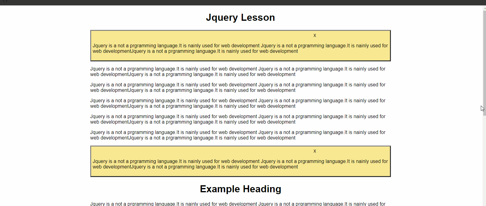

## jQuery Best Tutorials Snippets

### 1. Lesson 1 Snippets

### Example 0

#### HTML

```HTML
<!DOCTYPE html>
<html>
<head>
    <title>This an example</title>

    <link rel="stylesheet" href="jquery-ui.min.css"  type="text/css"/>

    <link href="style.css" rel="stylesheet" type="text/css" />

</head>

<body>


    <h1>Welcome to programming in C++</h1>

    <h1>Example Heading</h1>

    

    <p>Jquery is a not a prgramming language.It is nainly used for web development Jquery is a not a prgramming language.It is nainly used for web developmentJquery is a not a prgramming language.It is nainly used for web development</p>
    <p>Jquery is a not a prgramming language.It is nainly used for web development Jquery is a not a prgramming language.It is nainly used for web developmentJquery is a not a prgramming language.It is nainly used for web development</p>
    <p>Jquery is a not a prgramming language.It is nainly used for web development Jquery is a not a prgramming language.It is nainly used for web developmentJquery is a not a prgramming language.It is nainly used for web development</p>
    <p>Jquery is a not a prgramming language.It is nainly used for web development Jquery is a not a prgramming language.It is nainly used for web developmentJquery is a not a prgramming language.It is nainly used for web development</p>
    <p>Jquery is a not a prgramming language.It is nainly used for web development Jquery is a not a prgramming language.It is nainly used for web developmentJquery is a not a prgramming language.It is nainly used for web development</p>

    <script src="jquery-3.2.1.min.js" type="text/javascript"></script>
    <script src="jquery-ui.min.js" type="text/javascript"></script>
    <script src="js.js" type="text/javascript"></script>
</body>
</html>
```

```HTML
<!DOCTYPE html>

<html>

	<head>

		<title>This is the title</title>

        <link  rel="stylesheet" href="jquery-ui.min.css" type="text/css" />

        <link href="style.css" rel="stylesheet" type="text/css" />

	</head>

<body>

    <main>

        <h1>Jquery Lesson</h1>

        <div id="msgBox1" class="msgBoxes">

            <p>Jquery is a not a prgramming language.It is nainly used for web development Jquery is a not a prgramming language.It is nainly used for web developmentJquery is a not a prgramming language.It is nainly used for web development</p>

        </div>

        <p>Jquery is a not a prgramming language.It is nainly used for web development Jquery is a not a prgramming language.It is nainly used for web developmentJquery is a not a prgramming language.It is nainly used for web development</p>
        <p>Jquery is a not a prgramming language.It is nainly used for web development Jquery is a not a prgramming language.It is nainly used for web developmentJquery is a not a prgramming language.It is nainly used for web development</p>
        <p>Jquery is a not a prgramming language.It is nainly used for web development Jquery is a not a prgramming language.It is nainly used for web developmentJquery is a not a prgramming language.It is nainly used for web development</p>
        <p>Jquery is a not a prgramming language.It is nainly used for web development Jquery is a not a prgramming language.It is nainly used for web developmentJquery is a not a prgramming language.It is nainly used for web development</p>
        <p>Jquery is a not a prgramming language.It is nainly used for web development Jquery is a not a prgramming language.It is nainly used for web developmentJquery is a not a prgramming language.It is nainly used for web development</p>

        <div id="msgBox1" class="msgBoxes">

            <p>Jquery is a not a prgramming language.It is nainly used for web development Jquery is a not a prgramming language.It is nainly used for web developmentJquery is a not a prgramming language.It is nainly used for web development</p>

        </div>

        <h1>Example Heading</h1>

        <p>Jquery is a not a prgramming language.It is nainly used for web development Jquery is a not a prgramming language.It is nainly used for web developmentJquery is a not a prgramming language.It is nainly used for web development</p>
        <p>Jquery is a not a prgramming language.It is nainly used for web development Jquery is a not a prgramming language.It is nainly used for web developmentJquery is a not a prgramming language.It is nainly used for web development</p>
        <p>Jquery is a not a prgramming language.It is nainly used for web development Jquery is a not a prgramming language.It is nainly used for web developmentJquery is a not a prgramming language.It is nainly used for web development</p>
        <p>Jquery is a not a prgramming language.It is nainly used for web development Jquery is a not a prgramming language.It is nainly used for web developmentJquery is a not a prgramming language.It is nainly used for web development</p>
        <p>Jquery is a not a prgramming language.It is nainly used for web development Jquery is a not a prgramming language.It is nainly used for web developmentJquery is a not a prgramming language.It is nainly used for web development</p>

        <div id="msgBox2" class="msgBoxes">

            <p>Jquery is a not a prgramming language.It is nainly used for web development Jquery is a not a prgramming language.It is nainly used for web developmentJquery is a not a prgramming language.It is nainly used for web development</p>

        </div>

        <p>Jquery is a not a prgramming language.It is nainly used for web development Jquery is a not a prgramming language.It is nainly used for web developmentJquery is a not a prgramming language.It is nainly used for web development</p>
        <p>Jquery is a not a prgramming language.It is nainly used for web development Jquery is a not a prgramming language.It is nainly used for web developmentJquery is a not a prgramming language.It is nainly used for web development</p>
        <p>Jquery is a not a prgramming language.It is nainly used for web development Jquery is a not a prgramming language.It is nainly used for web developmentJquery is a not a prgramming language.It is nainly used for web development</p>
        <p>Jquery is a not a prgramming language.It is nainly used for web development Jquery is a not a prgramming language.It is nainly used for web developmentJquery is a not a prgramming language.It is nainly used for web development</p>
        <p>Jquery is a not a prgramming language.It is nainly used for web development Jquery is a not a prgramming language.It is nainly used for web developmentJquery is a not a prgramming language.It is nainly used for web development</p>

        <div id="questionsBox">

            <h2>Frequently Asked Questions</h2>

                <a  class="btns">What if the widget does not function correctly ?</a>

            <div id="ans1" class="ans">

                <p>Jquery is a not a prgramming language.It is nainly used for web development Jquery is a not a prgramming language.It is nainly used for web developmentJquery is a not a prgramming language.It is nainly used for web development</p>

            </div>

                <a class="btns">What if question two is asked ?</a>

            <div id="ans2" class="ans">

                <p>Jquery is a not a prgramming language.It is nainly used for web development Jquery is a not a prgramming language.It is nainly used for web developmentJquery is a not a prgramming language.It is nainly used for web development</p>

            </div>
                <a  class="btns">What if question three is asked ? </a>

            <div id="ans3" class="ans">

                <p>Jquery is a not a prgramming language.It is nainly used for web development Jquery is a not a prgramming language.It is nainly used for web developmentJquery is a not a prgramming language.It is nainly used for web development</p>

            </div>
                <a  class="btns">What if question foue is asked ?</a>

            <div id="ans4" class="ans">

                <p>Jquery is a not a prgramming language.It is nainly used for web development Jquery is a not a prgramming language.It is nainly used for web developmentJquery is a not a prgramming language.It is nainly used for web development</p>

            </div>

        </div>

        <footer>

            <div id="foot">

               <a style="color:blue;cursor:pointer;" id="more"><h3>Learn More</h3></a>

            </div>

        </footer>

    </main>

    <script src="jquery-3.2.1.min.js" type="text/javascript"></script>
    <script src="jquery-ui.min.js" type="text/javascript"></script>

    <script src="js.js" type="text/javascript"></script>

</body>

</html>
```

#### CSS

```CSS
body {

    margin-left:300px;
    margin-right:300px;
    font-family:Arial;

}
.msgBoxes {

    width:auto;
    height:auto;
    padding:5px;
    background-color:#f8e992;
    border:#808080 3px outset;   
    font-family:Arial;

}

#foot {

    width:auto;
    height:auto;
    background-color:#f8e992;
}

#foot h3 {

    text-align:center;
    outline:#808080 3px outset;   

}

#questionsBox a {

   list-style-type:none;
   line-height:50px;
   text-decoration:none;
   color:darkblue;
   font-family:Arial;
   font-weight:bold;
   display:block;
}

.close_x {

   position:relative;
   left:720px;
   font-family:'Gill Sans', 'Gill Sans MT', Calibri, 'Trebuchet MS', sans-serif;
   background-color::#808080;
   color:black;
   padding:2px;
}

    .close_x:hover {

        background-color:gray;
        padding:3px;
        cursor:pointer;

    }

.btns {

    cursor:pointer;

}

h1{

    text-align:center;

}

img {

    height:300px;
    width:300px;
    position:relative;
    left:220px;
}
```

#### JavaScript

```JavaScript
$(document).ready(function () {

    $(".msgBoxes").prepend("<span class='close_x'>X</span>")//I have dynamically added close buttons to all msg boxes.

    $(".close_x").click(function () {//This is click event.

        $(this).parent().fadeOut("slow");//This means the X button.
        //We select the $(this).parent() means the element that contains the x button.

    });

    $(".ans").hide();//i have hidden the answers.

    $(".btns").click(function () {

        $(this).next().slideToggle();//I have selected the element that is next to the btns.and assigned slideToggle() function.

    });

    $("#more").click(function () {

        $("#foot").load("about.html");//load() is used to AJAX Programming.

    });

});

//Xammp is required
```

### Output




### 2. Lesson 2 Snippets

### Example 0

#### HTML

```HTML
<!DOCTYPE html>

<html>

	<head>

		<title>This is the title</title>

        <link  rel="stylesheet" href="jquery-ui.min.css" type="text/css" />

        <link href="style.css" rel="stylesheet" type="text/css" />

	</head>

<body>

    <main>

        <div id="head">

            <h1>Jquery Next Steps</h1>
        </div>

        <div id="body_page">

            <div id="sec1">
                <p>Jquery is a not a prgramming language.It is nainly used for web development Jquery is a not a prgramming language.It is nainly used for web developmentJquery is a not a prgramming language.It is nainly used for web development</p>
                <p>Jquery is a not a prgramming language.It is nainly used for web development Jquery is a not a prgramming language.It is nainly used for web developmentJquery is a not a prgramming language.It is nainly used for web development</p>
                <p>Jquery is a not a prgramming language.It is nainly used for web development Jquery is a not a prgramming language.It is nainly used for web developmentJquery is a not a prgramming language.It is nainly used for web development</p>
                <p>Jquery is a not a prgramming language.It is nainly used for web development Jquery is a not a prgramming language.It is nainly used for web developmentJquery is a not a prgramming language.It is nainly used for web development</p>
                <p>Jquery is a not a prgramming language.It is nainly used for web development Jquery is a not a prgramming language.It is nainly used for web developmentJquery is a not a prgramming language.It is nainly used for web development</p>

                <div id="igm1Div">

                    

                </div>

                <p>Jquery is a not a prgramming language.It is nainly used for web development Jquery is a not a prgramming language.It is nainly used for web developmentJquery is a not a prgramming language.It is nainly used for web development</p>
                <p>Jquery is a not a prgramming language.It is nainly used for web development Jquery is a not a prgramming language.It is nainly used for web developmentJquery is a not a prgramming language.It is nainly used for web development</p>
                <p>Jquery is a not a prgramming language.It is nainly used for web development Jquery is a not a prgramming language.It is nainly used for web developmentJquery is a not a prgramming language.It is nainly used for web development</p>
                <p>Jquery is a not a prgramming language.It is nainly used for web development Jquery is a not a prgramming language.It is nainly used for web developmentJquery is a not a prgramming language.It is nainly used for web development</p>
                <p>Jquery is a not a prgramming language.It is nainly used for web development Jquery is a not a prgramming language.It is nainly used for web developmentJquery is a not a prgramming language.It is nainly used for web development</p>

            </div>

            <div id="sec2">

                <div id="menuBox">
                    <p>Jquery is a not a prgramming language.It is nainly used for web development Jquery is a not a prgramming language.It is nainly used for web developmentJquery is a not a prgramming language.It is nainly used for web development</p>
                    <p>Jquery is a not a prgramming language.It is nainly used for web development Jquery is a not a prgramming language.It is nainly used for web developmentJquery is a not a prgramming language.It is nainly used for web development</p>
                </div>

                <div id="links">

                    <ul>

                        <li><a href="#">List Item One</a></li>
                        <li><a href="#">List Item Two</a></li>
                        <li><a href="#">List Item Three</a></li>
                        <li><a href="#">List Item Four</a></li>
                        <li><a href="#">List item Five</a></li>
                        <li><a href="#">LIst Item Six</a></li>
                    </ul>


                </div>

            </div>

            <div id="sec3">

                <p>Jquery is a not a prgramming language.It is nainly used for web development Jquery is a not a prgramming language.It is nainly used for web developmentJquery is a not a prgramming language.It is nainly used for web development</p>
                <p>Jquery is a not a prgramming language.It is nainly used for web development Jquery is a not a prgramming language.It is nainly used for web developmentJquery is a not a prgramming language.It is nainly used for web development</p>
                <p>Jquery is a not a prgramming language.It is nainly used for web development Jquery is a not a prgramming language.It is nainly used for web developmentJquery is a not a prgramming language.It is nainly used for web development</p>
                <p>Jquery is a not a prgramming language.It is nainly used for web development Jquery is a not a prgramming language.It is nainly used for web developmentJquery is a not a prgramming language.It is nainly used for web development</p>
                <p>Jquery is a not a prgramming language.It is nainly used for web development Jquery is a not a prgramming language.It is nainly used for web developmentJquery is a not a prgramming language.It is nainly used for web development</p>
                <p>Jquery is a not a prgramming language.It is nainly used for web development Jquery is a not a prgramming language.It is nainly used for web developmentJquery is a not a prgramming language.It is nainly used for web development</p>
                <p>Jquery is a not a prgramming language.It is nainly used for web development Jquery is a not a prgramming language.It is nainly used for web developmentJquery is a not a prgramming language.It is nainly used for web development</p>
                <p>Jquery is a not a prgramming language.It is nainly used for web development Jquery is a not a prgramming language.It is nainly used for web developmentJquery is a not a prgramming language.It is nainly used for web development</p>
                <p>Jquery is a not a prgramming language.It is nainly used for web development Jquery is a not a prgramming language.It is nainly used for web developmentJquery is a not a prgramming language.It is nainly used for web development</p>
                <p>Jquery is a not a prgramming language.It is nainly used for web development Jquery is a not a prgramming language.It is nainly used for web developmentJquery is a not a prgramming language.It is nainly used for web development</p>

                <div id="img2Div">

                    

                </div>

            </div>

            <div id="sec4">

                <p>Jquery is a not a prgramming language.It is nainly used for web development Jquery is a not a prgramming language.It is nainly used for web developmentJquery is a not a prgramming language.It is nainly used for web development</p>
                <p>Jquery is a not a prgramming language.It is nainly used for web development Jquery is a not a prgramming language.It is nainly used for web developmentJquery is a not a prgramming language.It is nainly used for web development</p>
                <p>Jquery is a not a prgramming language.It is nainly used for web development Jquery is a not a prgramming language.It is nainly used for web developmentJquery is a not a prgramming language.It is nainly used for web development</p>
                <p>Jquery is a not a prgramming language.It is nainly used for web development Jquery is a not a prgramming language.It is nainly used for web developmentJquery is a not a prgramming language.It is nainly used for web development</p>
                <p>Jquery is a not a prgramming language.It is nainly used for web development Jquery is a not a prgramming language.It is nainly used for web developmentJquery is a not a prgramming language.It is nainly used for web development</p>
                <p>Jquery is a not a prgramming language.It is nainly used for web development Jquery is a not a prgramming language.It is nainly used for web developmentJquery is a not a prgramming language.It is nainly used for web development</p>
                <p>Jquery is a not a prgramming language.It is nainly used for web development Jquery is a not a prgramming language.It is nainly used for web developmentJquery is a not a prgramming language.It is nainly used for web development</p>
                <p>Jquery is a not a prgramming language.It is nainly used for web development Jquery is a not a prgramming language.It is nainly used for web developmentJquery is a not a prgramming language.It is nainly used for web development</p>
                <p>Jquery is a not a prgramming language.It is nainly used for web development Jquery is a not a prgramming language.It is nainly used for web developmentJquery is a not a prgramming language.It is nainly used for web development</p>
                <p>Jquery is a not a prgramming language.It is nainly used for web development Jquery is a not a prgramming language.It is nainly used for web developmentJquery is a not a prgramming language.It is nainly used for web development</p>

                <p>Jquery is a not a prgramming language.It is nainly used for web development Jquery is a not a prgramming language.It is nainly used for web developmentJquery is a not a prgramming language.It is nainly used for web development</p>
                <p>Jquery is a not a prgramming language.It is nainly used for web development Jquery is a not a prgramming language.It is nainly used for web developmentJquery is a not a prgramming language.It is nainly used for web development</p>
                <p>Jquery is a not a prgramming language.It is nainly used for web development Jquery is a not a prgramming language.It is nainly used for web developmentJquery is a not a prgramming language.It is nainly used for web development</p>
                <p>Jquery is a not a prgramming language.It is nainly used for web development Jquery is a not a prgramming language.It is nainly used for web developmentJquery is a not a prgramming language.It is nainly used for web development</p>
                <p>Jquery is a not a prgramming language.It is nainly used for web development Jquery is a not a prgramming language.It is nainly used for web developmentJquery is a not a prgramming language.It is nainly used for web development</p>
                <p>Jquery is a not a prgramming language.It is nainly used for web development Jquery is a not a prgramming language.It is nainly used for web developmentJquery is a not a prgramming language.It is nainly used for web development</p>
                <p>Jquery is a not a prgramming language.It is nainly used for web development Jquery is a not a prgramming language.It is nainly used for web developmentJquery is a not a prgramming language.It is nainly used for web development</p>
                <p>Jquery is a not a prgramming language.It is nainly used for web development Jquery is a not a prgramming language.It is nainly used for web developmentJquery is a not a prgramming language.It is nainly used for web development</p>
                <p>Jquery is a not a prgramming language.It is nainly used for web development Jquery is a not a prgramming language.It is nainly used for web developmentJquery is a not a prgramming language.It is nainly used for web development</p>
                <p>Jquery is a not a prgramming language.It is nainly used for web development Jquery is a not a prgramming language.It is nainly used for web developmentJquery is a not a prgramming language.It is nainly used for web development</p>

                <div id="img3Div">

                    

                </div>

            </div>

            <p>Jquery is a not a prgramming language.It is nainly used for web development Jquery is a not a prgramming language.It is nainly used for web developmentJquery is a not a prgramming language.It is nainly used for web development</p>
            <p>Jquery is a not a prgramming language.It is nainly used for web development Jquery is a not a prgramming language.It is nainly used for web developmentJquery is a not a prgramming language.It is nainly used for web development</p>
            <p>Jquery is a not a prgramming language.It is nainly used for web development Jquery is a not a prgramming language.It is nainly used for web developmentJquery is a not a prgramming language.It is nainly used for web development</p>
            <p>Jquery is a not a prgramming language.It is nainly used for web development Jquery is a not a prgramming language.It is nainly used for web developmentJquery is a not a prgramming language.It is nainly used for web development</p>
            <p>Jquery is a not a prgramming language.It is nainly used for web development Jquery is a not a prgramming language.It is nainly used for web developmentJquery is a not a prgramming language.It is nainly used for web development</p>
            <p>Jquery is a not a prgramming language.It is nainly used for web development Jquery is a not a prgramming language.It is nainly used for web developmentJquery is a not a prgramming language.It is nainly used for web development</p>
            <p>Jquery is a not a prgramming language.It is nainly used for web development Jquery is a not a prgramming language.It is nainly used for web developmentJquery is a not a prgramming language.It is nainly used for web development</p>
            <p>Jquery is a not a prgramming language.It is nainly used for web development Jquery is a not a prgramming language.It is nainly used for web developmentJquery is a not a prgramming language.It is nainly used for web development</p>
            <p>Jquery is a not a prgramming language.It is nainly used for web development Jquery is a not a prgramming language.It is nainly used for web developmentJquery is a not a prgramming language.It is nainly used for web development</p>
            <p>Jquery is a not a prgramming language.It is nainly used for web development Jquery is a not a prgramming language.It is nainly used for web developmentJquery is a not a prgramming language.It is nainly used for web development</p>

        </div>

    </main>

    <script src="jquery-3.2.1.min.js" type="text/javascript"></script>
    <script src="jquery-ui.min.js" type="text/javascript"></script>

    <script src="js.js" type="text/javascript"></script>

</body>

</html>
```

#### CSS

```CSS
body{

    margin-left:250px;
    margin-right:250px;
    font-family:Arial;

}

.imgs {

    width:600px;
    height:450px;
    position:relative;
    margin-left:125px;

}

#head h1{

    text-align:center;

}

#links a {

    text-decoration:none;
    display:block;
    line-height:30px;

}

#links ul li   {

 background-color:#b6f8f8;
 margin-bottom:10px;
 margin-left:10px;
 border:1px solid black;
list-style-type:none;

}

#links{

    width:300px;
    height:auto;
    margin-bottom:100px;
    margin-top:50px;

}

#menuBox {

   height:auto;
   width:260px;
   background-color:#fafa9c;
  float:right;
}
```

#### JavaScript

```JavaScript
$(document).ready(function () {

    $("#img1").css("opacity", 0);
    $("#links").css("opacity", 0);
    $("#menuBox").css("opacity", 0);
    $("#img2").hide();
    $("#img3").hide();

    $(window).scroll(function () {

        var windowScrollTopPostion = $(window).scrollTop();

            if (windowScrollTopPostion > 100 ) {

                $("#img1").animate({
                    "opacity": 1
                }, 600);//300 is the time millisconds

            }

            if (windowScrollTopPostion > 600) {

                $("#links").animate({
                    "opacity":1
                },1000);
                $("#menuBox").animate({
                    "opacity":1
                },600);

            }
            if (windowScrollTopPostion > 1500) {

                $("#img2").fadeIn("slow");
            }

            if (windowScrollTopPostion > 3200) {

                $("#img3").slideDown("slow");
            }

    });

});
```

### Output


### 3. Lesson 3 Snippets

### Example 0

#### HTML

```HTML
<!DOCTYPE html>

<html>

	<head>

		<title>This is the title</title>

        <link  rel="stylesheet" href="jquery-ui.min.css" type="text/css" />

        <link href="style.css" rel="stylesheet" type="text/css" />

	</head>

<body>

    <main>

        <header>

            <h1>Simple Page</h1>

        </header>

        <nav id="menu">

            <ul>

                <li><a href="#">Home</a></li>
                <li><a href="#">About</a></li>
                <li><a href="#">Contact</a></li>
                <li><a href="#">PhP</a></li>
                <li><a href="#">Java</a></li>
                <li><a href="#">Python</a></li>
            </ul>

        </nav>

       <div id="body_div">

           <p>Jquery is a not a prgramming language.It is nainly used for web development Jquery is a not a prgramming language.It is nainly used for web developmentJquery is a not a prgramming language.It is nainly used for web development</p>
           <p>Jquery is a not a prgramming language.It is nainly used for web development Jquery is a not a prgramming language.It is nainly used for web developmentJquery is a not a prgramming language.It is nainly used for web development</p>
           <p>Jquery is a not a prgramming language.It is nainly used for web development Jquery is a not a prgramming language.It is nainly used for web developmentJquery is a not a prgramming language.It is nainly used for web development</p>
           <p>Jquery is a not a prgramming language.It is nainly used for web development Jquery is a not a prgramming language.It is nainly used for web developmentJquery is a not a prgramming language.It is nainly used for web development</p>
           <p>Jquery is a not a prgramming language.It is nainly used for web development Jquery is a not a prgramming language.It is nainly used for web developmentJquery is a not a prgramming language.It is nainly used for web development</p>
           <p>Jquery is a not a prgramming language.It is nainly used for web development Jquery is a not a prgramming language.It is nainly used for web developmentJquery is a not a prgramming language.It is nainly used for web development</p>
           <p>Jquery is a not a prgramming language.It is nainly used for web development Jquery is a not a prgramming language.It is nainly used for web developmentJquery is a not a prgramming language.It is nainly used for web development</p>
           <p>Jquery is a not a prgramming language.It is nainly used for web development Jquery is a not a prgramming language.It is nainly used for web developmentJquery is a not a prgramming language.It is nainly used for web development</p>
           <p>Jquery is a not a prgramming language.It is nainly used for web development Jquery is a not a prgramming language.It is nainly used for web developmentJquery is a not a prgramming language.It is nainly used for web development</p>
           <p>Jquery is a not a prgramming language.It is nainly used for web development Jquery is a not a prgramming language.It is nainly used for web developmentJquery is a not a prgramming language.It is nainly used for web development</p>
           <p>Jquery is a not a prgramming language.It is nainly used for web development Jquery is a not a prgramming language.It is nainly used for web developmentJquery is a not a prgramming language.It is nainly used for web development</p>
           <p>Jquery is a not a prgramming language.It is nainly used for web development Jquery is a not a prgramming language.It is nainly used for web developmentJquery is a not a prgramming language.It is nainly used for web development</p>
           <p>Jquery is a not a prgramming language.It is nainly used for web development Jquery is a not a prgramming language.It is nainly used for web developmentJquery is a not a prgramming language.It is nainly used for web development</p>
           <p>Jquery is a not a prgramming language.It is nainly used for web development Jquery is a not a prgramming language.It is nainly used for web developmentJquery is a not a prgramming language.It is nainly used for web development</p>
           <p>Jquery is a not a prgramming language.It is nainly used for web development Jquery is a not a prgramming language.It is nainly used for web developmentJquery is a not a prgramming language.It is nainly used for web development</p>
           <p>Jquery is a not a prgramming language.It is nainly used for web development Jquery is a not a prgramming language.It is nainly used for web developmentJquery is a not a prgramming language.It is nainly used for web development</p>
           <p>Jquery is a not a prgramming language.It is nainly used for web development Jquery is a not a prgramming language.It is nainly used for web developmentJquery is a not a prgramming language.It is nainly used for web development</p>
           <p>Jquery is a not a prgramming language.It is nainly used for web development Jquery is a not a prgramming language.It is nainly used for web developmentJquery is a not a prgramming language.It is nainly used for web development</p>
           <p>Jquery is a not a prgramming language.It is nainly used for web development Jquery is a not a prgramming language.It is nainly used for web developmentJquery is a not a prgramming language.It is nainly used for web development</p>
           <p>Jquery is a not a prgramming language.It is nainly used for web development Jquery is a not a prgramming language.It is nainly used for web developmentJquery is a not a prgramming language.It is nainly used for web development</p>
           <p>Jquery is a not a prgramming language.It is nainly used for web development Jquery is a not a prgramming language.It is nainly used for web developmentJquery is a not a prgramming language.It is nainly used for web development</p>
           <p>Jquery is a not a prgramming language.It is nainly used for web development Jquery is a not a prgramming language.It is nainly used for web developmentJquery is a not a prgramming language.It is nainly used for web development</p>
           <p>Jquery is a not a prgramming language.It is nainly used for web development Jquery is a not a prgramming language.It is nainly used for web developmentJquery is a not a prgramming language.It is nainly used for web development</p>
           <p>Jquery is a not a prgramming language.It is nainly used for web development Jquery is a not a prgramming language.It is nainly used for web developmentJquery is a not a prgramming language.It is nainly used for web development</p>
           <p>Jquery is a not a prgramming language.It is nainly used for web development Jquery is a not a prgramming language.It is nainly used for web developmentJquery is a not a prgramming language.It is nainly used for web development</p>
           <p>Jquery is a not a prgramming language.It is nainly used for web development Jquery is a not a prgramming language.It is nainly used for web developmentJquery is a not a prgramming language.It is nainly used for web development</p>
           <p>Jquery is a not a prgramming language.It is nainly used for web development Jquery is a not a prgramming language.It is nainly used for web developmentJquery is a not a prgramming language.It is nainly used for web development</p>
           <p>Jquery is a not a prgramming language.It is nainly used for web development Jquery is a not a prgramming language.It is nainly used for web developmentJquery is a not a prgramming language.It is nainly used for web development</p>
           <p>Jquery is a not a prgramming language.It is nainly used for web development Jquery is a not a prgramming language.It is nainly used for web developmentJquery is a not a prgramming language.It is nainly used for web development</p>
           <p>Jquery is a not a prgramming language.It is nainly used for web development Jquery is a not a prgramming language.It is nainly used for web developmentJquery is a not a prgramming language.It is nainly used for web development</p>
           <p>Jquery is a not a prgramming language.It is nainly used for web development Jquery is a not a prgramming language.It is nainly used for web developmentJquery is a not a prgramming language.It is nainly used for web development</p>
           <p>Jquery is a not a prgramming language.It is nainly used for web development Jquery is a not a prgramming language.It is nainly used for web developmentJquery is a not a prgramming language.It is nainly used for web development</p>
           <p>Jquery is a not a prgramming language.It is nainly used for web development Jquery is a not a prgramming language.It is nainly used for web developmentJquery is a not a prgramming language.It is nainly used for web development</p>
           <p>Jquery is a not a prgramming language.It is nainly used for web development Jquery is a not a prgramming language.It is nainly used for web developmentJquery is a not a prgramming language.It is nainly used for web development</p>
           <p>Jquery is a not a prgramming language.It is nainly used for web development Jquery is a not a prgramming language.It is nainly used for web developmentJquery is a not a prgramming language.It is nainly used for web development</p>
           <p>Jquery is a not a prgramming language.It is nainly used for web development Jquery is a not a prgramming language.It is nainly used for web developmentJquery is a not a prgramming language.It is nainly used for web development</p>
           <p>Jquery is a not a prgramming language.It is nainly used for web development Jquery is a not a prgramming language.It is nainly used for web developmentJquery is a not a prgramming language.It is nainly used for web development</p>
           <p>Jquery is a not a prgramming language.It is nainly used for web development Jquery is a not a prgramming language.It is nainly used for web developmentJquery is a not a prgramming language.It is nainly used for web development</p>
           <p>Jquery is a not a prgramming language.It is nainly used for web development Jquery is a not a prgramming language.It is nainly used for web developmentJquery is a not a prgramming language.It is nainly used for web development</p>
           <p>Jquery is a not a prgramming language.It is nainly used for web development Jquery is a not a prgramming language.It is nainly used for web developmentJquery is a not a prgramming language.It is nainly used for web development</p>
           <p>Jquery is a not a prgramming language.It is nainly used for web development Jquery is a not a prgramming language.It is nainly used for web developmentJquery is a not a prgramming language.It is nainly used for web development</p>
           <p>Jquery is a not a prgramming language.It is nainly used for web development Jquery is a not a prgramming language.It is nainly used for web developmentJquery is a not a prgramming language.It is nainly used for web development</p>
           <p>Jquery is a not a prgramming language.It is nainly used for web development Jquery is a not a prgramming language.It is nainly used for web developmentJquery is a not a prgramming language.It is nainly used for web development</p>
           <p>Jquery is a not a prgramming language.It is nainly used for web development Jquery is a not a prgramming language.It is nainly used for web developmentJquery is a not a prgramming language.It is nainly used for web development</p>
           <p>Jquery is a not a prgramming language.It is nainly used for web development Jquery is a not a prgramming language.It is nainly used for web developmentJquery is a not a prgramming language.It is nainly used for web development</p>
           <p>Jquery is a not a prgramming language.It is nainly used for web development Jquery is a not a prgramming language.It is nainly used for web developmentJquery is a not a prgramming language.It is nainly used for web development</p>
           <p>Jquery is a not a prgramming language.It is nainly used for web development Jquery is a not a prgramming language.It is nainly used for web developmentJquery is a not a prgramming language.It is nainly used for web development</p>
           <p>Jquery is a not a prgramming language.It is nainly used for web development Jquery is a not a prgramming language.It is nainly used for web developmentJquery is a not a prgramming language.It is nainly used for web development</p>
           <p>Jquery is a not a prgramming language.It is nainly used for web development Jquery is a not a prgramming language.It is nainly used for web developmentJquery is a not a prgramming language.It is nainly used for web development</p>
           <p>Jquery is a not a prgramming language.It is nainly used for web development Jquery is a not a prgramming language.It is nainly used for web developmentJquery is a not a prgramming language.It is nainly used for web development</p>
           <p>Jquery is a not a prgramming language.It is nainly used for web development Jquery is a not a prgramming language.It is nainly used for web developmentJquery is a not a prgramming language.It is nainly used for web development</p>
           <p>Jquery is a not a prgramming language.It is nainly used for web development Jquery is a not a prgramming language.It is nainly used for web developmentJquery is a not a prgramming language.It is nainly used for web development</p>
           <p>Jquery is a not a prgramming language.It is nainly used for web development Jquery is a not a prgramming language.It is nainly used for web developmentJquery is a not a prgramming language.It is nainly used for web development</p>
           <p>Jquery is a not a prgramming language.It is nainly used for web development Jquery is a not a prgramming language.It is nainly used for web developmentJquery is a not a prgramming language.It is nainly used for web development</p>
           <p>Jquery is a not a prgramming language.It is nainly used for web development Jquery is a not a prgramming language.It is nainly used for web developmentJquery is a not a prgramming language.It is nainly used for web development</p>
           <p>Jquery is a not a prgramming language.It is nainly used for web development Jquery is a not a prgramming language.It is nainly used for web developmentJquery is a not a prgramming language.It is nainly used for web development</p>
           <p>Jquery is a not a prgramming language.It is nainly used for web development Jquery is a not a prgramming language.It is nainly used for web developmentJquery is a not a prgramming language.It is nainly used for web development</p>
           <p>Jquery is a not a prgramming language.It is nainly used for web development Jquery is a not a prgramming language.It is nainly used for web developmentJquery is a not a prgramming language.It is nainly used for web development</p>
           <p>Jquery is a not a prgramming language.It is nainly used for web development Jquery is a not a prgramming language.It is nainly used for web developmentJquery is a not a prgramming language.It is nainly used for web development</p>
           <p>Jquery is a not a prgramming language.It is nainly used for web development Jquery is a not a prgramming language.It is nainly used for web developmentJquery is a not a prgramming language.It is nainly used for web development</p>

       </div>

    </main>

    <script src="jquery-3.2.1.min.js" type="text/javascript"></script>
    <script src="jquery-ui.min.js" type="text/javascript"></script>

    <script src="js.js" type="text/javascript"></script>

</body>

</html>
```

#### CSS

```CSS
body {
     margin-left:300px;
    margin-right:300px;

}

header {

    width:auto;
    height:200px;
    background-color:#89c4ef;
    border:1px solid black;

}
    header h1 {
        text-align:center;
        font-size:30px;
        margin-top:75px;
    }

nav ul li {

    list-style-type:none;
    display:inline;
    padding-left:20px;
    text-transform:uppercase;
    padding:12px;
    margin-left:25px;
    height:10px;
    width:10px;

}

    nav ul li a {

        text-decoration:none;

    }

    nav ul li a:hover{

         background-color:darkgray;
         padding:10px;

    }
nav {
    margin-top:-15px;
    width:auto;
    border:1px solid black;
    height:50px;
    background-color:lightgray;

}

.fixed {

    position:fixed;
    top:0;
  width:750px;

}
```

#### JavaScript

```JavaScript

```

### Output


