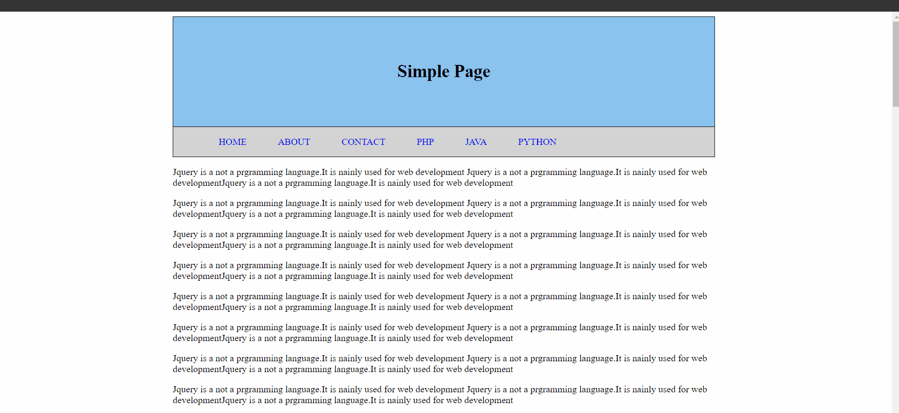
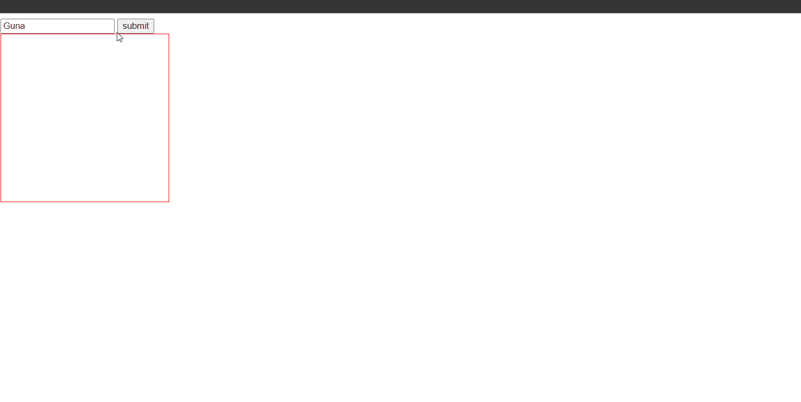

## jQuery Best Tutorials Snippets

### 1. Lesson 1 Snippets

### Example 0

#### HTML

```HTML
<!DOCTYPE html>
<html>
<head>
    <title>This an example</title>

    <link rel="stylesheet" href="jquery-ui.min.css"  type="text/css"/>

    <link href="style.css" rel="stylesheet" type="text/css" />

</head>

<body>


    <h1>Welcome to programming in C++</h1>

    <h1>Example Heading</h1>

    

    <p>Jquery is a not a prgramming language.It is nainly used for web development Jquery is a not a prgramming language.It is nainly used for web developmentJquery is a not a prgramming language.It is nainly used for web development</p>
    <p>Jquery is a not a prgramming language.It is nainly used for web development Jquery is a not a prgramming language.It is nainly used for web developmentJquery is a not a prgramming language.It is nainly used for web development</p>
    <p>Jquery is a not a prgramming language.It is nainly used for web development Jquery is a not a prgramming language.It is nainly used for web developmentJquery is a not a prgramming language.It is nainly used for web development</p>
    <p>Jquery is a not a prgramming language.It is nainly used for web development Jquery is a not a prgramming language.It is nainly used for web developmentJquery is a not a prgramming language.It is nainly used for web development</p>
    <p>Jquery is a not a prgramming language.It is nainly used for web development Jquery is a not a prgramming language.It is nainly used for web developmentJquery is a not a prgramming language.It is nainly used for web development</p>

    <script src="jquery-3.2.1.min.js" type="text/javascript"></script>
    <script src="jquery-ui.min.js" type="text/javascript"></script>
    <script src="js.js" type="text/javascript"></script>
</body>
</html>
```

```HTML
<!DOCTYPE html>

<html>

	<head>

		<title>This is the title</title>

        <link  rel="stylesheet" href="jquery-ui.min.css" type="text/css" />

        <link href="style.css" rel="stylesheet" type="text/css" />

	</head>

<body>

    <main>

        <h1>Jquery Lesson</h1>

        <div id="msgBox1" class="msgBoxes">

            <p>Jquery is a not a prgramming language.It is nainly used for web development Jquery is a not a prgramming language.It is nainly used for web developmentJquery is a not a prgramming language.It is nainly used for web development</p>

        </div>

        <p>Jquery is a not a prgramming language.It is nainly used for web development Jquery is a not a prgramming language.It is nainly used for web developmentJquery is a not a prgramming language.It is nainly used for web development</p>
        <p>Jquery is a not a prgramming language.It is nainly used for web development Jquery is a not a prgramming language.It is nainly used for web developmentJquery is a not a prgramming language.It is nainly used for web development</p>
        <p>Jquery is a not a prgramming language.It is nainly used for web development Jquery is a not a prgramming language.It is nainly used for web developmentJquery is a not a prgramming language.It is nainly used for web development</p>
        <p>Jquery is a not a prgramming language.It is nainly used for web development Jquery is a not a prgramming language.It is nainly used for web developmentJquery is a not a prgramming language.It is nainly used for web development</p>
        <p>Jquery is a not a prgramming language.It is nainly used for web development Jquery is a not a prgramming language.It is nainly used for web developmentJquery is a not a prgramming language.It is nainly used for web development</p>

        <div id="msgBox1" class="msgBoxes">

            <p>Jquery is a not a prgramming language.It is nainly used for web development Jquery is a not a prgramming language.It is nainly used for web developmentJquery is a not a prgramming language.It is nainly used for web development</p>

        </div>

        <h1>Example Heading</h1>

        <p>Jquery is a not a prgramming language.It is nainly used for web development Jquery is a not a prgramming language.It is nainly used for web developmentJquery is a not a prgramming language.It is nainly used for web development</p>
        <p>Jquery is a not a prgramming language.It is nainly used for web development Jquery is a not a prgramming language.It is nainly used for web developmentJquery is a not a prgramming language.It is nainly used for web development</p>
        <p>Jquery is a not a prgramming language.It is nainly used for web development Jquery is a not a prgramming language.It is nainly used for web developmentJquery is a not a prgramming language.It is nainly used for web development</p>
        <p>Jquery is a not a prgramming language.It is nainly used for web development Jquery is a not a prgramming language.It is nainly used for web developmentJquery is a not a prgramming language.It is nainly used for web development</p>
        <p>Jquery is a not a prgramming language.It is nainly used for web development Jquery is a not a prgramming language.It is nainly used for web developmentJquery is a not a prgramming language.It is nainly used for web development</p>

        <div id="msgBox2" class="msgBoxes">

            <p>Jquery is a not a prgramming language.It is nainly used for web development Jquery is a not a prgramming language.It is nainly used for web developmentJquery is a not a prgramming language.It is nainly used for web development</p>

        </div>

        <p>Jquery is a not a prgramming language.It is nainly used for web development Jquery is a not a prgramming language.It is nainly used for web developmentJquery is a not a prgramming language.It is nainly used for web development</p>
        <p>Jquery is a not a prgramming language.It is nainly used for web development Jquery is a not a prgramming language.It is nainly used for web developmentJquery is a not a prgramming language.It is nainly used for web development</p>
        <p>Jquery is a not a prgramming language.It is nainly used for web development Jquery is a not a prgramming language.It is nainly used for web developmentJquery is a not a prgramming language.It is nainly used for web development</p>
        <p>Jquery is a not a prgramming language.It is nainly used for web development Jquery is a not a prgramming language.It is nainly used for web developmentJquery is a not a prgramming language.It is nainly used for web development</p>
        <p>Jquery is a not a prgramming language.It is nainly used for web development Jquery is a not a prgramming language.It is nainly used for web developmentJquery is a not a prgramming language.It is nainly used for web development</p>

        <div id="questionsBox">

            <h2>Frequently Asked Questions</h2>

                <a  class="btns">What if the widget does not function correctly ?</a>

            <div id="ans1" class="ans">

                <p>Jquery is a not a prgramming language.It is nainly used for web development Jquery is a not a prgramming language.It is nainly used for web developmentJquery is a not a prgramming language.It is nainly used for web development</p>

            </div>

                <a class="btns">What if question two is asked ?</a>

            <div id="ans2" class="ans">

                <p>Jquery is a not a prgramming language.It is nainly used for web development Jquery is a not a prgramming language.It is nainly used for web developmentJquery is a not a prgramming language.It is nainly used for web development</p>

            </div>
                <a  class="btns">What if question three is asked ? </a>

            <div id="ans3" class="ans">

                <p>Jquery is a not a prgramming language.It is nainly used for web development Jquery is a not a prgramming language.It is nainly used for web developmentJquery is a not a prgramming language.It is nainly used for web development</p>

            </div>
                <a  class="btns">What if question foue is asked ?</a>

            <div id="ans4" class="ans">

                <p>Jquery is a not a prgramming language.It is nainly used for web development Jquery is a not a prgramming language.It is nainly used for web developmentJquery is a not a prgramming language.It is nainly used for web development</p>

            </div>

        </div>

        <footer>

            <div id="foot">

               <a style="color:blue;cursor:pointer;" id="more"><h3>Learn More</h3></a>

            </div>

        </footer>

    </main>

    <script src="jquery-3.2.1.min.js" type="text/javascript"></script>
    <script src="jquery-ui.min.js" type="text/javascript"></script>

    <script src="js.js" type="text/javascript"></script>

</body>

</html>
```

#### CSS

```CSS
body {

    margin-left:300px;
    margin-right:300px;
    font-family:Arial;

}
.msgBoxes {

    width:auto;
    height:auto;
    padding:5px;
    background-color:#f8e992;
    border:#808080 3px outset;   
    font-family:Arial;

}

#foot {

    width:auto;
    height:auto;
    background-color:#f8e992;
}

#foot h3 {

    text-align:center;
    outline:#808080 3px outset;   

}

#questionsBox a {

   list-style-type:none;
   line-height:50px;
   text-decoration:none;
   color:darkblue;
   font-family:Arial;
   font-weight:bold;
   display:block;
}

.close_x {

   position:relative;
   left:720px;
   font-family:'Gill Sans', 'Gill Sans MT', Calibri, 'Trebuchet MS', sans-serif;
   background-color::#808080;
   color:black;
   padding:2px;
}

    .close_x:hover {

        background-color:gray;
        padding:3px;
        cursor:pointer;

    }

.btns {

    cursor:pointer;

}

h1{

    text-align:center;

}

img {

    height:300px;
    width:300px;
    position:relative;
    left:220px;
}
```

#### JavaScript

```JavaScript
$(document).ready(function () {

    $(".msgBoxes").prepend("<span class='close_x'>X</span>")//I have dynamically added close buttons to all msg boxes.

    $(".close_x").click(function () {//This is click event.

        $(this).parent().fadeOut("slow");//This means the X button.
        //We select the $(this).parent() means the element that contains the x button.

    });

    $(".ans").hide();//i have hidden the answers.

    $(".btns").click(function () {

        $(this).next().slideToggle();//I have selected the element that is next to the btns.and assigned slideToggle() function.

    });

    $("#more").click(function () {

        $("#foot").load("about.html");//load() is used to AJAX Programming.

    });

});

//Xammp is required
```

### Output


### 2. Lesson 2 Snippets

### Example 0

#### HTML

```HTML
<!DOCTYPE html>

<html>

	<head>

		<title>This is the title</title>

        <link  rel="stylesheet" href="jquery-ui.min.css" type="text/css" />

        <link href="style.css" rel="stylesheet" type="text/css" />

	</head>

<body>

    <main>

        <div id="head">

            <h1>Jquery Next Steps</h1>
        </div>

        <div id="body_page">

            <div id="sec1">
                <p>Jquery is a not a prgramming language.It is nainly used for web development Jquery is a not a prgramming language.It is nainly used for web developmentJquery is a not a prgramming language.It is nainly used for web development</p>
                <p>Jquery is a not a prgramming language.It is nainly used for web development Jquery is a not a prgramming language.It is nainly used for web developmentJquery is a not a prgramming language.It is nainly used for web development</p>
                <p>Jquery is a not a prgramming language.It is nainly used for web development Jquery is a not a prgramming language.It is nainly used for web developmentJquery is a not a prgramming language.It is nainly used for web development</p>
                <p>Jquery is a not a prgramming language.It is nainly used for web development Jquery is a not a prgramming language.It is nainly used for web developmentJquery is a not a prgramming language.It is nainly used for web development</p>
                <p>Jquery is a not a prgramming language.It is nainly used for web development Jquery is a not a prgramming language.It is nainly used for web developmentJquery is a not a prgramming language.It is nainly used for web development</p>

                <div id="igm1Div">

                    

                </div>

                <p>Jquery is a not a prgramming language.It is nainly used for web development Jquery is a not a prgramming language.It is nainly used for web developmentJquery is a not a prgramming language.It is nainly used for web development</p>
                <p>Jquery is a not a prgramming language.It is nainly used for web development Jquery is a not a prgramming language.It is nainly used for web developmentJquery is a not a prgramming language.It is nainly used for web development</p>
                <p>Jquery is a not a prgramming language.It is nainly used for web development Jquery is a not a prgramming language.It is nainly used for web developmentJquery is a not a prgramming language.It is nainly used for web development</p>
                <p>Jquery is a not a prgramming language.It is nainly used for web development Jquery is a not a prgramming language.It is nainly used for web developmentJquery is a not a prgramming language.It is nainly used for web development</p>
                <p>Jquery is a not a prgramming language.It is nainly used for web development Jquery is a not a prgramming language.It is nainly used for web developmentJquery is a not a prgramming language.It is nainly used for web development</p>

            </div>

            <div id="sec2">

                <div id="menuBox">
                    <p>Jquery is a not a prgramming language.It is nainly used for web development Jquery is a not a prgramming language.It is nainly used for web developmentJquery is a not a prgramming language.It is nainly used for web development</p>
                    <p>Jquery is a not a prgramming language.It is nainly used for web development Jquery is a not a prgramming language.It is nainly used for web developmentJquery is a not a prgramming language.It is nainly used for web development</p>
                </div>

                <div id="links">

                    <ul>

                        <li><a href="#">List Item One</a></li>
                        <li><a href="#">List Item Two</a></li>
                        <li><a href="#">List Item Three</a></li>
                        <li><a href="#">List Item Four</a></li>
                        <li><a href="#">List item Five</a></li>
                        <li><a href="#">LIst Item Six</a></li>
                    </ul>


                </div>

            </div>

            <div id="sec3">

                <p>Jquery is a not a prgramming language.It is nainly used for web development Jquery is a not a prgramming language.It is nainly used for web developmentJquery is a not a prgramming language.It is nainly used for web development</p>
                <p>Jquery is a not a prgramming language.It is nainly used for web development Jquery is a not a prgramming language.It is nainly used for web developmentJquery is a not a prgramming language.It is nainly used for web development</p>
                <p>Jquery is a not a prgramming language.It is nainly used for web development Jquery is a not a prgramming language.It is nainly used for web developmentJquery is a not a prgramming language.It is nainly used for web development</p>
                <p>Jquery is a not a prgramming language.It is nainly used for web development Jquery is a not a prgramming language.It is nainly used for web developmentJquery is a not a prgramming language.It is nainly used for web development</p>
                <p>Jquery is a not a prgramming language.It is nainly used for web development Jquery is a not a prgramming language.It is nainly used for web developmentJquery is a not a prgramming language.It is nainly used for web development</p>
                <p>Jquery is a not a prgramming language.It is nainly used for web development Jquery is a not a prgramming language.It is nainly used for web developmentJquery is a not a prgramming language.It is nainly used for web development</p>
                <p>Jquery is a not a prgramming language.It is nainly used for web development Jquery is a not a prgramming language.It is nainly used for web developmentJquery is a not a prgramming language.It is nainly used for web development</p>
                <p>Jquery is a not a prgramming language.It is nainly used for web development Jquery is a not a prgramming language.It is nainly used for web developmentJquery is a not a prgramming language.It is nainly used for web development</p>
                <p>Jquery is a not a prgramming language.It is nainly used for web development Jquery is a not a prgramming language.It is nainly used for web developmentJquery is a not a prgramming language.It is nainly used for web development</p>
                <p>Jquery is a not a prgramming language.It is nainly used for web development Jquery is a not a prgramming language.It is nainly used for web developmentJquery is a not a prgramming language.It is nainly used for web development</p>

                <div id="img2Div">

                    

                </div>

            </div>

            <div id="sec4">

                <p>Jquery is a not a prgramming language.It is nainly used for web development Jquery is a not a prgramming language.It is nainly used for web developmentJquery is a not a prgramming language.It is nainly used for web development</p>
                <p>Jquery is a not a prgramming language.It is nainly used for web development Jquery is a not a prgramming language.It is nainly used for web developmentJquery is a not a prgramming language.It is nainly used for web development</p>
                <p>Jquery is a not a prgramming language.It is nainly used for web development Jquery is a not a prgramming language.It is nainly used for web developmentJquery is a not a prgramming language.It is nainly used for web development</p>
                <p>Jquery is a not a prgramming language.It is nainly used for web development Jquery is a not a prgramming language.It is nainly used for web developmentJquery is a not a prgramming language.It is nainly used for web development</p>
                <p>Jquery is a not a prgramming language.It is nainly used for web development Jquery is a not a prgramming language.It is nainly used for web developmentJquery is a not a prgramming language.It is nainly used for web development</p>
                <p>Jquery is a not a prgramming language.It is nainly used for web development Jquery is a not a prgramming language.It is nainly used for web developmentJquery is a not a prgramming language.It is nainly used for web development</p>
                <p>Jquery is a not a prgramming language.It is nainly used for web development Jquery is a not a prgramming language.It is nainly used for web developmentJquery is a not a prgramming language.It is nainly used for web development</p>
                <p>Jquery is a not a prgramming language.It is nainly used for web development Jquery is a not a prgramming language.It is nainly used for web developmentJquery is a not a prgramming language.It is nainly used for web development</p>
                <p>Jquery is a not a prgramming language.It is nainly used for web development Jquery is a not a prgramming language.It is nainly used for web developmentJquery is a not a prgramming language.It is nainly used for web development</p>
                <p>Jquery is a not a prgramming language.It is nainly used for web development Jquery is a not a prgramming language.It is nainly used for web developmentJquery is a not a prgramming language.It is nainly used for web development</p>

                <p>Jquery is a not a prgramming language.It is nainly used for web development Jquery is a not a prgramming language.It is nainly used for web developmentJquery is a not a prgramming language.It is nainly used for web development</p>
                <p>Jquery is a not a prgramming language.It is nainly used for web development Jquery is a not a prgramming language.It is nainly used for web developmentJquery is a not a prgramming language.It is nainly used for web development</p>
                <p>Jquery is a not a prgramming language.It is nainly used for web development Jquery is a not a prgramming language.It is nainly used for web developmentJquery is a not a prgramming language.It is nainly used for web development</p>
                <p>Jquery is a not a prgramming language.It is nainly used for web development Jquery is a not a prgramming language.It is nainly used for web developmentJquery is a not a prgramming language.It is nainly used for web development</p>
                <p>Jquery is a not a prgramming language.It is nainly used for web development Jquery is a not a prgramming language.It is nainly used for web developmentJquery is a not a prgramming language.It is nainly used for web development</p>
                <p>Jquery is a not a prgramming language.It is nainly used for web development Jquery is a not a prgramming language.It is nainly used for web developmentJquery is a not a prgramming language.It is nainly used for web development</p>
                <p>Jquery is a not a prgramming language.It is nainly used for web development Jquery is a not a prgramming language.It is nainly used for web developmentJquery is a not a prgramming language.It is nainly used for web development</p>
                <p>Jquery is a not a prgramming language.It is nainly used for web development Jquery is a not a prgramming language.It is nainly used for web developmentJquery is a not a prgramming language.It is nainly used for web development</p>
                <p>Jquery is a not a prgramming language.It is nainly used for web development Jquery is a not a prgramming language.It is nainly used for web developmentJquery is a not a prgramming language.It is nainly used for web development</p>
                <p>Jquery is a not a prgramming language.It is nainly used for web development Jquery is a not a prgramming language.It is nainly used for web developmentJquery is a not a prgramming language.It is nainly used for web development</p>

                <div id="img3Div">

                    

                </div>

            </div>

            <p>Jquery is a not a prgramming language.It is nainly used for web development Jquery is a not a prgramming language.It is nainly used for web developmentJquery is a not a prgramming language.It is nainly used for web development</p>
            <p>Jquery is a not a prgramming language.It is nainly used for web development Jquery is a not a prgramming language.It is nainly used for web developmentJquery is a not a prgramming language.It is nainly used for web development</p>
            <p>Jquery is a not a prgramming language.It is nainly used for web development Jquery is a not a prgramming language.It is nainly used for web developmentJquery is a not a prgramming language.It is nainly used for web development</p>
            <p>Jquery is a not a prgramming language.It is nainly used for web development Jquery is a not a prgramming language.It is nainly used for web developmentJquery is a not a prgramming language.It is nainly used for web development</p>
            <p>Jquery is a not a prgramming language.It is nainly used for web development Jquery is a not a prgramming language.It is nainly used for web developmentJquery is a not a prgramming language.It is nainly used for web development</p>
            <p>Jquery is a not a prgramming language.It is nainly used for web development Jquery is a not a prgramming language.It is nainly used for web developmentJquery is a not a prgramming language.It is nainly used for web development</p>
            <p>Jquery is a not a prgramming language.It is nainly used for web development Jquery is a not a prgramming language.It is nainly used for web developmentJquery is a not a prgramming language.It is nainly used for web development</p>
            <p>Jquery is a not a prgramming language.It is nainly used for web development Jquery is a not a prgramming language.It is nainly used for web developmentJquery is a not a prgramming language.It is nainly used for web development</p>
            <p>Jquery is a not a prgramming language.It is nainly used for web development Jquery is a not a prgramming language.It is nainly used for web developmentJquery is a not a prgramming language.It is nainly used for web development</p>
            <p>Jquery is a not a prgramming language.It is nainly used for web development Jquery is a not a prgramming language.It is nainly used for web developmentJquery is a not a prgramming language.It is nainly used for web development</p>

        </div>

    </main>

    <script src="jquery-3.2.1.min.js" type="text/javascript"></script>
    <script src="jquery-ui.min.js" type="text/javascript"></script>

    <script src="js.js" type="text/javascript"></script>

</body>

</html>
```

#### CSS

```CSS
body{

    margin-left:250px;
    margin-right:250px;
    font-family:Arial;

}

.imgs {

    width:600px;
    height:450px;
    position:relative;
    margin-left:125px;

}

#head h1{

    text-align:center;

}

#links a {

    text-decoration:none;
    display:block;
    line-height:30px;

}

#links ul li   {

 background-color:#b6f8f8;
 margin-bottom:10px;
 margin-left:10px;
 border:1px solid black;
list-style-type:none;

}

#links{

    width:300px;
    height:auto;
    margin-bottom:100px;
    margin-top:50px;

}

#menuBox {

   height:auto;
   width:260px;
   background-color:#fafa9c;
  float:right;
}
```

#### JavaScript

```JavaScript
$(document).ready(function () {

    $("#img1").css("opacity", 0);
    $("#links").css("opacity", 0);
    $("#menuBox").css("opacity", 0);
    $("#img2").hide();
    $("#img3").hide();

    $(window).scroll(function () {

        var windowScrollTopPostion = $(window).scrollTop();

            if (windowScrollTopPostion > 100 ) {

                $("#img1").animate({
                    "opacity": 1
                }, 600);//300 is the time millisconds

            }

            if (windowScrollTopPostion > 600) {

                $("#links").animate({
                    "opacity":1
                },1000);
                $("#menuBox").animate({
                    "opacity":1
                },600);

            }
            if (windowScrollTopPostion > 1500) {

                $("#img2").fadeIn("slow");
            }

            if (windowScrollTopPostion > 3200) {

                $("#img3").slideDown("slow");
            }

    });

});
```

### Output


### 3. Lesson 3 Snippets

### Example 0

#### HTML

```HTML
<!DOCTYPE html>

<html>

	<head>

		<title>This is the title</title>

        <link  rel="stylesheet" href="jquery-ui.min.css" type="text/css" />

        <link href="style.css" rel="stylesheet" type="text/css" />

	</head>

<body>

    <main>

        <header>

            <h1>Simple Page</h1>

        </header>

        <nav id="menu">

            <ul>

                <li><a href="#">Home</a></li>
                <li><a href="#">About</a></li>
                <li><a href="#">Contact</a></li>
                <li><a href="#">PhP</a></li>
                <li><a href="#">Java</a></li>
                <li><a href="#">Python</a></li>
            </ul>

        </nav>

       <div id="body_div">

           <p>Jquery is a not a prgramming language.It is nainly used for web development Jquery is a not a prgramming language.It is nainly used for web developmentJquery is a not a prgramming language.It is nainly used for web development</p>
           <p>Jquery is a not a prgramming language.It is nainly used for web development Jquery is a not a prgramming language.It is nainly used for web developmentJquery is a not a prgramming language.It is nainly used for web development</p>
           <p>Jquery is a not a prgramming language.It is nainly used for web development Jquery is a not a prgramming language.It is nainly used for web developmentJquery is a not a prgramming language.It is nainly used for web development</p>
           <p>Jquery is a not a prgramming language.It is nainly used for web development Jquery is a not a prgramming language.It is nainly used for web developmentJquery is a not a prgramming language.It is nainly used for web development</p>
           <p>Jquery is a not a prgramming language.It is nainly used for web development Jquery is a not a prgramming language.It is nainly used for web developmentJquery is a not a prgramming language.It is nainly used for web development</p>
           <p>Jquery is a not a prgramming language.It is nainly used for web development Jquery is a not a prgramming language.It is nainly used for web developmentJquery is a not a prgramming language.It is nainly used for web development</p>
           <p>Jquery is a not a prgramming language.It is nainly used for web development Jquery is a not a prgramming language.It is nainly used for web developmentJquery is a not a prgramming language.It is nainly used for web development</p>
           <p>Jquery is a not a prgramming language.It is nainly used for web development Jquery is a not a prgramming language.It is nainly used for web developmentJquery is a not a prgramming language.It is nainly used for web development</p>
           <p>Jquery is a not a prgramming language.It is nainly used for web development Jquery is a not a prgramming language.It is nainly used for web developmentJquery is a not a prgramming language.It is nainly used for web development</p>
           <p>Jquery is a not a prgramming language.It is nainly used for web development Jquery is a not a prgramming language.It is nainly used for web developmentJquery is a not a prgramming language.It is nainly used for web development</p>
           <p>Jquery is a not a prgramming language.It is nainly used for web development Jquery is a not a prgramming language.It is nainly used for web developmentJquery is a not a prgramming language.It is nainly used for web development</p>
           <p>Jquery is a not a prgramming language.It is nainly used for web development Jquery is a not a prgramming language.It is nainly used for web developmentJquery is a not a prgramming language.It is nainly used for web development</p>
           <p>Jquery is a not a prgramming language.It is nainly used for web development Jquery is a not a prgramming language.It is nainly used for web developmentJquery is a not a prgramming language.It is nainly used for web development</p>
           <p>Jquery is a not a prgramming language.It is nainly used for web development Jquery is a not a prgramming language.It is nainly used for web developmentJquery is a not a prgramming language.It is nainly used for web development</p>
           <p>Jquery is a not a prgramming language.It is nainly used for web development Jquery is a not a prgramming language.It is nainly used for web developmentJquery is a not a prgramming language.It is nainly used for web development</p>
           <p>Jquery is a not a prgramming language.It is nainly used for web development Jquery is a not a prgramming language.It is nainly used for web developmentJquery is a not a prgramming language.It is nainly used for web development</p>
           <p>Jquery is a not a prgramming language.It is nainly used for web development Jquery is a not a prgramming language.It is nainly used for web developmentJquery is a not a prgramming language.It is nainly used for web development</p>
           <p>Jquery is a not a prgramming language.It is nainly used for web development Jquery is a not a prgramming language.It is nainly used for web developmentJquery is a not a prgramming language.It is nainly used for web development</p>
           <p>Jquery is a not a prgramming language.It is nainly used for web development Jquery is a not a prgramming language.It is nainly used for web developmentJquery is a not a prgramming language.It is nainly used for web development</p>
           <p>Jquery is a not a prgramming language.It is nainly used for web development Jquery is a not a prgramming language.It is nainly used for web developmentJquery is a not a prgramming language.It is nainly used for web development</p>
           <p>Jquery is a not a prgramming language.It is nainly used for web development Jquery is a not a prgramming language.It is nainly used for web developmentJquery is a not a prgramming language.It is nainly used for web development</p>
           <p>Jquery is a not a prgramming language.It is nainly used for web development Jquery is a not a prgramming language.It is nainly used for web developmentJquery is a not a prgramming language.It is nainly used for web development</p>
           <p>Jquery is a not a prgramming language.It is nainly used for web development Jquery is a not a prgramming language.It is nainly used for web developmentJquery is a not a prgramming language.It is nainly used for web development</p>
           <p>Jquery is a not a prgramming language.It is nainly used for web development Jquery is a not a prgramming language.It is nainly used for web developmentJquery is a not a prgramming language.It is nainly used for web development</p>
           <p>Jquery is a not a prgramming language.It is nainly used for web development Jquery is a not a prgramming language.It is nainly used for web developmentJquery is a not a prgramming language.It is nainly used for web development</p>
           <p>Jquery is a not a prgramming language.It is nainly used for web development Jquery is a not a prgramming language.It is nainly used for web developmentJquery is a not a prgramming language.It is nainly used for web development</p>
           <p>Jquery is a not a prgramming language.It is nainly used for web development Jquery is a not a prgramming language.It is nainly used for web developmentJquery is a not a prgramming language.It is nainly used for web development</p>
           <p>Jquery is a not a prgramming language.It is nainly used for web development Jquery is a not a prgramming language.It is nainly used for web developmentJquery is a not a prgramming language.It is nainly used for web development</p>
           <p>Jquery is a not a prgramming language.It is nainly used for web development Jquery is a not a prgramming language.It is nainly used for web developmentJquery is a not a prgramming language.It is nainly used for web development</p>
           <p>Jquery is a not a prgramming language.It is nainly used for web development Jquery is a not a prgramming language.It is nainly used for web developmentJquery is a not a prgramming language.It is nainly used for web development</p>
           <p>Jquery is a not a prgramming language.It is nainly used for web development Jquery is a not a prgramming language.It is nainly used for web developmentJquery is a not a prgramming language.It is nainly used for web development</p>
           <p>Jquery is a not a prgramming language.It is nainly used for web development Jquery is a not a prgramming language.It is nainly used for web developmentJquery is a not a prgramming language.It is nainly used for web development</p>
           <p>Jquery is a not a prgramming language.It is nainly used for web development Jquery is a not a prgramming language.It is nainly used for web developmentJquery is a not a prgramming language.It is nainly used for web development</p>
           <p>Jquery is a not a prgramming language.It is nainly used for web development Jquery is a not a prgramming language.It is nainly used for web developmentJquery is a not a prgramming language.It is nainly used for web development</p>
           <p>Jquery is a not a prgramming language.It is nainly used for web development Jquery is a not a prgramming language.It is nainly used for web developmentJquery is a not a prgramming language.It is nainly used for web development</p>
           <p>Jquery is a not a prgramming language.It is nainly used for web development Jquery is a not a prgramming language.It is nainly used for web developmentJquery is a not a prgramming language.It is nainly used for web development</p>
           <p>Jquery is a not a prgramming language.It is nainly used for web development Jquery is a not a prgramming language.It is nainly used for web developmentJquery is a not a prgramming language.It is nainly used for web development</p>
           <p>Jquery is a not a prgramming language.It is nainly used for web development Jquery is a not a prgramming language.It is nainly used for web developmentJquery is a not a prgramming language.It is nainly used for web development</p>
           <p>Jquery is a not a prgramming language.It is nainly used for web development Jquery is a not a prgramming language.It is nainly used for web developmentJquery is a not a prgramming language.It is nainly used for web development</p>
           <p>Jquery is a not a prgramming language.It is nainly used for web development Jquery is a not a prgramming language.It is nainly used for web developmentJquery is a not a prgramming language.It is nainly used for web development</p>
           <p>Jquery is a not a prgramming language.It is nainly used for web development Jquery is a not a prgramming language.It is nainly used for web developmentJquery is a not a prgramming language.It is nainly used for web development</p>
           <p>Jquery is a not a prgramming language.It is nainly used for web development Jquery is a not a prgramming language.It is nainly used for web developmentJquery is a not a prgramming language.It is nainly used for web development</p>
           <p>Jquery is a not a prgramming language.It is nainly used for web development Jquery is a not a prgramming language.It is nainly used for web developmentJquery is a not a prgramming language.It is nainly used for web development</p>
           <p>Jquery is a not a prgramming language.It is nainly used for web development Jquery is a not a prgramming language.It is nainly used for web developmentJquery is a not a prgramming language.It is nainly used for web development</p>
           <p>Jquery is a not a prgramming language.It is nainly used for web development Jquery is a not a prgramming language.It is nainly used for web developmentJquery is a not a prgramming language.It is nainly used for web development</p>
           <p>Jquery is a not a prgramming language.It is nainly used for web development Jquery is a not a prgramming language.It is nainly used for web developmentJquery is a not a prgramming language.It is nainly used for web development</p>
           <p>Jquery is a not a prgramming language.It is nainly used for web development Jquery is a not a prgramming language.It is nainly used for web developmentJquery is a not a prgramming language.It is nainly used for web development</p>
           <p>Jquery is a not a prgramming language.It is nainly used for web development Jquery is a not a prgramming language.It is nainly used for web developmentJquery is a not a prgramming language.It is nainly used for web development</p>
           <p>Jquery is a not a prgramming language.It is nainly used for web development Jquery is a not a prgramming language.It is nainly used for web developmentJquery is a not a prgramming language.It is nainly used for web development</p>
           <p>Jquery is a not a prgramming language.It is nainly used for web development Jquery is a not a prgramming language.It is nainly used for web developmentJquery is a not a prgramming language.It is nainly used for web development</p>
           <p>Jquery is a not a prgramming language.It is nainly used for web development Jquery is a not a prgramming language.It is nainly used for web developmentJquery is a not a prgramming language.It is nainly used for web development</p>
           <p>Jquery is a not a prgramming language.It is nainly used for web development Jquery is a not a prgramming language.It is nainly used for web developmentJquery is a not a prgramming language.It is nainly used for web development</p>
           <p>Jquery is a not a prgramming language.It is nainly used for web development Jquery is a not a prgramming language.It is nainly used for web developmentJquery is a not a prgramming language.It is nainly used for web development</p>
           <p>Jquery is a not a prgramming language.It is nainly used for web development Jquery is a not a prgramming language.It is nainly used for web developmentJquery is a not a prgramming language.It is nainly used for web development</p>
           <p>Jquery is a not a prgramming language.It is nainly used for web development Jquery is a not a prgramming language.It is nainly used for web developmentJquery is a not a prgramming language.It is nainly used for web development</p>
           <p>Jquery is a not a prgramming language.It is nainly used for web development Jquery is a not a prgramming language.It is nainly used for web developmentJquery is a not a prgramming language.It is nainly used for web development</p>
           <p>Jquery is a not a prgramming language.It is nainly used for web development Jquery is a not a prgramming language.It is nainly used for web developmentJquery is a not a prgramming language.It is nainly used for web development</p>
           <p>Jquery is a not a prgramming language.It is nainly used for web development Jquery is a not a prgramming language.It is nainly used for web developmentJquery is a not a prgramming language.It is nainly used for web development</p>
           <p>Jquery is a not a prgramming language.It is nainly used for web development Jquery is a not a prgramming language.It is nainly used for web developmentJquery is a not a prgramming language.It is nainly used for web development</p>
           <p>Jquery is a not a prgramming language.It is nainly used for web development Jquery is a not a prgramming language.It is nainly used for web developmentJquery is a not a prgramming language.It is nainly used for web development</p>

       </div>

    </main>

    <script src="jquery-3.2.1.min.js" type="text/javascript"></script>
    <script src="jquery-ui.min.js" type="text/javascript"></script>

    <script src="js.js" type="text/javascript"></script>

</body>

</html>
```

#### CSS

```CSS
body {
     margin-left:300px;
    margin-right:300px;

}

header {

    width:auto;
    height:200px;
    background-color:#89c4ef;
    border:1px solid black;

}
    header h1 {
        text-align:center;
        font-size:30px;
        margin-top:75px;
    }

nav ul li {

    list-style-type:none;
    display:inline;
    padding-left:20px;
    text-transform:uppercase;
    padding:12px;
    margin-left:25px;
    height:10px;
    width:10px;

}

    nav ul li a {

        text-decoration:none;

    }

    nav ul li a:hover{

         background-color:darkgray;
         padding:10px;

    }
nav {
    margin-top:-15px;
    width:auto;
    border:1px solid black;
    height:50px;
    background-color:lightgray;

}

.fixed {

    position:fixed;
    top:0;
  width:750px;

}
```

#### JavaScript

```JavaScript

```

### Output


### 3. Lesson 3 Snippets

### Example 0

#### HTML

```HTML
<!DOCTYPE html>

<html>

	<head>

		<title>This is the title</title>

        <link  rel="stylesheet" href="jquery-ui.min.css" type="text/css" />

        <link href="style.css" rel="stylesheet" type="text/css" />

	</head>

<body>

    <main>

        <header>

            <h1>Simple Page</h1>

        </header>

        <nav id="menu">

            <ul>

                <li><a href="#">Home</a></li>
                <li><a href="#">About</a></li>
                <li><a href="#">Contact</a></li>
                <li><a href="#">PhP</a></li>
                <li><a href="#">Java</a></li>
                <li><a href="#">Python</a></li>
            </ul>

        </nav>

       <div id="body_div">

           <p>Jquery is a not a prgramming language.It is nainly used for web development Jquery is a not a prgramming language.It is nainly used for web developmentJquery is a not a prgramming language.It is nainly used for web development</p>
           <p>Jquery is a not a prgramming language.It is nainly used for web development Jquery is a not a prgramming language.It is nainly used for web developmentJquery is a not a prgramming language.It is nainly used for web development</p>
           <p>Jquery is a not a prgramming language.It is nainly used for web development Jquery is a not a prgramming language.It is nainly used for web developmentJquery is a not a prgramming language.It is nainly used for web development</p>
           <p>Jquery is a not a prgramming language.It is nainly used for web development Jquery is a not a prgramming language.It is nainly used for web developmentJquery is a not a prgramming language.It is nainly used for web development</p>
           <p>Jquery is a not a prgramming language.It is nainly used for web development Jquery is a not a prgramming language.It is nainly used for web developmentJquery is a not a prgramming language.It is nainly used for web development</p>
           <p>Jquery is a not a prgramming language.It is nainly used for web development Jquery is a not a prgramming language.It is nainly used for web developmentJquery is a not a prgramming language.It is nainly used for web development</p>
           <p>Jquery is a not a prgramming language.It is nainly used for web development Jquery is a not a prgramming language.It is nainly used for web developmentJquery is a not a prgramming language.It is nainly used for web development</p>
           <p>Jquery is a not a prgramming language.It is nainly used for web development Jquery is a not a prgramming language.It is nainly used for web developmentJquery is a not a prgramming language.It is nainly used for web development</p>
           <p>Jquery is a not a prgramming language.It is nainly used for web development Jquery is a not a prgramming language.It is nainly used for web developmentJquery is a not a prgramming language.It is nainly used for web development</p>
           <p>Jquery is a not a prgramming language.It is nainly used for web development Jquery is a not a prgramming language.It is nainly used for web developmentJquery is a not a prgramming language.It is nainly used for web development</p>
           <p>Jquery is a not a prgramming language.It is nainly used for web development Jquery is a not a prgramming language.It is nainly used for web developmentJquery is a not a prgramming language.It is nainly used for web development</p>
           <p>Jquery is a not a prgramming language.It is nainly used for web development Jquery is a not a prgramming language.It is nainly used for web developmentJquery is a not a prgramming language.It is nainly used for web development</p>
           <p>Jquery is a not a prgramming language.It is nainly used for web development Jquery is a not a prgramming language.It is nainly used for web developmentJquery is a not a prgramming language.It is nainly used for web development</p>
           <p>Jquery is a not a prgramming language.It is nainly used for web development Jquery is a not a prgramming language.It is nainly used for web developmentJquery is a not a prgramming language.It is nainly used for web development</p>
           <p>Jquery is a not a prgramming language.It is nainly used for web development Jquery is a not a prgramming language.It is nainly used for web developmentJquery is a not a prgramming language.It is nainly used for web development</p>
           <p>Jquery is a not a prgramming language.It is nainly used for web development Jquery is a not a prgramming language.It is nainly used for web developmentJquery is a not a prgramming language.It is nainly used for web development</p>
           <p>Jquery is a not a prgramming language.It is nainly used for web development Jquery is a not a prgramming language.It is nainly used for web developmentJquery is a not a prgramming language.It is nainly used for web development</p>
           <p>Jquery is a not a prgramming language.It is nainly used for web development Jquery is a not a prgramming language.It is nainly used for web developmentJquery is a not a prgramming language.It is nainly used for web development</p>
           <p>Jquery is a not a prgramming language.It is nainly used for web development Jquery is a not a prgramming language.It is nainly used for web developmentJquery is a not a prgramming language.It is nainly used for web development</p>
           <p>Jquery is a not a prgramming language.It is nainly used for web development Jquery is a not a prgramming language.It is nainly used for web developmentJquery is a not a prgramming language.It is nainly used for web development</p>
           <p>Jquery is a not a prgramming language.It is nainly used for web development Jquery is a not a prgramming language.It is nainly used for web developmentJquery is a not a prgramming language.It is nainly used for web development</p>
           <p>Jquery is a not a prgramming language.It is nainly used for web development Jquery is a not a prgramming language.It is nainly used for web developmentJquery is a not a prgramming language.It is nainly used for web development</p>
           <p>Jquery is a not a prgramming language.It is nainly used for web development Jquery is a not a prgramming language.It is nainly used for web developmentJquery is a not a prgramming language.It is nainly used for web development</p>
           <p>Jquery is a not a prgramming language.It is nainly used for web development Jquery is a not a prgramming language.It is nainly used for web developmentJquery is a not a prgramming language.It is nainly used for web development</p>
           <p>Jquery is a not a prgramming language.It is nainly used for web development Jquery is a not a prgramming language.It is nainly used for web developmentJquery is a not a prgramming language.It is nainly used for web development</p>
           <p>Jquery is a not a prgramming language.It is nainly used for web development Jquery is a not a prgramming language.It is nainly used for web developmentJquery is a not a prgramming language.It is nainly used for web development</p>
           <p>Jquery is a not a prgramming language.It is nainly used for web development Jquery is a not a prgramming language.It is nainly used for web developmentJquery is a not a prgramming language.It is nainly used for web development</p>
           <p>Jquery is a not a prgramming language.It is nainly used for web development Jquery is a not a prgramming language.It is nainly used for web developmentJquery is a not a prgramming language.It is nainly used for web development</p>
           <p>Jquery is a not a prgramming language.It is nainly used for web development Jquery is a not a prgramming language.It is nainly used for web developmentJquery is a not a prgramming language.It is nainly used for web development</p>
           <p>Jquery is a not a prgramming language.It is nainly used for web development Jquery is a not a prgramming language.It is nainly used for web developmentJquery is a not a prgramming language.It is nainly used for web development</p>
           <p>Jquery is a not a prgramming language.It is nainly used for web development Jquery is a not a prgramming language.It is nainly used for web developmentJquery is a not a prgramming language.It is nainly used for web development</p>
           <p>Jquery is a not a prgramming language.It is nainly used for web development Jquery is a not a prgramming language.It is nainly used for web developmentJquery is a not a prgramming language.It is nainly used for web development</p>
           <p>Jquery is a not a prgramming language.It is nainly used for web development Jquery is a not a prgramming language.It is nainly used for web developmentJquery is a not a prgramming language.It is nainly used for web development</p>
           <p>Jquery is a not a prgramming language.It is nainly used for web development Jquery is a not a prgramming language.It is nainly used for web developmentJquery is a not a prgramming language.It is nainly used for web development</p>
           <p>Jquery is a not a prgramming language.It is nainly used for web development Jquery is a not a prgramming language.It is nainly used for web developmentJquery is a not a prgramming language.It is nainly used for web development</p>
           <p>Jquery is a not a prgramming language.It is nainly used for web development Jquery is a not a prgramming language.It is nainly used for web developmentJquery is a not a prgramming language.It is nainly used for web development</p>
           <p>Jquery is a not a prgramming language.It is nainly used for web development Jquery is a not a prgramming language.It is nainly used for web developmentJquery is a not a prgramming language.It is nainly used for web development</p>
           <p>Jquery is a not a prgramming language.It is nainly used for web development Jquery is a not a prgramming language.It is nainly used for web developmentJquery is a not a prgramming language.It is nainly used for web development</p>
           <p>Jquery is a not a prgramming language.It is nainly used for web development Jquery is a not a prgramming language.It is nainly used for web developmentJquery is a not a prgramming language.It is nainly used for web development</p>
           <p>Jquery is a not a prgramming language.It is nainly used for web development Jquery is a not a prgramming language.It is nainly used for web developmentJquery is a not a prgramming language.It is nainly used for web development</p>
           <p>Jquery is a not a prgramming language.It is nainly used for web development Jquery is a not a prgramming language.It is nainly used for web developmentJquery is a not a prgramming language.It is nainly used for web development</p>
           <p>Jquery is a not a prgramming language.It is nainly used for web development Jquery is a not a prgramming language.It is nainly used for web developmentJquery is a not a prgramming language.It is nainly used for web development</p>
           <p>Jquery is a not a prgramming language.It is nainly used for web development Jquery is a not a prgramming language.It is nainly used for web developmentJquery is a not a prgramming language.It is nainly used for web development</p>
           <p>Jquery is a not a prgramming language.It is nainly used for web development Jquery is a not a prgramming language.It is nainly used for web developmentJquery is a not a prgramming language.It is nainly used for web development</p>
           <p>Jquery is a not a prgramming language.It is nainly used for web development Jquery is a not a prgramming language.It is nainly used for web developmentJquery is a not a prgramming language.It is nainly used for web development</p>
           <p>Jquery is a not a prgramming language.It is nainly used for web development Jquery is a not a prgramming language.It is nainly used for web developmentJquery is a not a prgramming language.It is nainly used for web development</p>
           <p>Jquery is a not a prgramming language.It is nainly used for web development Jquery is a not a prgramming language.It is nainly used for web developmentJquery is a not a prgramming language.It is nainly used for web development</p>
           <p>Jquery is a not a prgramming language.It is nainly used for web development Jquery is a not a prgramming language.It is nainly used for web developmentJquery is a not a prgramming language.It is nainly used for web development</p>
           <p>Jquery is a not a prgramming language.It is nainly used for web development Jquery is a not a prgramming language.It is nainly used for web developmentJquery is a not a prgramming language.It is nainly used for web development</p>
           <p>Jquery is a not a prgramming language.It is nainly used for web development Jquery is a not a prgramming language.It is nainly used for web developmentJquery is a not a prgramming language.It is nainly used for web development</p>
           <p>Jquery is a not a prgramming language.It is nainly used for web development Jquery is a not a prgramming language.It is nainly used for web developmentJquery is a not a prgramming language.It is nainly used for web development</p>
           <p>Jquery is a not a prgramming language.It is nainly used for web development Jquery is a not a prgramming language.It is nainly used for web developmentJquery is a not a prgramming language.It is nainly used for web development</p>
           <p>Jquery is a not a prgramming language.It is nainly used for web development Jquery is a not a prgramming language.It is nainly used for web developmentJquery is a not a prgramming language.It is nainly used for web development</p>
           <p>Jquery is a not a prgramming language.It is nainly used for web development Jquery is a not a prgramming language.It is nainly used for web developmentJquery is a not a prgramming language.It is nainly used for web development</p>
           <p>Jquery is a not a prgramming language.It is nainly used for web development Jquery is a not a prgramming language.It is nainly used for web developmentJquery is a not a prgramming language.It is nainly used for web development</p>
           <p>Jquery is a not a prgramming language.It is nainly used for web development Jquery is a not a prgramming language.It is nainly used for web developmentJquery is a not a prgramming language.It is nainly used for web development</p>
           <p>Jquery is a not a prgramming language.It is nainly used for web development Jquery is a not a prgramming language.It is nainly used for web developmentJquery is a not a prgramming language.It is nainly used for web development</p>
           <p>Jquery is a not a prgramming language.It is nainly used for web development Jquery is a not a prgramming language.It is nainly used for web developmentJquery is a not a prgramming language.It is nainly used for web development</p>
           <p>Jquery is a not a prgramming language.It is nainly used for web development Jquery is a not a prgramming language.It is nainly used for web developmentJquery is a not a prgramming language.It is nainly used for web development</p>
           <p>Jquery is a not a prgramming language.It is nainly used for web development Jquery is a not a prgramming language.It is nainly used for web developmentJquery is a not a prgramming language.It is nainly used for web development</p>

       </div>

    </main>

    <script src="jquery-3.2.1.min.js" type="text/javascript"></script>
    <script src="jquery-ui.min.js" type="text/javascript"></script>

    <script src="js.js" type="text/javascript"></script>

</body>

</html>
```

#### CSS

```CSS
body {
     margin-left:300px;
    margin-right:300px;

}

header {

    width:auto;
    height:200px;
    background-color:#89c4ef;
    border:1px solid black;

}
    header h1 {
        text-align:center;
        font-size:30px;
        margin-top:75px;
    }

nav ul li {

    list-style-type:none;
    display:inline;
    padding-left:20px;
    text-transform:uppercase;
    padding:12px;
    margin-left:25px;
    height:10px;
    width:10px;

}

    nav ul li a {

        text-decoration:none;

    }

    nav ul li a:hover{

         background-color:darkgray;
         padding:10px;

    }
nav {
    margin-top:-15px;
    width:auto;
    border:1px solid black;
    height:50px;
    background-color:lightgray;

}

.fixed {

    position:fixed;
    top:0;
  width:750px;

}
```

#### JavaScript

```JavaScript
$(document).ready(function () {

    var navPostion = $("#menu").offset().top;

    $("#menu").wrap('<div class="nav_place"></div>');//We make an element with the class of nav_place
    $(".nav_place").height($("#menu").outerHeight());

    $(window).scroll(function () {

        var windowScrollPostion = $(window).scrollTop();

        if (windowScrollPostion >= navPostion) {

            $("#menu").addClass("fixed");
        } else {

            $("#menu").removeClass("fixed");

        }
    });

});
```

### Output



### 4. Lesson 4 Snippets

### Example 0

#### HTML

```HTML
<!DOCTYPE html>

<html>

	<head>

		<title>This is the title</title>

        <link  rel="stylesheet" href="jquery-ui.min.css" type="text/css" />

        <link href="style.css" rel="stylesheet" type="text/css" />

	</head>

<body>

    <main>

        <header>

            <div id="heading">

                <h1 id="headText">Application Header</h1>

            </div>

        </header>

        <div id="rightSidebar">

            <div id="linksNav">

                <nav id="navigation">

                                       <ul>

                        <li><a href="#">Menu Item 1</a></li>
                        <li><a href="#">Menu Item 2</a></li>
                        <li><a href="#">Menu Item 3</a></li>
                        <li><a href="#">Menu Item 4</a></li>
                        <li><a href="#">Menu Item 5</a></li>

                    </ul>

                </nav>

            </div>

            <div id="rightSideBarContant">

                <div id="text1">

                    <p>It is a fundamental aspect of human intelligence to seek out, recognize, and create relationships
                    among concepts. We build hierarchies, matrices, networks, and other interrelationships to explain and
                    understand the ways in which things interact. C++ attempts to capture this in inheritance hierarchies.
                    Today you will learn.What is a dog? When you look at your pet, what do you see? A biologist sees a network of interacting
                    organs, a physicist sees atoms and forces at work, and a taxonomist sees a representative of the
                    species canine domesticus.It is that last assessment that interests us at the moment. A dog is a kind of canine, a canine is a kind
                    of mammal, and so forth. Taxonomists divide the world of living things into Kingdom, Phylum, Class,
                    Order, Family, Genus, and Species.</p>

                </div>

            </div>

            <div id="rightSideBarButtons">

                <input type="button" class="btns" id="btn1"  value="Button 1"/>
                <input type="button" class="btns" id="btn2" value="Button 2" />
            </div>


        </div>

        <div id="main_Contant">

            <div id="headOfTheMainContant">

                <h2>Main Contant</h2>

                <div id="main_contant_texts">

                    <p>
                        It is a fundamental aspect of human intelligence to seek out, recognize, and create relationships
                        among concepts. We build hierarchies, matrices, networks, and other interrelationships to explain and
                        understand the ways in which things interact. C++ attempts to capture this in inheritance hierarchies.
                        Today you will learn.What is a dog? When you look at your pet, what do you see? A biologist sees a network of interacting
                        organs, a physicist sees atoms and forces at work, and a taxonomist sees a representative of the
                        species canine domesticus.It is that last assessment that interests us at the moment. A dog is a kind of canine, a canine is a kind
                        of mammal, and so forth. Taxonomists divide the world of living things into Kingdom, Phylum, Class,
                        Order, Family, Genus, and Species.
                    </p>
                    <p>
                        It is a fundamental aspect of human intelligence to seek out, recognize, and create relationships
                        among concepts. We build hierarchies, matrices, networks, and other interrelationships to explain and
                        understand the ways in which things interact. C++ attempts to capture this in inheritance hierarchies.
                        Today you will learn.What is a dog? When you look at your pet, what do you see? A biologist sees a network of interacting
                        organs, a physicist sees atoms and forces at work, and a taxonomist sees a representative of the
                        species canine domesticus.It is that last assessment that interests us at the moment. A dog is a kind of canine, a canine is a kind
                        of mammal, and so forth. Taxonomists divide the world of living things into Kingdom, Phylum, Class,
                        Order, Family, Genus, and Species.
                    </p>
                    <p>
                        It is a fundamental aspect of human intelligence to seek out, recognize, and create relationships
                        among concepts. We build hierarchies, matrices, networks, and other interrelationships to explain and
                        understand the ways in which things interact. C++ attempts to capture this in inheritance hierarchies.
                        Today you will learn.What is a dog? When you look at your pet, what do you see? A biologist sees a network of interacting
                        organs, a physicist sees atoms and forces at work, and a taxonomist sees a representative of the
                        species canine domesticus.It is that last assessment that interests us at the moment. A dog is a kind of canine, a canine is a kind
                        of mammal, and so forth. Taxonomists divide the world of living things into Kingdom, Phylum, Class,
                        Order, Family, Genus, and Species.
                    </p>
                    <p>
                        It is a fundamental aspect of human intelligence to seek out, recognize, and create relationships
                        among concepts. We build hierarchies, matrices, networks, and other interrelationships to explain and
                        understand the ways in which things interact. C++ attempts to capture this in inheritance hierarchies.
                        Today you will learn.What is a dog? When you look at your pet, what do you see? A biologist sees a network of interacting
                        organs, a physicist sees atoms and forces at work, and a taxonomist sees a representative of the
                        species canine domesticus.It is that last assessment that interests us at the moment. A dog is a kind of canine, a canine is a kind
                        of mammal, and so forth. Taxonomists divide the world of living things into Kingdom, Phylum, Class,
                        Order, Family, Genus, and Species.
                    </p>
                    <p>
                        It is a fundamental aspect of human intelligence to seek out, recognize, and create relationships
                        among concepts. We build hierarchies, matrices, networks, and other interrelationships to explain and
                        understand the ways in which things interact. C++ attempts to capture this in inheritance hierarchies.
                        Today you will learn.What is a dog? When you look at your pet, what do you see? A biologist sees a network of interacting
                        organs, a physicist sees atoms and forces at work, and a taxonomist sees a representative of the
                        species canine domesticus.It is that last assessment that interests us at the moment. A dog is a kind of canine, a canine is a kind
                        of mammal, and so forth. Taxonomists divide the world of living things into Kingdom, Phylum, Class,
                        Order, Family, Genus, and Species.
                    </p>
                    <p>
                        It is a fundamental aspect of human intelligence to seek out, recognize, and create relationships
                        among concepts. We build hierarchies, matrices, networks, and other interrelationships to explain and
                        understand the ways in which things interact. C++ attempts to capture this in inheritance hierarchies.
                        Today you will learn.What is a dog? When you look at your pet, what do you see? A biologist sees a network of interacting
                        organs, a physicist sees atoms and forces at work, and a taxonomist sees a representative of the
                        species canine domesticus.It is that last assessment that interests us at the moment. A dog is a kind of canine, a canine is a kind
                        of mammal, and so forth. Taxonomists divide the world of living things into Kingdom, Phylum, Class,
                        Order, Family, Genus, and Species.
                    </p>
                    <p>
                        It is a fundamental aspect of human intelligence to seek out, recognize, and create relationships
                        among concepts. We build hierarchies, matrices, networks, and other interrelationships to explain and
                        understand the ways in which things interact. C++ attempts to capture this in inheritance hierarchies.
                        Today you will learn.What is a dog? When you look at your pet, what do you see? A biologist sees a network of interacting
                        organs, a physicist sees atoms and forces at work, and a taxonomist sees a representative of the
                        species canine domesticus.It is that last assessment that interests us at the moment. A dog is a kind of canine, a canine is a kind
                        of mammal, and so forth. Taxonomists divide the world of living things into Kingdom, Phylum, Class,
                        Order, Family, Genus, and Species.
                    </p>
                    <p>
                        It is a fundamental aspect of human intelligence to seek out, recognize, and create relationships
                        among concepts. We build hierarchies, matrices, networks, and other interrelationships to explain and
                        understand the ways in which things interact. C++ attempts to capture this in inheritance hierarchies.
                        Today you will learn.What is a dog? When you look at your pet, what do you see? A biologist sees a network of interacting
                        organs, a physicist sees atoms and forces at work, and a taxonomist sees a representative of the
                        species canine domesticus.It is that last assessment that interests us at the moment. A dog is a kind of canine, a canine is a kind
                        of mammal, and so forth. Taxonomists divide the world of living things into Kingdom, Phylum, Class,
                        Order, Family, Genus, and Species.
                    </p>
                    <p>
                        It is a fundamental aspect of human intelligence to seek out, recognize, and create relationships
                        among concepts. We build hierarchies, matrices, networks, and other interrelationships to explain and
                        understand the ways in which things interact. C++ attempts to capture this in inheritance hierarchies.
                        Today you will learn.What is a dog? When you look at your pet, what do you see? A biologist sees a network of interacting
                        organs, a physicist sees atoms and forces at work, and a taxonomist sees a representative of the
                        species canine domesticus.It is that last assessment that interests us at the moment. A dog is a kind of canine, a canine is a kind
                        of mammal, and so forth. Taxonomists divide the world of living things into Kingdom, Phylum, Class,
                        Order, Family, Genus, and Species.
                    </p>
                    <p>
                        It is a fundamental aspect of human intelligence to seek out, recognize, and create relationships
                        among concepts. We build hierarchies, matrices, networks, and other interrelationships to explain and
                        understand the ways in which things interact. C++ attempts to capture this in inheritance hierarchies.
                        Today you will learn.What is a dog? When you look at your pet, what do you see? A biologist sees a network of interacting
                        organs, a physicist sees atoms and forces at work, and a taxonomist sees a representative of the
                        species canine domesticus.It is that last assessment that interests us at the moment. A dog is a kind of canine, a canine is a kind
                        of mammal, and so forth. Taxonomists divide the world of living things into Kingdom, Phylum, Class,
                        Order, Family, Genus, and Species.
                    </p>
                    <p>
                        It is a fundamental aspect of human intelligence to seek out, recognize, and create relationships
                        among concepts. We build hierarchies, matrices, networks, and other interrelationships to explain and
                        understand the ways in which things interact. C++ attempts to capture this in inheritance hierarchies.
                        Today you will learn.What is a dog? When you look at your pet, what do you see? A biologist sees a network of interacting
                        organs, a physicist sees atoms and forces at work, and a taxonomist sees a representative of the
                        species canine domesticus.It is that last assessment that interests us at the moment. A dog is a kind of canine, a canine is a kind
                        of mammal, and so forth. Taxonomists divide the world of living things into Kingdom, Phylum, Class,
                        Order, Family, Genus, and Species.
                    </p>
                    <p>
                        It is a fundamental aspect of human intelligence to seek out, recognize, and create relationships
                        among concepts. We build hierarchies, matrices, networks, and other interrelationships to explain and
                        understand the ways in which things interact. C++ attempts to capture this in inheritance hierarchies.
                        Today you will learn.What is a dog? When you look at your pet, what do you see? A biologist sees a network of interacting
                        organs, a physicist sees atoms and forces at work, and a taxonomist sees a representative of the
                        species canine domesticus.It is that last assessment that interests us at the moment. A dog is a kind of canine, a canine is a kind
                        of mammal, and so forth. Taxonomists divide the world of living things into Kingdom, Phylum, Class,
                        Order, Family, Genus, and Species.
                    </p>
                    <p>
                        It is a fundamental aspect of human intelligence to seek out, recognize, and create relationships
                        among concepts. We build hierarchies, matrices, networks, and other interrelationships to explain and
                        understand the ways in which things interact. C++ attempts to capture this in inheritance hierarchies.
                        Today you will learn.What is a dog? When you look at your pet, what do you see? A biologist sees a network of interacting
                        organs, a physicist sees atoms and forces at work, and a taxonomist sees a representative of the
                        species canine domesticus.It is that last assessment that interests us at the moment. A dog is a kind of canine, a canine is a kind
                        of mammal, and so forth. Taxonomists divide the world of living things into Kingdom, Phylum, Class,
                        Order, Family, Genus, and Species.
                    </p>
                    <p>
                        It is a fundamental aspect of human intelligence to seek out, recognize, and create relationships
                        among concepts. We build hierarchies, matrices, networks, and other interrelationships to explain and
                        understand the ways in which things interact. C++ attempts to capture this in inheritance hierarchies.
                        Today you will learn.What is a dog? When you look at your pet, what do you see? A biologist sees a network of interacting
                        organs, a physicist sees atoms and forces at work, and a taxonomist sees a representative of the
                        species canine domesticus.It is that last assessment that interests us at the moment. A dog is a kind of canine, a canine is a kind
                        of mammal, and so forth. Taxonomists divide the world of living things into Kingdom, Phylum, Class,
                        Order, Family, Genus, and Species.
                    </p>
                    <p>
                        It is a fundamental aspect of human intelligence to seek out, recognize, and create relationships
                        among concepts. We build hierarchies, matrices, networks, and other interrelationships to explain and
                        understand the ways in which things interact. C++ attempts to capture this in inheritance hierarchies.
                        Today you will learn.What is a dog? When you look at your pet, what do you see? A biologist sees a network of interacting
                        organs, a physicist sees atoms and forces at work, and a taxonomist sees a representative of the
                        species canine domesticus.It is that last assessment that interests us at the moment. A dog is a kind of canine, a canine is a kind
                        of mammal, and so forth. Taxonomists divide the world of living things into Kingdom, Phylum, Class,
                        Order, Family, Genus, and Species.
                    </p>

                </div>
            </div>

        </div>

        <div id="leftSidebar">

            <div id="LeftSideBarText">

                <p>
                    It is a fundamental aspect of human intelligence to seek out, recognize, and create relationships
                    among concepts. We build hierarchies, matrices, networks, and other interrelationships to explain and
                    understand the ways in which things interact. C++ attempts to capture this in inheritance hierarchies.
                    Today you will learn.What is a dog? When you look at your pet, what do you see? A biologist sees a network of interacting
                    organs, a physicist sees atoms and forces at work, and a taxonomist sees a representative of the
                    species canine domesticus.It is that last assessment that interests us at the moment. A dog is a kind of canine, a canine is a kind
                    of mammal, and so forth. Taxonomists divide the world of living things into Kingdom, Phylum, Class,
                    Order, Family, Genus, and Species.
                </p>
                <p>
                    It is a fundamental aspect of human intelligence to seek out, recognize, and create relationships
                    among concepts. We build hierarchies, matrices, networks, and other interrelationships to explain and
                    understand the ways in which things interact. C++ attempts to capture this in inheritance hierarchies.
                    Today you will learn.What is a dog? When you look at your pet, what do you see? A biologist sees a network of interacting
                    organs, a physicist sees atoms and forces at work, and a taxonomist sees a representative of the
                    species canine domesticus.It is that last assessment that interests us at the moment. A dog is a kind of canine, a canine is a kind
                    of mammal, and so forth. Taxonomists divide the world of living things into Kingdom, Phylum, Class,
                    Order, Family, Genus, and Species.
                </p>
                <p>
                    It is a fundamental aspect of human intelligence to seek out, recognize, and create relationships
                    among concepts. We build hierarchies, matrices, networks, and other interrelationships to explain and
                    understand the ways in which things interact. C++ attempts to capture this in inheritance hierarchies.
                    Today you will learn.What is a dog? When you look at your pet, what do you see? A biologist sees a network of interacting
                    organs, a physicist sees atoms and forces at work, and a taxonomist sees a representative of the
                    species canine domesticus.It is that last assessment that interests us at the moment. A dog is a kind of canine, a canine is a kind
                    of mammal, and so forth. Taxonomists divide the world of living things into Kingdom, Phylum, Class,
                    Order, Family, Genus, and Species.
                </p>

            </div>

        </div>

    </main>

    <script src="jquery-3.2.1.min.js" type="text/javascript"></script>
    <script src="jquery-ui.min.js" type="text/javascript"></script>

    <script src="js.js" type="text/javascript"></script>

</body>

</html>
```

#### CSS

```CSS
body {

    margin:0;
    padding:0;

}

header {
    padding-top:10px;
    width:100%;
    height:120px;
    background-color:#103b62;

}

#heading {


    font-family:'Arabic Typesetting';
    font-size:2.5em;
    color:white;
    position:relative;
    top:-40px;

}

    #heading h1 {

   text-shadow:1px 1px #ff0000;

   text-align:center;
    }

#rightSidebar {
    padding-top:10px;
    width:280px;
    height:411px;
    background-color:#f5ecec;
     border-bottom-left-radius:10px;
    border-bottom-right-radius:10px;
    float:left;

}

#linksNav {

    width:auto;
    height:auto;
    padding:0px;
    margin:0px;

}

#navigation {

    width:300px;;
    height:auto;
    padding:0px;
    margin:0px;
    position:relative;
   left:-30px;
}

    #navigation ul li {

        list-style-type:none;
         font-weight:bold;
         line-height:40px;
         width:auto;
         height:auto;
         border-bottom:1px solid #ddd8d8;
    }

        #navigation ul li a {

                   color:#4d7fac;
           text-decoration:none;

        }

            #navigation ul li a:hover {

                color:green;

            }
            #navigation ul li a:active {

                 color:red;

            }

#rightSideBarContant {

    width:270px;

    font-family:Arial sans-serif;
   margin-left:10px;
   overflow:auto;

}

#rightSideBarButtons {

    width:280px;
    height:80px;;
    background-color:#f5ecec;
    border-bottom-left-radius:10px;
    border-bottom-right-radius:10px;
    position:absolute;
    bottom:0;
}

.btns {

    width:80px;
    height:40px;
    background-color:#103b62;
    border-radius:80px;
    margin-top:30px;
    margin-left:27px;
    border:2px solid red;

}

    .btns:hover {

        background-color:aqua;

    }

#main_Contant {
position:absolute;
left:300px;
width:770px;
padding-top:10px;
overflow:scroll;
}

#leftSidebar {


    padding-top:10px;
    width:280px;
    background-color:#f5ecec;
     border-bottom-left-radius:10px;
    border-bottom-right-radius:10px;
    position:absolute;
    left:1070px;
   overflow:auto;
}
```

#### JavaScript

```JavaScript
$(document).ready(function () {

    var windowHeight =0;
    var headerHeight = 0;
    var resizeValue = 0;

    resizable();

    function resizable() {//When resizing

        windowHeight = $(window).height();//Window height
        headerHeight = $("header").outerHeight();//header height
        resizeValue = windowHeight - headerHeight;//window height - header height
        $("#main_Contant").height(resizeValue)//appaly the resizeValue
        $("#leftSidebar").height(resizeValue);//appaly the resizeValue
        $("#rightSideBarContant").height(resizeValue);//appaly the resizeValue

    }

    $(window).resize(function () {

        resizable();

    });

});
```

### Output


### 5. Lesson 5 Snippets

### Example 0

#### HTML

```HTML
<!DOCTYPE html>

<html>

	<head>

		<title>This is the title</title>

        <link  rel="stylesheet" href="jquery-ui.min.css" type="text/css" />

        <link href="style.css" rel="stylesheet" type="text/css" />

	</head>

<body>

    <main>

        <header>

            <h1 id="head">The Page Header</h1>

        </header>

        <div id="m">Menu</div>
        <nav>
            <ul>

                <li><a href="#">Menu 1</a></li>
                <li><a href="#">Menu 2</a></li>
                <li><a href="#">Menu 3</a></li>
                <li><a href="#">Menu 4</a></li>
                <li><a href="#">Menu 5</a></li>
            </ul>

        </nav>

        <div id="bodyContant">

            <div id="sec1">
                Here's another problem on which to practice your object-oriented analysis: You have been hired by
                Acme Software, Inc., to start a new software project and to hire a team of C++ programmers to
                implement your program. Jim Grandiose, vice-president of new product development, is your new
                boss. He wants you to design and build PostMaster, a utility to read electronic mail from various
                unrelated e-mail providers. The potential customer is a businessperson who uses more than one e-mail
                product, for example Interchange, CompuServe, Prodigy, America Online, Delphi, Internet Mail,
                Lotus Notes, AppleMail, cc:Mail, and so forth.

                PostMasterProfessional, to be developed as version 2 of PostMaster, is already anticipated. It will add
                an Administrative Assistant mode, which will allow the user to designate another person to read some
                or all of the mail, to handle routine correspondence, and so forth. There is also speculation in the
                marketing department that an artificial intelligence component might add the capability for
                PostMaster to pre-sort and prioritize the mail based on subject and content keywords and associations.
                Other enhancements have been talked about, including the ability to handle not only mail but
                discussion groups such as Interchange discussions, CompuServe forums, Internet newsgroups, and so
                forth. It is obvious that Acme has great hopes for PostMaster, and you are under severe time
                constraints to bring it to market, though you seem to have a nearly unlimited budget.

                You set up your office and order your equipment, and then your first order of business is to get a good
                specification for the product. After examining the market, you decide to recommend that development
                be focused on a single platform, and you set out to decide among DOS; UNIX; the Macintosh; and
                Windows, Windows NT, and OS/2.
                You have many painful meetings with Jim Grandiose, and it becomes clear that there is no right
                choice, and so you decide to separate the front end, that is the user interface or UI, from the back end,
                the communications and database part. To get things going quickly, you decide to write for DOS first,
                followed by Win32, the Mac, and then UNIX and OS/2.
                This simple decision has enormous ramifications for your project. It quickly becomes obvious that
                you will need a class library or a series of libraries to handle memory management, the various user
                interfaces, and perhaps also the communications and database components.
                Mr. Grandiose believes strongly that projects live or die by having one person with a clear vision, so
                he asks that you do the initial architectural analysis and design before hiring any programmers. You
                set out to analyze the problem.
                Here's another problem on which to practice your object-oriented analysis: You have been hired by
                Acme Software, Inc., to start a new software project and to hire a team of C++ programmers to
                implement your program. Jim Grandiose, vice-president of new product development, is your new
                boss. He wants you to design and build PostMaster, a utility to read electronic mail from various
                unrelated e-mail providers. The potential customer is a businessperson who uses more than one e-mail
                product, for example Interchange, CompuServe, Prodigy, America Online, Delphi, Internet Mail,
                Lotus Notes, AppleMail, cc:Mail, and so forth.

                PostMasterProfessional, to be developed as version 2 of PostMaster, is already anticipated. It will add
                an Administrative Assistant mode, which will allow the user to designate another person to read some
                or all of the mail, to handle routine correspondence, and so forth. There is also speculation in the
                marketing department that an artificial intelligence component might add the capability for
                PostMaster to pre-sort and prioritize the mail based on subject and content keywords and associations.
                Other enhancements have been talked about, including the ability to handle not only mail but
                discussion groups such as Interchange discussions, CompuServe forums, Internet newsgroups, and so
                forth. It is obvious that Acme has great hopes for PostMaster, and you are under severe time
                constraints to bring it to market, though you seem to have a nearly unlimited budget.

                You set up your office and order your equipment, and then your first order of business is to get a good
                specification for the product. After examining the market, you decide to recommend that development
                be focused on a single platform, and you set out to decide among DOS; UNIX; the Macintosh; and
                Windows, Windows NT, and OS/2.
                You have many painful meetings with Jim Grandiose, and it becomes clear that there is no right
                choice, and so you decide to separate the front end, that is the user interface or UI, from the back end,
                the communications and database part. To get things going quickly, you decide to write for DOS first,
                followed by Win32, the Mac, and then UNIX and OS/2.
                This simple decision has enormous ramifications for your project. It quickly becomes obvious that
                you will need a class library or a series of libraries to handle memory management, the various user
                interfaces, and perhaps also the communications and database components.
                Mr. Grandiose believes strongly that projects live or die by having one person with a clear vision, so
                he asks that you do the initial architectural analysis and design before hiring any programmers. You
                set out to analyze the problem.
                Here's another problem on which to practice your object-oriented analysis: You have been hired by
                Acme Software, Inc., to start a new software project and to hire a team of C++ programmers to
                implement your program. Jim Grandiose, vice-president of new product development, is your new
                boss. He wants you to design and build PostMaster, a utility to read electronic mail from various
                unrelated e-mail providers. The potential customer is a businessperson who uses more than one e-mail
                product, for example Interchange, CompuServe, Prodigy, America Online, Delphi, Internet Mail,
                Lotus Notes, AppleMail, cc:Mail, and so forth.

                PostMasterProfessional, to be developed as version 2 of PostMaster, is already anticipated. It will add
                an Administrative Assistant mode, which will allow the user to designate another person to read some
                or all of the mail, to handle routine correspondence, and so forth. There is also speculation in the
                marketing department that an artificial intelligence component might add the capability for
                PostMaster to pre-sort and prioritize the mail based on subject and content keywords and associations.
                Other enhancements have been talked about, including the ability to handle not only mail but
                discussion groups such as Interchange discussions, CompuServe forums, Internet newsgroups, and so
                forth. It is obvious that Acme has great hopes for PostMaster, and you are under severe time
                constraints to bring it to market, though you seem to have a nearly unlimited budget.

                You set up your office and order your equipment, and then your first order of business is to get a good
                specification for the product. After examining the market, you decide to recommend that development
                be focused on a single platform, and you set out to decide among DOS; UNIX; the Macintosh; and
                Windows, Windows NT, and OS/2.
                You have many painful meetings with Jim Grandiose, and it becomes clear that there is no right
                choice, and so you decide to separate the front end, that is the user interface or UI, from the back end,
                the communications and database part. To get things going quickly, you decide to write for DOS first,
                followed by Win32, the Mac, and then UNIX and OS/2.
                This simple decision has enormous ramifications for your project. It quickly becomes obvious that
                you will need a class library or a series of libraries to handle memory management, the various user
                interfaces, and perhaps also the communications and database components.
                Mr. Grandiose believes strongly that projects live or die by having one person with a clear vision, so
                he asks that you do the initial architectural analysis and design before hiring any programmers. You
                set out to analyze the problem.
                Here's another problem on which to practice your object-oriented analysis: You have been hired by
                Acme Software, Inc., to start a new software project and to hire a team of C++ programmers to
                implement your program. Jim Grandiose, vice-president of new product development, is your new
                boss. He wants you to design and build PostMaster, a utility to read electronic mail from various
                unrelated e-mail providers. The potential customer is a businessperson who uses more than one e-mail
                product, for example Interchange, CompuServe, Prodigy, America Online, Delphi, Internet Mail,
                Lotus Notes, AppleMail, cc:Mail, and so forth.

                PostMasterProfessional, to be developed as version 2 of PostMaster, is already anticipated. It will add
                an Administrative Assistant mode, which will allow the user to designate another person to read some
                or all of the mail, to handle routine correspondence, and so forth. There is also speculation in the
                marketing department that an artificial intelligence component might add the capability for
                PostMaster to pre-sort and prioritize the mail based on subject and content keywords and associations.
                Other enhancements have been talked about, including the ability to handle not only mail but
                discussion groups such as Interchange discussions, CompuServe forums, Internet newsgroups, and so
                forth. It is obvious that Acme has great hopes for PostMaster, and you are under severe time
                constraints to bring it to market, though you seem to have a nearly unlimited budget.

                You set up your office and order your equipment, and then your first order of business is to get a good
                specification for the product. After examining the market, you decide to recommend that development
                be focused on a single platform, and you set out to decide among DOS; UNIX; the Macintosh; and
                Windows, Windows NT, and OS/2.
                You have many painful meetings with Jim Grandiose, and it becomes clear that there is no right
                choice, and so you decide to separate the front end, that is the user interface or UI, from the back end,
                the communications and database part. To get things going quickly, you decide to write for DOS first,
                followed by Win32, the Mac, and then UNIX and OS/2.
                This simple decision has enormous ramifications for your project. It quickly becomes obvious that
                you will need a class library or a series of libraries to handle memory management, the various user
                interfaces, and perhaps also the communications and database components.
                Mr. Grandiose believes strongly that projects live or die by having one person with a clear vision, so
                he asks that you do the initial architectural analysis and design before hiring any programmers. You
                set out to analyze the problem.
            </div>

        </div>

    </main>

    <script src="jquery-3.2.1.min.js" type="text/javascript"></script>
    <script src="jquery-ui.min.js" type="text/javascript"></script>

    <script src="js.js" type="text/javascript"></script>

</body>

</html>
```

#### CSS

```CSS
body {

    padding:0px;
    margin:0px;

}

header {

    width:100%;
    height:150px;
    background-color:#131f69;
    padding-top:10px;
}

    header #head {

        color:white;
        text-shadow:1px 1px red;
        font-size:2.2em;
        text-align:center;
        margin-top:50px;

    }

nav {

     background-color:#7083f7;
     padding:2px;


}

    nav ul li {

        list-style-type:none;
        display:inline;
        padding-left:20px;
        font-weight:bold;


    }

        nav ul li a {

            text-decoration:none;
            color:red;
            text-shadow:1px 1px white;

        }

#m {

    display:none;
}

@media screen and (max-width:480px) {

     nav ul li {

        display:block;
        padding-bottom:10px;
        margin-bottom:10px;

    }
    nav {

        display:none;

    }
    #m {

            display:block;
    }

    .heigh {
    display:block;

    }

}
```

#### JavaScript

```JavaScript
$(document).ready(function () {

    $("#m").click(function () {

        $("nav").slideToggle(400, function () {

            $(this).toggleClass("heigh").css("display","");

        });
    });

});
```

### Output


### Example 1

#### HTML

```HTML
<!DOCTYPE html>

<html>

	<head>

		<title>This is the title</title>

        <link  rel="stylesheet" href="jquery-ui.min.css" type="text/css" />

        <link href="style.css" rel="stylesheet" type="text/css" />

	</head>

<body>

    <main>

        <header>

            <h1 id="head">The Page Header</h1>

        </header>

        <div id="m">Menu</div>
        <nav>
            <ul>

                <li><a href="#">Menu 1</a></li>
                <li><a href="#">Menu 2</a></li>
                <li><a href="#">Menu 3</a></li>
                <li><a href="#">Menu 4</a></li>
                <li><a href="#">Menu 5</a></li>
            </ul>

        </nav>

        <div id="bodyContant">

            <div id="sec1">
                Here's another problem on which to practice your object-oriented analysis: You have been hired by
                Acme Software, Inc., to start a new software project and to hire a team of C++ programmers to
                implement your program. Jim Grandiose, vice-president of new product development, is your new
                boss. He wants you to design and build PostMaster, a utility to read electronic mail from various
                unrelated e-mail providers. The potential customer is a businessperson who uses more than one e-mail
                product, for example Interchange, CompuServe, Prodigy, America Online, Delphi, Internet Mail,
                Lotus Notes, AppleMail, cc:Mail, and so forth.

                PostMasterProfessional, to be developed as version 2 of PostMaster, is already anticipated. It will add
                an Administrative Assistant mode, which will allow the user to designate another person to read some
                or all of the mail, to handle routine correspondence, and so forth. There is also speculation in the
                marketing department that an artificial intelligence component might add the capability for
                PostMaster to pre-sort and prioritize the mail based on subject and content keywords and associations.
                Other enhancements have been talked about, including the ability to handle not only mail but
                discussion groups such as Interchange discussions, CompuServe forums, Internet newsgroups, and so
                forth. It is obvious that Acme has great hopes for PostMaster, and you are under severe time
                constraints to bring it to market, though you seem to have a nearly unlimited budget.

                You set up your office and order your equipment, and then your first order of business is to get a good
                specification for the product. After examining the market, you decide to recommend that development
                be focused on a single platform, and you set out to decide among DOS; UNIX; the Macintosh; and
                Windows, Windows NT, and OS/2.
                You have many painful meetings with Jim Grandiose, and it becomes clear that there is no right
                choice, and so you decide to separate the front end, that is the user interface or UI, from the back end,
                the communications and database part. To get things going quickly, you decide to write for DOS first,
                followed by Win32, the Mac, and then UNIX and OS/2.
                This simple decision has enormous ramifications for your project. It quickly becomes obvious that
                you will need a class library or a series of libraries to handle memory management, the various user
                interfaces, and perhaps also the communications and database components.
                Mr. Grandiose believes strongly that projects live or die by having one person with a clear vision, so
                he asks that you do the initial architectural analysis and design before hiring any programmers. You
                set out to analyze the problem.
                Here's another problem on which to practice your object-oriented analysis: You have been hired by
                Acme Software, Inc., to start a new software project and to hire a team of C++ programmers to
                implement your program. Jim Grandiose, vice-president of new product development, is your new
                boss. He wants you to design and build PostMaster, a utility to read electronic mail from various
                unrelated e-mail providers. The potential customer is a businessperson who uses more than one e-mail
                product, for example Interchange, CompuServe, Prodigy, America Online, Delphi, Internet Mail,
                Lotus Notes, AppleMail, cc:Mail, and so forth.

                PostMasterProfessional, to be developed as version 2 of PostMaster, is already anticipated. It will add
                an Administrative Assistant mode, which will allow the user to designate another person to read some
                or all of the mail, to handle routine correspondence, and so forth. There is also speculation in the
                marketing department that an artificial intelligence component might add the capability for
                PostMaster to pre-sort and prioritize the mail based on subject and content keywords and associations.
                Other enhancements have been talked about, including the ability to handle not only mail but
                discussion groups such as Interchange discussions, CompuServe forums, Internet newsgroups, and so
                forth. It is obvious that Acme has great hopes for PostMaster, and you are under severe time
                constraints to bring it to market, though you seem to have a nearly unlimited budget.

                You set up your office and order your equipment, and then your first order of business is to get a good
                specification for the product. After examining the market, you decide to recommend that development
                be focused on a single platform, and you set out to decide among DOS; UNIX; the Macintosh; and
                Windows, Windows NT, and OS/2.
                You have many painful meetings with Jim Grandiose, and it becomes clear that there is no right
                choice, and so you decide to separate the front end, that is the user interface or UI, from the back end,
                the communications and database part. To get things going quickly, you decide to write for DOS first,
                followed by Win32, the Mac, and then UNIX and OS/2.
                This simple decision has enormous ramifications for your project. It quickly becomes obvious that
                you will need a class library or a series of libraries to handle memory management, the various user
                interfaces, and perhaps also the communications and database components.
                Mr. Grandiose believes strongly that projects live or die by having one person with a clear vision, so
                he asks that you do the initial architectural analysis and design before hiring any programmers. You
                set out to analyze the problem.
                Here's another problem on which to practice your object-oriented analysis: You have been hired by
                Acme Software, Inc., to start a new software project and to hire a team of C++ programmers to
                implement your program. Jim Grandiose, vice-president of new product development, is your new
                boss. He wants you to design and build PostMaster, a utility to read electronic mail from various
                unrelated e-mail providers. The potential customer is a businessperson who uses more than one e-mail
                product, for example Interchange, CompuServe, Prodigy, America Online, Delphi, Internet Mail,
                Lotus Notes, AppleMail, cc:Mail, and so forth.

                PostMasterProfessional, to be developed as version 2 of PostMaster, is already anticipated. It will add
                an Administrative Assistant mode, which will allow the user to designate another person to read some
                or all of the mail, to handle routine correspondence, and so forth. There is also speculation in the
                marketing department that an artificial intelligence component might add the capability for
                PostMaster to pre-sort and prioritize the mail based on subject and content keywords and associations.
                Other enhancements have been talked about, including the ability to handle not only mail but
                discussion groups such as Interchange discussions, CompuServe forums, Internet newsgroups, and so
                forth. It is obvious that Acme has great hopes for PostMaster, and you are under severe time
                constraints to bring it to market, though you seem to have a nearly unlimited budget.

                You set up your office and order your equipment, and then your first order of business is to get a good
                specification for the product. After examining the market, you decide to recommend that development
                be focused on a single platform, and you set out to decide among DOS; UNIX; the Macintosh; and
                Windows, Windows NT, and OS/2.
                You have many painful meetings with Jim Grandiose, and it becomes clear that there is no right
                choice, and so you decide to separate the front end, that is the user interface or UI, from the back end,
                the communications and database part. To get things going quickly, you decide to write for DOS first,
                followed by Win32, the Mac, and then UNIX and OS/2.
                This simple decision has enormous ramifications for your project. It quickly becomes obvious that
                you will need a class library or a series of libraries to handle memory management, the various user
                interfaces, and perhaps also the communications and database components.
                Mr. Grandiose believes strongly that projects live or die by having one person with a clear vision, so
                he asks that you do the initial architectural analysis and design before hiring any programmers. You
                set out to analyze the problem.
                Here's another problem on which to practice your object-oriented analysis: You have been hired by
                Acme Software, Inc., to start a new software project and to hire a team of C++ programmers to
                implement your program. Jim Grandiose, vice-president of new product development, is your new
                boss. He wants you to design and build PostMaster, a utility to read electronic mail from various
                unrelated e-mail providers. The potential customer is a businessperson who uses more than one e-mail
                product, for example Interchange, CompuServe, Prodigy, America Online, Delphi, Internet Mail,
                Lotus Notes, AppleMail, cc:Mail, and so forth.

                PostMasterProfessional, to be developed as version 2 of PostMaster, is already anticipated. It will add
                an Administrative Assistant mode, which will allow the user to designate another person to read some
                or all of the mail, to handle routine correspondence, and so forth. There is also speculation in the
                marketing department that an artificial intelligence component might add the capability for
                PostMaster to pre-sort and prioritize the mail based on subject and content keywords and associations.
                Other enhancements have been talked about, including the ability to handle not only mail but
                discussion groups such as Interchange discussions, CompuServe forums, Internet newsgroups, and so
                forth. It is obvious that Acme has great hopes for PostMaster, and you are under severe time
                constraints to bring it to market, though you seem to have a nearly unlimited budget.

                You set up your office and order your equipment, and then your first order of business is to get a good
                specification for the product. After examining the market, you decide to recommend that development
                be focused on a single platform, and you set out to decide among DOS; UNIX; the Macintosh; and
                Windows, Windows NT, and OS/2.
                You have many painful meetings with Jim Grandiose, and it becomes clear that there is no right
                choice, and so you decide to separate the front end, that is the user interface or UI, from the back end,
                the communications and database part. To get things going quickly, you decide to write for DOS first,
                followed by Win32, the Mac, and then UNIX and OS/2.
                This simple decision has enormous ramifications for your project. It quickly becomes obvious that
                you will need a class library or a series of libraries to handle memory management, the various user
                interfaces, and perhaps also the communications and database components.
                Mr. Grandiose believes strongly that projects live or die by having one person with a clear vision, so
                he asks that you do the initial architectural analysis and design before hiring any programmers. You
                set out to analyze the problem.
            </div>

        </div>

    </main>

    <script src="jquery-3.2.1.min.js" type="text/javascript"></script>
    <script src="jquery-ui.min.js" type="text/javascript"></script>

    <script src="js.js" type="text/javascript"></script>

</body>

</html>
```

#### CSS

```CSS
body {

    padding:0px;
    margin:0px;

}

header {

    width:100%;
    height:150px;
    background-color:#131f69;
    padding-top:10px;
}

    header #head {

        color:white;
        text-shadow:1px 1px red;
        font-size:2.2em;
        text-align:center;
        margin-top:50px;

    }

nav {

     background-color:#7083f7;
     padding:2px;

}

    nav ul li {

        list-style-type:none;
        display:inline;
        padding-left:20px;
        font-weight:bold;

    }

        nav ul li a {

            text-decoration:none;
            color:red;
            text-shadow:1px 1px white;

                }

#m {


    display:none;
}

@media screen and (max-width:480px) {

     nav ul li {

        display:block;
        padding-bottom:10px;
        margin-bottom:10px;

    }
    nav {

        display:none;

    }
    #m {

        display:block;
    }

    .heigh {
    display:block;

    }

}
```

### Output


### 6. Selectors Snippets

### Example 0

#### HTML

```HTML
<!DOCTYPE html>

<html>

	<head>

		<title>This is the title</title>

        <link  rel="stylesheet" href="jquery-ui.min.css" type="text/css" />

        <link href="style.css" rel="stylesheet" type="text/css" />

	</head>

<body>

    <input type="button" id="btn1" value="Hello" />

    <script src="jquery-3.2.1.min.js" type="text/javascript"></script>
    <script src="jquery-ui.min.js" type="text/javascript"></script>

    <script src="js.js" type="text/javascript"></script>

</body>

</html>
```

#### CSS

```CSS
$(document).ready(function () {

    $("#btn1").click(function () {

        $("#btn1").hide();
    });

});

//jQuery uses CSS Selectors.
```

### Output


### Example 1

#### HTML

```HTML
<!DOCTYPE html>

<html>

	<head>

		<title>This is the title</title>

        <link  rel="stylesheet" href="jquery-ui.min.css" type="text/css" />

        <link href="style.css" rel="stylesheet" type="text/css" />

	</head>

<body>

    <input type="button" id="btn1" value="Hello" />

    <script src="jquery-3.2.1.min.js" type="text/javascript"></script>
    <script src="jquery-ui.min.js" type="text/javascript"></script>

    <script src="js.js" type="text/javascript"></script>

</body>

</html>
```

#### JavaScript

```JavaScript
$(document).ready(function () {

    $("#btn1").click(function () {

        $("#btn1").css("font-size","20px").css("color","red");
    });

});

//jQuery uses CSS Selectors.
```

### Output


### 7. Event Snippets

### Example 0

#### HTML

```HTML
<!DOCTYPE html>

<html>

	<head>

		<title>This is the title</title>

        <link  rel="stylesheet" href="jquery-ui.min.css" type="text/css" />

        <link href="style.css" rel="stylesheet" type="text/css" />

	</head>

<body>

    <input type="button" id="btn1" value="Hello" />

    <script src="jquery-3.2.1.min.js" type="text/javascript"></script>
    <script src="jquery-ui.min.js" type="text/javascript"></script>

    <script src="js.js" type="text/javascript"></script>

</body>

</html>
```

#### JavaScript

```JavaScript
$(document).ready(function () {

    $("#btn1").click(function () {

        alert("Hello");
    });

});

//click() provides click event.
```

### Output


### Example 1

#### HTML

```HTML
<!DOCTYPE html>

<html>

	<head>

		<title>This is the title</title>

        <link  rel="stylesheet" href="jquery-ui.min.css" type="text/css" />

        <link href="style.css" rel="stylesheet" type="text/css" />

	</head>

<body>

    <input type="button" id="btn1" value="Hello" />

    <script src="jquery-3.2.1.min.js" type="text/javascript"></script>
    <script src="jquery-ui.min.js" type="text/javascript"></script>

    <script src="js.js" type="text/javascript"></script>

</body>

</html>
```

#### JavaScript

```JavaScript
$(document).ready(function () {

    $("#btn1").click(function () {

        $(this).css("color", "red");
    });

});

//click() provides click event.
//$(this) keywords repers the this keyword.
```

### Output


### 8. Application Snippets

### Example 0

#### HTML

```HTML
<!DOCTYPE html>

<html>

	<head>

		<title>This is the title</title>

        <link  rel="stylesheet" href="jquery-ui.min.css" type="text/css" />

        <link href="style.css" rel="stylesheet" type="text/css" />

	</head>

<body>

    <input type="text" id="text" />   

    <input type="button" id="btn" value="submit" />

    <div id="box"></div>

    <script src="jquery-3.2.1.min.js" type="text/javascript"></script>
    <script src="jquery-ui.min.js" type="text/javascript"></script>

    <script src="js.js" type="text/javascript"></script>

</body>

</html>
```

#### CSS

```CSS
#box {

    width:250px;
    height:250px;
    border:1px solid red;

}
```

#### JavaScript

```JavaScript
$(document).ready(function () {

    $('#btn').click(function () {

        var inpText = $("#text").val();
        $("#box").text(inpText);

    });

});
```

### Output



### Example 1

#### HTML

```HTML
<!DOCTYPE html>

<html>

	<head>

		<title>This is the title</title>

        <link  rel="stylesheet" href="jquery-ui.min.css" type="text/css" />

        <link href="style.css" rel="stylesheet" type="text/css" />

	</head>

<body>

    <div id="head">

        <h1 id="headText">Jquery Chat Box</h1>

    </div>

    <div id="container">

    </div>

    <textarea id="textArea"></textarea><br />

    <input type="button" id="send" value="Send" /><br />
    <label><input type="checkbox" id="check" />Send On enter</label>

    <script src="jquery-3.2.1.min.js" type="text/javascript"></script>
    <script src="jquery-ui.min.js" type="text/javascript"></script>

    <script src="js.js" type="text/javascript"></script>

</body>

</html>
```

#### CSS

```CSS
body{

    margin:0;
    padding:0;
    background-color:lightgray;

}
#head {

    width:auto;
    padding-top:10px;
    height:60px;
    background-color:rosybrown;

}

#headText {

    font-family:sans-serif;
    text-shadow:1px 1px green;
    text-align:center;
    margin-top:-2px;

}

#container {

    width:800px;
    height:400px;
    border:1px solid black;
    background-color:white;
    margin-left:300px;
    margin-top:50px;
    overflow:scroll;

}

#textArea {

    width:250px;
    margin-left:300px;
    margin-top:2px;
    width:796px;

}

#send {

   margin-left:1055px;

}
#span {

    color:red;

}
```

#### JavaScript

```JavaScript
function otherName() {

    $("#container").html("<span style='color:green';>Guna</span>"+"<span>Hai How are u?..</span>");

}

$(document).ready(function () {

    otherName();

    $("#textArea").keypress(function (event) {//event is the event.


        if (event.which == 13) {//The Key Number charCode or keyCode.

            if ($("#checkbox").prop("checked")) {//prop is properties.properies of checkbox.

                                $("#send").click();

event.preventDefault();

            }
        }


    });

    var username = "<span style='color:red'>You:</span>"

    $("#send").click(function () {

        var newMsg = $("#textArea").val();

        var prevMsg = $("#container").html();

        $("#container").html(prevMsg +"<br />"+username + newMsg);
        $("#textArea").val("");
    });

});
```

### Output


### Example 2

#### HTML

```HTML
<!DOCTYPE html>

<html>

	<head>

		<title>This is the title</title>

        <link  rel="stylesheet" href="jquery-ui.min.css" type="text/css" />

        <link href="style.css" rel="stylesheet" type="text/css" />

	</head>

<body>

    <div id="overlay"></div>

    <div id="frame">

        

    </div>

    <div id="head">

        <h3 id="headText">Photo Gallery</h3>

    </div>

    <div id="wrap">

        <ul id="protfilo">

            <li></li>
            <li></li>
            <li></li>
            <li></li>
            <li></li>
            <li></li>

        </ul>

    </div>

    <script src="jquery-3.2.1.min.js" type="text/javascript"></script>
    <script src="jquery-ui.min.js" type="text/javascript"></script>

    <script src="js.js" type="text/javascript"></script>

</body>

</html>
```

#### CSS

```CSS
#wrap {

    width:1024px;
    margin:0px auto;
    min-height:500px;
}

body {


    margin:0px;
    padding:0px;
}

#protfilo {

   list-style-type:none;

}

#protfilo li{

      display:inline-block;
      margin:10px 5px 10px 5px;

}

    #protfilo li img {

    width:240px;
    height:170px;
    }

#head {

    width:auto;
    height:60px;
    background-color:black;
    padding-top:10px;

}

#headText {

    font-family:sans-serif;
    text-align:center;
    color:white;

}
#overlay {
    width: 100%;
    height: 100%;
    background-color: black;
    opacity: 0.5;
    position: fixed;
    display:none;
}

#frame {

    background-color:white;
   width:500px;
   height:400px;
   margin-left:-250px;
   position:fixed;
   left:50%;
   top:25%;
   display:none;

}

    #frame img {

    width:500px;
    height:400px;
    border:20px solid white;
    outline:2px solid red;
    cursor:pointer;
    }
```

#### JavaScript

```JavaScript
$(document).ready(function () {

    $("#protfilo img").click(function () {

        var imgSrc = $(this).attr("src");
        var imgAlt = $(this).attr("alt");

        $("#frame img").attr("src", imgSrc);
        $("#frame img").attr("alt", imgAlt);
        $("#frame").fadeIn();
        $("#overlay").css("display", "block");

    });

    $("#overlay").click(function () {

        $(this).fadeOut();
        $("#frame img").fadeOut();
        $("#frame").fadeOut();
    });

    var imgPos = 1;

    $("#frame img").click(function () {

        imgPos++;

        if (imgPos > 6) {

            imgPos = 1;
        }

        $("#frame img").attr("src", "imgs/k ("+imgPos+").jpg")
    });

});
```

### Output


### 9. AJAX Snippets

### Example 0

#### HTML

```HTML
<!DOCTYPE html>

<html>

	<head>

		<title>This is the title</title>

        <link  rel="stylesheet" href="jquery-ui.min.css" type="text/css" />

        <link href="style.css" rel="stylesheet" type="text/css" />

	</head>

<body>

    <div id="con">

    </div>

    <input type="button" value="load" id="btn" />

    <script src="jquery-3.2.1.min.js" type="text/javascript"></script>
    <script src="jquery-ui.min.js" type="text/javascript"></script>

    <script src="js.js" type="text/javascript"></script>

</body>

</html>
```

#### JavaScript

```JavaScript
$(document).ready(function () {

    $("#btn").click(function () {

        $.get("kuna.html", function (data) {

            $("#con").html(data);
        })
    });

});

//This is the get method in JQ
//XAAMP is required.
```

### Output


