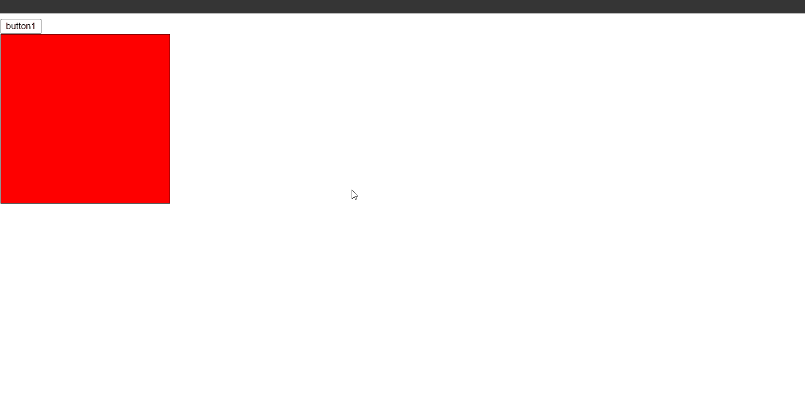
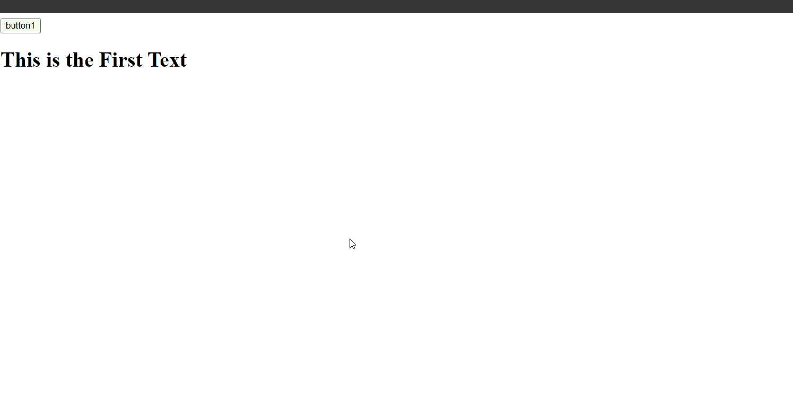
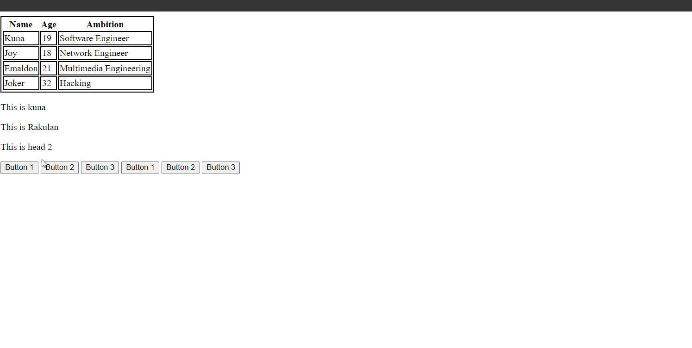
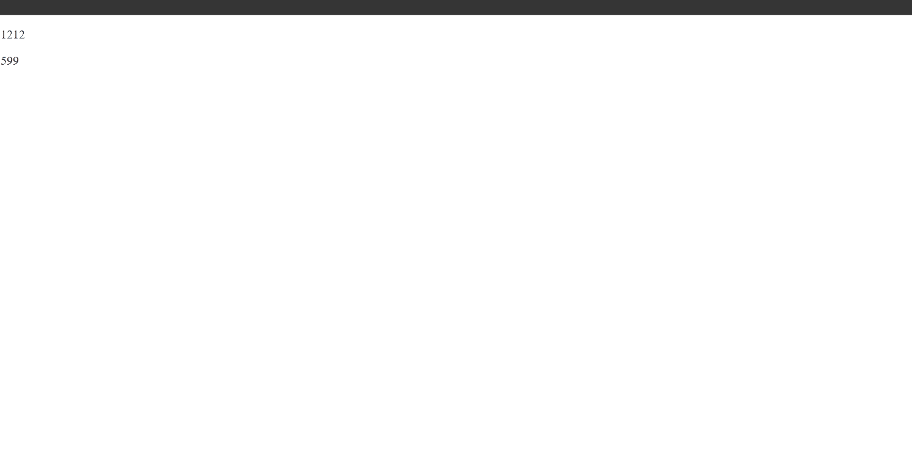
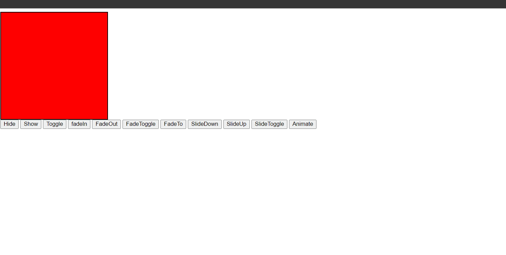

### jQuery Dreak Beans Snippets

### Example 0

#### HTML

```HTML
<!DOCTYPE html>

<html>

	<head>

		<title>This is the title</title>

        <link  rel="stylesheet" href="jquery-ui.min.css" type="text/css" />

        <link href="style.css" rel="stylesheet" type="text/css" />

	</head>

<body>

    <input type="button" id="btn1"  value="button1"/>

    <div>

        <div class="firstDiv"></div>

        <div class="secoundDiv"></div>
    </div>

    <script src="jquery-3.2.1.min.js" type="text/javascript"></script>
    <script src="jquery-ui.min.js" type="text/javascript"></script>

    <script src="js.js" type="text/javascript"></script>

</body>

</html>
```

#### CSS

```CSS
.firstDiv {

    width:250px;
    height:250px;
    background-color:red;
    border:1px solid black;
}
```

#### JavaScript

```JavaScript
$(document).ready(function () {

    $("#btn1").click(function () {

        $("div .firstDiv").fadeOut("slow");

    });

});
```

### Output



### Example 1

#### HTML

```HTML
<!DOCTYPE html>

<html>

	<head>

		<title>This is the title</title>

        <link  rel="stylesheet" href="jquery-ui.min.css" type="text/css" />

        <link href="style.css" rel="stylesheet" type="text/css" />

	</head>

<body>

    <input type="button" id="btn1"  value="button1"/>

    <h1 id="t">This is the First Text</h1>

    <script src="jquery-3.2.1.min.js" type="text/javascript"></script>
    <script src="jquery-ui.min.js" type="text/javascript"></script>

    <script src="js.js" type="text/javascript"></script>

</body>

</html>
```

#### CSS

```CSS
.firstDiv {

    width:250px;
    height:250px;
    background-color:red;
    border:1px solid black;
}
```

#### JavaScript

```JavaScript
$(function () {

    $("#btn1").click(function (){

        $("#t").text("Hello  You have been changed");

    });
});
```

### Output



### Example 2

#### HTML

```HTML
<!DOCTYPE html>

<html>

	<head>

		<title>This is the title</title>

        <link  rel="stylesheet" href="jquery-ui.min.css" type="text/css" />

        <link href="style.css" rel="stylesheet" type="text/css" />

	</head>

<body>

    <table id="t1">

        <tr>

            <th>Name</th>
            <th>Age</th>
            <th>Ambition</th>
        </tr>

        <tr>

            <td>Kuna</td>
            <td>19</td>
            <td>Software Engineer</td>

        </tr>

        <tr>

            <td>Joy</td>
            <td>18</td>
            <td>Network Engineer</td>
        </tr>

        <tr>
            <td>Emaldon</td>
            <td>21</td>
            <td>Multimedia Engineering</td>

        </tr>

        <tr>
            <td>Joker</td>
            <td>32</td>
            <td>Hacking</td>
        </tr>

    </table>

    <div id="conTexts">

        <p id="p1">This is kuna</p>
        <p id="p2">This is Rakulan</p>
        <p id="p3">This is head 2</p>

    </div>

    <input id="btn1" type="button"  value="Button 1"/>
    <input id="btn2" type="button"  value="Button 2"/>
    <input id="btn3" type="button"  value="Button 3"/>
    <input id="btn4" type="button" value="Button 1" />
    <input id="btn5" type="button" value="Button 2" />
    <input id="btn6" type="button" value="Button 3" />

    <script src="jquery-3.2.1.min.js" type="text/javascript"></script>
    <script src="jquery-ui.min.js" type="text/javascript"></script>

    <script src="js.js" type="text/javascript"></script>

</body>

</html>
```

#### CSS

```CSS
table {

    border:2px solid black;

}
table tr td {

    border:2px solid black;

}
```

#### JavaScript

```JavaScript
$(document).ready(function () {

    $("#btn1").click(function () {

        $("table th").css("background-color", "red");

    });

    $("#btn2").click(function () {

        $("table").css("background-color","blue")

    });

    $("#btn3").click(function () {

        $("table").css("height", "250px").css("wdith", "250px");

    });

    $("#btn4").click(function () {

        $("#p1,#p2,#p3").css("font-weight", "bold");

    });

    $("#btn5").click(function () {

        $("body").css("background-color","yellow");

    });

    $("#btn6").click(function () {

        $("body").css("background-color", "white");
    });

});
```

### Output



### Example 3

#### HTML

```HTML
<!DOCTYPE html>

<html>

	<head>

		<title>This is the title</title>

        <link  rel="stylesheet" href="jquery-ui.min.css" type="text/css" />

        <link href="style.css" rel="stylesheet" type="text/css" />

	</head>

<body>

    <p id="cW"></p>
    <p id="cH"></p>

    <script src="jquery-3.2.1.min.js" type="text/javascript"></script>
    <script src="jquery-ui.min.js" type="text/javascript"></script>

    <script src="js.js" type="text/javascript"></script>

</body>

</html>
```

#### JavaScript

```JavaScript
$(document).ready(function () {

    $(window).mousemove(function (event) {

        var width = event.clientX;
        var height = event.clientY;

        $("#cW").text(width);
        $("#cH").text(height);

    });

    $("")

});
```

### Output



### Example 4

#### HTML

```HTML
<!DOCTYPE html>

<html>

	<head>

		<title>This is the title</title>

        <link  rel="stylesheet" href="jquery-ui.min.css" type="text/css" />

        <link href="style.css" rel="stylesheet" type="text/css" />

	</head>

<body>

    <div id="box">

    </div>

    <input id="hide" type="button" value="Hide" />
    <input id="show" type="button" value="Show" />
    <input id="toggle" type="button" value="Toggle" />
    <input id="fadein" type="button" value="fadeIn" />
    <input id="fadeout" type="button" value="FadeOut" />
    <input id="fadetoggle" type="button" value="FadeToggle" />
    <input id="fadeto" type="button" value="FadeTo" />
    <input id="slidedown" type="button" value="SlideDown" />
    <input id="slideup" type="button" value="SlideUp" />
    <input id="slidetoggle" type="button" value="SlideToggle" />
    <input id="animate" type="button" value="Animate" />

    <script src="jquery-3.2.1.min.js" type="text/javascript"></script>
    <script src="jquery-ui.min.js" type="text/javascript"></script>

    <script src="js.js" type="text/javascript"></script>

</body>

</html>
```

#### CSS

```CSS
#box {

    width:250px;
    height:250px;
    background-color:red;
    border:2px solid black;

}
```

#### JavaScript

```JavaScript
$(document).ready(function () {

    $("#hide").click(function () {

        $("#box").hide("slow");//slow fast milliseconds.

    });

    $("#show").click(function () {

        $("#box").show("fast");//fast slow milliseconds.

    });

    $("#fadein").click(function () {

        $("#box").fadeIn()//fast slow milliseconds.

    });

    $("#fadeout").click(function () {

        $("#box").fadeOut()//fast slow milliseconds.

    });

    $("#slidedown").click(function () {

        $("#box").slideDown()//fast slow milliseconds.

    });

    $("#slideup").click(function () {

        $("#box").slideUp();//fast slow milliseconds.

    });

    $("#fadeto").click(function () {

        $("#box").fadeTo("slow", 0.5);//fast slow milliseconds.
    });

    $("#toggle").click(function () {

        $("#box").toggle("slow")//fast slow milliseconds.
    });

       $("#fadetoggle").click(function () {

        $("#box").fadeToggle("fast");//fast slow milliseconds.
    });

    $("#slidetoggle").click(function () {

        $("#box").slideToggle();

    });

    $("#animate").click(function () {

        $("#box").css("position", "relative");

        $("#box").animate({

            left: "250px",
            top: "250px",

        }).animate({

            left: "0px",
            top:"0px"

        });

    });

});
```

### Output


