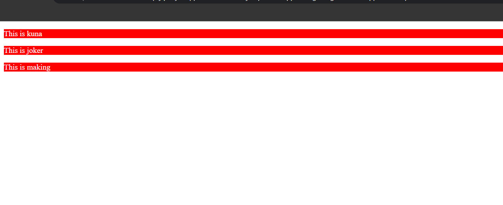
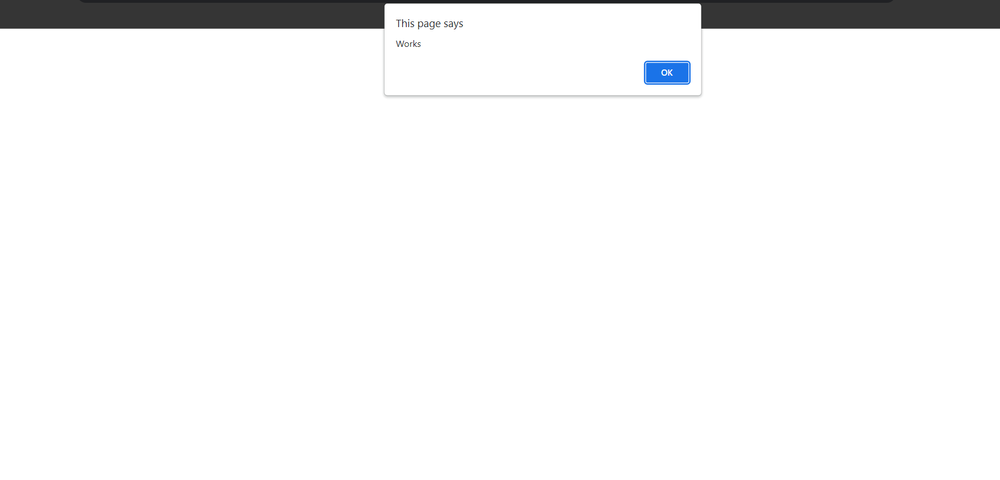

### Microsoft Jumpstart Snippets

### Getting Started Snippets

### Example 0

#### HTML

```HTML
<!DOCTYPE html>

<html>

	<head>

		<title>This is the title</title>

        <link  rel="stylesheet" href="jquery-ui.min.css" type="text/css" />

        <link href="style.css" rel="stylesheet" type="text/css" />

	</head>

<body>

    <p>This is kuna</p>
    <p>This is joker</p>
    <p>This is making</p>

    <script src="jquery-3.2.1.min.js" type="text/javascript"></script>
    <script src="jquery-ui.min.js" type="text/javascript"></script>

    <script src="js.js" type="text/javascript"></script>

</body>

</html>
```

#### JavaScript

```JavaScript
$(document).ready(function () {

    $("p").css("background-color", "red").css("color","white")

});

//This is the chaining method.
```

### Output



### Example 1

#### HTML

```HTML
<!DOCTYPE html>

<html>

	<head>

		<title>This is the title</title>

        <link  rel="stylesheet" href="jquery-ui.min.css" type="text/css" />

        <link href="style.css" rel="stylesheet" type="text/css" />

	</head>

<body>

    <script src="jquery-3.2.1.min.js" type="text/javascript"></script>
    <script src="jquery-ui.min.js" type="text/javascript"></script>

    <script src="js.js" type="text/javascript"></script>

</body>

</html>
```

#### JavaScript

```JavaScript
$(document).ready(function () {

    $(window).bind("click", function () {

        alert("Works");

    });

});

//on is same as bind() and addEventLisener() in JS.
```

### Output


